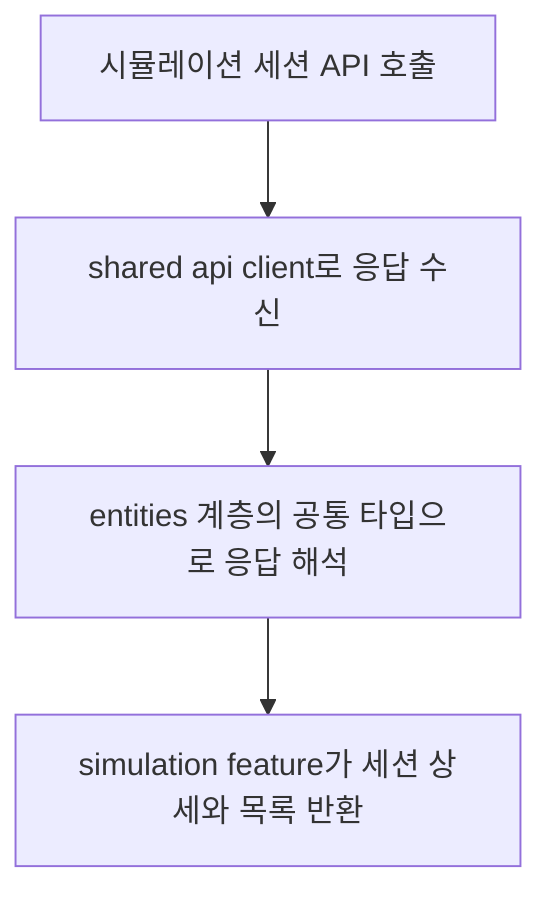

# Frontend FSD Spec: Simulation API의 Consultation Feature 의존성 분리

## Goal

`simulation` feature가 `consultation` feature의 타입을 직접 import하지 않도록 상담 세션/메시지 및 매칭 워크플로우 응답 타입을 하위 계층의 공통 모델에 둔다.

## User Flow Chart



## Design Diff

### As-is vs To-be

| 영역 | As-is | To-be | 변경 내용 |
|------|-------|-------|----------|
| 시뮬레이션 API 타입 의존성 | `frontend/src/features/simulation/api/simulationApi.ts`가 `frontend/src/features/consultation/api/consultationApi.ts`의 `ChatMessage`, `ChatSession` 타입을 import | `simulation`과 `consultation`이 `entities/chat`의 공통 상담 API 타입을 참조 | feature 간 cross-slice import 제거 |
| 매칭 워크플로우 응답 타입 | `simulationApi.ts`가 `frontend/src/features/consultation/api/llmToolWorkflowApi.ts`의 `LlmToolWorkflowPayload` 타입을 import | `entities/workflow`의 공통 매칭 워크플로우 타입을 참조 | simulation feature의 consultation feature 직접 의존 제거 |
| 런타임 동작 | API endpoint와 unwrap 로직은 유지 | API endpoint와 unwrap 로직은 유지 | 타입 위치만 정리하고 사용자 동작은 변경하지 않음 |

## Component Tree

UI 컴포넌트 변경 없음.

```
features/simulation/api/simulationApi.ts
├─ entities/chat: 상담 세션/메시지 API 타입
├─ entities/workflow: 매칭 워크플로우 API 타입
└─ shared/api: customFetch, response unwrap helper
```

## API Integration

### Endpoints

이번 변경은 API endpoint를 추가하거나 수정하지 않는다. 기존 수동 호출 endpoint를 유지한다.

| Method | Path | Description |
|--------|------|-------------|
| GET | `/api/v1/workspaces/{workspaceId}/simulation/sessions` | 시뮬레이션 세션 목록 조회 |
| POST | `/api/v1/workspaces/{workspaceId}/simulation/sessions` | 시뮬레이션 세션 생성 |
| GET | `/api/v1/workspaces/{workspaceId}/simulation/sessions/{sessionId}` | 시뮬레이션 세션 상세 조회 |
| POST | `/api/v1/workspaces/{workspaceId}/simulation/sessions/{sessionId}/messages` | 시뮬레이션 메시지 전송 |
| GET | `/api/v1/consultation/sessions/{sessionId}/matched-workflow` | 상담 세션의 매칭 워크플로우 조회 |

## Data Flow

```
features/simulation
  -> entities/chat
  -> entities/workflow
  -> shared/api

features/consultation
  -> entities/chat
  -> entities/workflow
  -> shared/api
```

FSD 의존성 방향은 `features -> entities -> shared`로 유지한다. `simulation`과 `consultation` 간 직접 import는 허용하지 않는다.

## 수정 대상 파일

| 파일 | 변경 유형 | 설명 |
|------|----------|------|
| `frontend/src/entities/chat/model/consultationTypes.ts` | new | consultation/simulation API가 공유하는 상담 세션·메시지 타입 정의 |
| `frontend/src/entities/chat/index.ts` | modify | 공유 상담 API 타입 export |
| `frontend/src/entities/workflow/model/matchedWorkflow.ts` | new | 매칭 워크플로우 응답 타입 정의 |
| `frontend/src/entities/workflow/index.ts` | modify | 매칭 워크플로우 타입 export |
| `frontend/src/features/consultation/api/consultationApi.ts` | modify | 상담 세션·메시지 타입을 `entities/chat`에서 참조 |
| `frontend/src/features/consultation/api/llmToolWorkflowApi.ts` | modify | 매칭 워크플로우 타입을 `entities/workflow`에서 참조 |
| `frontend/src/features/simulation/api/simulationApi.ts` | modify | consultation feature 직접 import 제거 |

## State Management

상태 관리 변경 없음. TanStack Query key, cache, hook 동작은 변경하지 않는다.

## Tests

### Test Strategy

| 구분 | 방법 | 도구 | 비고 |
|------|------|------|------|
| 타입 검사 | frontend build | `pnpm build` | FSD import 변경 후 타입 연결 확인 |
| API 단위 테스트 | Vitest | `pnpm test -- --run src/features/simulation/api/simulationApi.test.ts src/features/consultation/api/consultationApi.test.ts src/features/consultation/api/llmToolWorkflowApi.test.ts src/entities/chat/model/consultationTypes.test.ts` | 변경된 API 타입 사용 경로의 기존 동작 유지 확인 |

### Test Scenarios

#### Happy Path

| # | 시나리오 | 사전 조건 | 조작 | 기대 결과 |
|---|---------|---------|------|----------|
| 1 | 시뮬레이션 세션 목록 조회 | API가 세션 page 응답 반환 | `simulationApi.listSessions` 호출 | 기존 page shape으로 unwrap된다 |
| 2 | 시뮬레이션 세션 상세 조회 | API가 세션·메시지·매칭 워크플로우 응답 반환 | `simulationApi.getSession` 호출 | 공통 타입 기반 상세 응답을 반환한다 |
| 3 | 상담 세션 목록 조회 | API가 상담 세션 page 응답 반환 | `consultationApi.getSessionPage` 호출 | 기존 page shape으로 unwrap된다 |
| 4 | 상담 매칭 워크플로우 조회 | API가 `workflowDefinitionId` 포함 응답 반환 | `getCurrentWorkflow` 호출 | `MatchedWorkflow`로 판별된다 |

#### Error & Edge Cases

| # | 시나리오 | 조작 | 기대 결과 |
|---|---------|------|----------|
| 1 | simulation API 응답이 `{ data }`로 감싸짐 | detail/list API 호출 | 기존 helper로 동일하게 unwrap된다 |
| 2 | 매칭 워크플로우가 없음 | `workflowDefinitionId`가 null인 응답 | `getCurrentWorkflow`가 null을 반환한다 |
| 3 | 매칭 워크플로우 조회 실패 | 네트워크 또는 서버 오류 | 기존처럼 null로 degrade한다 |

## Acceptance Criteria

- `frontend/src/features/simulation/api/simulationApi.ts`에서 `@/features/consultation/*` import가 사라진다.
- 상담 세션/메시지 API 타입은 `features`보다 하위 계층인 `entities/chat`에서 제공한다.
- 매칭 워크플로우 API 타입은 `features`보다 하위 계층인 `entities/workflow`에서 제공한다.
- `consultation`과 `simulation` feature는 공통 타입에 의존하며 서로 직접 의존하지 않는다.
- 관련 frontend 타입 검사와 API 테스트가 통과한다.

## Non-goals

- OpenAPI generated client를 재생성하지 않는다.
- API endpoint, response unwrap 방식, UI 상태, UX 문구를 변경하지 않는다.
- 기존 normalized demo chat 모델의 `ChatMessage`, `ChatSession` 타입 의미를 변경하지 않는다.

## Open Questions

- 없음.
