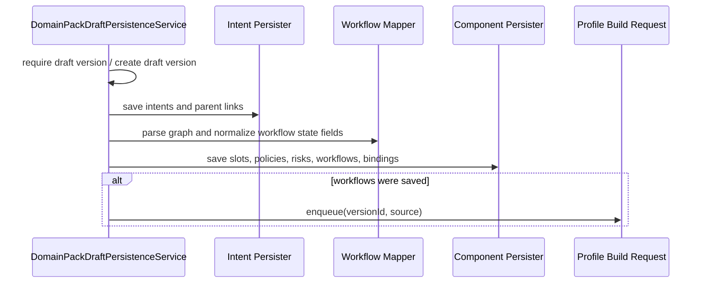

# Backend Spec: draft component 저장 경로 분리

## Goal

`DomainPackDraftPersistenceService`가 draft version orchestration에 집중하도록 intent, slot/policy/risk/workflow/component 저장과 workflow graph mapping 책임을 분리한다.

## Background

Issue #610은 `DomainPackDraftPersistenceService`가 draft artifact parsing, component 저장, workflow node/edge mapping, matching profile enqueue를 한 클래스에서 처리해 Domain Pack schema 변경 시 영향 범위가 커지는 문제를 다룬다.

현재 확인된 대상 파일:

- `backend/src/main/java/com/init/domainpack/application/DomainPackDraftPersistenceService.java`
- `backend/src/test/java/com/init/domainpack/application/DomainPackDraftPersistenceServiceTest.java`

이슈 본문의 참고 위치는 `backend/src/main/java/com/init/domainpack/application/service/DomainPackDraftPersistenceService.java`였지만, 현재 저장소에서는 위 application package 경로가 실제 위치다.

## Scope

- `domain-pack` application 계층 안에서 draft component별 저장 또는 mapping 책임을 분리한다.
- intent 저장, slot/policy/risk/workflow 저장, intent-slot binding 저장, workflow graph parsing/normalization 책임을 명확히 나눈다.
- 기존 public use case 진입점인 `persistVersion`, `persistIntents`, `persist`, `persistWorkflowDraft`의 호출 계약과 transaction 경계는 유지한다.
- workflow가 실제 저장된 경우에만 matching profile enqueue를 호출하는 현재 정책을 명시적으로 유지한다.

## Non-goals

- REST API, request/response DTO, OpenAPI contract는 변경하지 않는다.
- PostgreSQL schema나 migration은 변경하지 않는다.
- workflow graph validation rule 자체를 바꾸지 않는다.
- matching profile build queue의 내부 구현이나 retry 정책은 변경하지 않는다.

## Affected Modules

- Bounded Context: `domain-pack`
- Layer: `application`
- External collaborator: `com.init.workflowruntime.application.matching.WorkflowMatchingProfileBuildRequestService`
- Repositories:
  - `DomainPackVersionRepository`
  - `IntentDefinitionRepository`
  - `SlotDefinitionRepository`
  - `PolicyDefinitionRepository`
  - `RiskDefinitionRepository`
  - `WorkflowDefinitionRepository`
  - `IntentSlotBindingRepository`

## Expected Design

## Requirements

1. `DomainPackDraftPersistenceService`는 draft version 생성/조회, component 저장 순서 결정, transaction boundary, enqueue source 선택만 담당한다.
2. intent 저장 책임은 intent code 중복 skip, request 내 중복 검증, parent intent resolution, 저장 count 계산을 포함한다.
3. component 저장 책임은 slot → policy → risk → workflow → intent-slot binding 순서를 유지한다.
4. workflow mapping 책임은 `WorkflowGraphValidator` 기반 graph parsing, ACTION node `policyRef` 검증, `initialState`/`terminalStatesJson` normalization을 담당한다.
5. `persistWorkflowDraft`는 submitted policy와 같은 draft version에 이미 존재하는 policy만 workflow `policyRef`로 허용한다.
6. `persist`와 `persistWorkflowDraft`는 workflow 저장 건수가 1건 이상일 때만 `WorkflowMatchingProfileBuildRequestService.enqueue`를 호출한다.
7. component 저장 중 예외가 발생하면 enqueue가 호출되지 않아야 하며, 기존 transaction rollback semantics를 해치지 않는다.

## Validation

- `DomainPackDraftPersistenceServiceTest` 또는 분리된 application-layer 단위 테스트에서 intent/slot/policy/risk/workflow 저장 책임을 검증한다.
- draft artifact 샘플에 해당하는 수동 draft 저장 경로와 pipeline workflow draft callback 경로가 기존 result count를 유지하는지 검증한다.
- workflow `policyRef`가 callback payload와 기존 DB policy 어디에도 없을 때 기존 예외가 유지되는지 검증한다.
- workflow 저장이 없는 payload에서는 enqueue가 호출되지 않는지 검증한다.
- 가능한 경우 `cd backend && ./gradlew test --tests com.init.domainpack.application.DomainPackDraftPersistenceServiceTest`로 targeted verification을 실행한다.

## Open Questions

- 없음. 이슈 범위는 내부 application-layer 책임 분리와 기존 동작 보존으로 충분히 구체화되어 있다.
