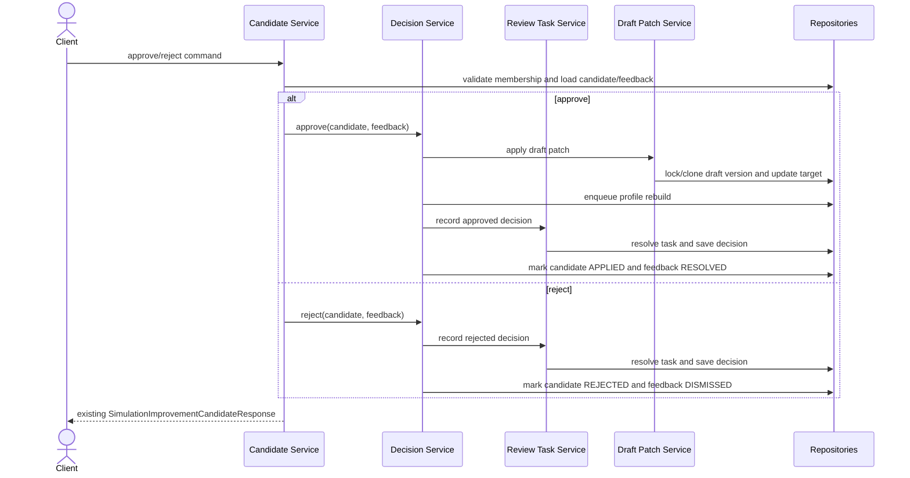

# simulation improvement candidate 승인 흐름 분리

## Goal

`SimulationImprovementCandidateService`에 결합된 승인/반려, review task, draft patch, feedback/profile enqueue 책임을 분리하여 승인 흐름 변경 리스크를 낮춘다.

## Problem

`backend/src/main/java/com/init/workflowruntime/application/SimulationImprovementCandidateService.java`가 후보 조회와 상태 변경뿐 아니라 review task 생성, 승인/반려 decision 기록, domain pack draft patch 적용, feedback 상태 기록, workflow matching profile rebuild enqueue까지 함께 처리한다. 승인 정책과 draft 변경 정책이 한 서비스에 모여 있어 작은 정책 변경도 후보 상태 전이와 draft 반영 경로를 함께 건드리게 된다.

## Scope

- 후보 조회, workspace 검증, 기본 create/list/get/updateStatus API orchestration은 기존 application service에 유지한다.
- 승인/반려 terminal 상태 전이와 feedback 기록 책임을 application 계층의 별도 collaborator로 분리한다.
- review task 생성/조회와 review decision 기록 책임을 별도 collaborator로 분리한다.
- draft domain pack version 선택, clone, target element description patch 책임을 별도 collaborator로 분리한다.
- 승인 성공 시 profile rebuild enqueue는 필수 승인 단계로 유지하며, enqueue 실패 시 후보/feedback terminal 상태를 저장하지 않는 정책을 명확히 한다.
- 승인/반려 API response DTO, HTTP endpoint, 상태 전이 결과는 기존 동작을 유지한다.

## Non-goals

- 새로운 API endpoint, request/response field, database schema를 추가하지 않는다.
- draft patch operation 범위를 description update 외로 확장하지 않는다.
- review 도메인 모델, workflow matching profile worker, embedding 생성 정책을 변경하지 않는다.
- frontend 화면이나 generated API를 변경하지 않는다.

## Affected Paths

- `backend/src/main/java/com/init/workflowruntime/application/SimulationImprovementCandidateService.java`
- `backend/src/main/java/com/init/workflowruntime/application/SimulationImprovementCandidateDecisionService.java`
- `backend/src/main/java/com/init/workflowruntime/application/SimulationImprovementCandidateReviewTaskService.java`
- `backend/src/main/java/com/init/workflowruntime/application/SimulationImprovementDraftPatchService.java`
- `backend/src/test/java/com/init/workflowruntime/application/SimulationImprovementCandidateServiceTest.java`
- `.agent/specs/611.md`

## Sequence Diagram

## Requirements

1. 승인/반려 endpoint는 기존 `SimulationImprovementCandidateResponse` shape과 상태 값을 유지해야 한다.
2. workspace membership 검증과 후보/feedback workspace 검증은 기존과 동일하게 승인/반려 처리 전에 수행해야 한다.
3. `READY_FOR_REVIEW`가 아니거나 열린 review task가 없는 후보는 승인/반려할 수 없어야 한다.
4. review task 생성과 재사용 정책은 `READY_FOR_REVIEW` status update 흐름에서 기존과 동일해야 한다.
5. draft patch는 기존 target type별 description update 정책과 source id → draft code resolve fallback을 유지해야 한다.
6. published source version 승인 시 기존 draft가 있으면 잠그고, 없으면 `SIMULATION_REVIEW` source type draft를 clone해야 한다.
7. draft target을 찾지 못하거나 unsupported target이면 candidate, feedback, review decision, profile enqueue가 terminal 승인 상태로 저장되지 않아야 한다.
8. profile rebuild enqueue 실패는 승인 실패로 처리하며 candidate `APPLIED`와 feedback `RESOLVED` 저장을 진행하지 않아야 한다.
9. 반려는 draft patch와 profile enqueue를 수행하지 않고 review decision, candidate `REJECTED`, feedback `DISMISSED`만 처리해야 한다.

## Data/API Impact

- REST API path, request, response 변경은 없다.
- PostgreSQL schema와 migration 변경은 없다.
- review decision payload schemaVersion과 draft patch JSON key는 기존 값을 유지한다.
- profile rebuild enqueue trigger type은 `SIMULATION_CANDIDATE_APPLIED`를 유지한다.

## Tests

- `SimulationImprovementCandidateServiceTest`에서 승인, 반려, 재승인 방지, review task 재사용, draft clone/patch, draft patch 실패 상태 보존을 유지 또는 보강한다.
- profile rebuild enqueue 실패 시 candidate/feedback terminal 상태 저장이 진행되지 않는 테스트를 추가한다.
- 분리된 collaborator는 기존 service-level test에서 실제 instance로 연결해 public 승인/반려 흐름의 integration 단위로 검증한다.

## Acceptance Criteria

- `SimulationImprovementCandidateService`는 조회/검증/orchestration 중심으로 축소되고 draft patch와 review decision 세부 로직을 직접 갖지 않는다.
- 승인 성공 시 기존처럼 draft target description이 갱신되고 후보는 `APPLIED`, feedback은 `RESOLVED`가 된다.
- 반려 성공 시 후보는 `REJECTED`, feedback은 `DISMISSED`가 된다.
- 이미 처리된 review task나 READY가 아닌 후보는 기존 에러 정책으로 거절된다.
- draft target missing 실패와 profile enqueue 실패가 candidate/feedback terminal 저장으로 이어지지 않는다.

## Validation

- `./gradlew test --tests com.init.workflowruntime.application.SimulationImprovementCandidateServiceTest`
- `./gradlew test`
- `git diff --check`

## Open Questions

- 없음. 이슈 본문이 API 호환, 상태 전이 보존, 책임 분리, 실패 정책 명확화 범위를 결정하기에 충분하다.
