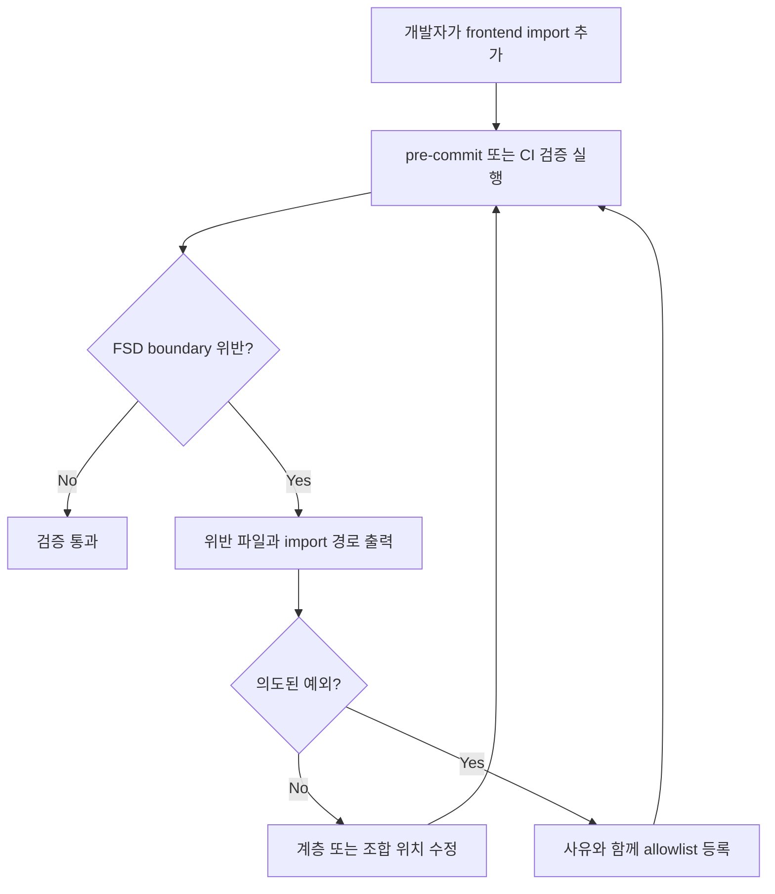

# Frontend FSD Import Boundary Audit

## Goal

프론트엔드 FSD 계층 방향과 같은 계층 cross-slice 금지 규칙을 자동 검사하여, 위반 PR이 pre-commit 및 CI 검증 단계에서 실패하도록 한다.

---

## User Flow Chart



---

## Design Diff

### As-is vs To-be

| 영역          | As-is                                                | To-be                                           | 변경 내용                                                   |
| ------------- | ---------------------------------------------------- | ----------------------------------------------- | ----------------------------------------------------------- |
| FSD 규칙 검증 | `.agent/rules/typescript.md` 문서와 코드 리뷰에 의존 | 로컬 스크립트가 import boundary를 자동 검사     | 위반 파일, 라인, import 경로를 실패 메시지로 노출           |
| 예외 관리     | 명시적 관리 지점 없음                                | JSON allowlist로 사유를 필수 기록               | 기존 예외와 신규 예외의 의도를 리뷰 가능하게 유지           |
| 실행 위치     | pre-commit frontend lint에서만 일반 ESLint 실행      | frontend lint와 test 스크립트에서 FSD 감사 실행 | pre-commit과 CI basic의 frontend test 경로에서 위반 PR 차단 |

---

## Component Tree

```text
frontend package scripts
├─ test
│  ├─ audit:api
│  ├─ audit:fsd
│  └─ vp test
└─ lint
   ├─ audit:api
   ├─ audit:fsd
   └─ eslint .

frontend/scripts/audit-fsd-import-boundaries.mjs
└─ frontend/scripts/fsd-import-boundary-allowlist.json
```

---

## API Integration

API 변경은 없다. Backend OpenAPI, Orval generated endpoint, 런타임 HTTP contract는 영향을 받지 않는다.

---

## Data Flow

```text
frontend/src/**/*.{ts,tsx}
        │
        ▼
ts-morph AST scan
        │
        ├─ alias import "@/..."
        ├─ relative import "../..."
        ├─ re-export from "..."
        └─ dynamic import("...")
        │
        ▼
FSD layer/slice classifier
        │
        ▼
violation list - allowlist
        │
        ▼
pass 또는 actionable error output
```

---

## 수정 대상 파일

| 파일                                                  | 변경 유형 | 설명                                                        |
| ----------------------------------------------------- | --------- | ----------------------------------------------------------- |
| `frontend/scripts/audit-fsd-import-boundaries.mjs`    | new       | FSD 계층 방향과 cross-slice import를 검사하는 Node 스크립트 |
| `frontend/scripts/fsd-import-boundary-allowlist.json` | new       | 의도된 기존 예외를 사유와 함께 관리하는 allowlist           |
| `frontend/package.json`                               | modify    | `audit:fsd` 스크립트를 추가하고 `test`, `lint`에 연결       |
| `.agent/specs/617.md`                                 | new       | 이슈 요구사항과 검증 기준을 기록                            |

---

## State Management

상태 관리 변경은 없다. 검사 스크립트는 소스 파일을 읽기 전용으로 분석하고 애플리케이션 런타임 상태에는 관여하지 않는다.

---

## Tests

### Test Strategy

| 구분                 | 방법                      | 도구                              | 비고                                              |
| -------------------- | ------------------------- | --------------------------------- | ------------------------------------------------- |
| 감사 스크립트 검증   | 전체 frontend source scan | `pnpm --dir frontend audit:fsd`   | allowlist 외 위반이 있으면 실패                   |
| pre-commit 경로 검증 | frontend lint 실행        | `pnpm run lint:frontend`          | lint-staged가 호출하는 lint script 선행 감사 확인 |
| CI 경로 검증         | frontend test script 실행 | `pnpm run test:frontend -- --run` | CI coverage 경로의 test script 선행 감사 확인     |

### Test Environment & 사전 조건

| 항목      | 값                                                                 |
| --------- | ------------------------------------------------------------------ |
| 환경      | 로컬 pnpm workspace                                                |
| 분석 대상 | `frontend/src/**/*.{ts,tsx}`                                       |
| 제외 대상 | generated API, test/spec 파일, `frontend/src/test`, 타입 선언 파일 |

### Test Scenarios

#### Happy Path

| #   | 시나리오               | 사전 조건                                         | 조작                                 | 기대 결과 |
| --- | ---------------------- | ------------------------------------------------- | ------------------------------------ | --------- |
| 1   | 허용 방향 import       | `features/foo`가 `entities/bar`를 import          | `pnpm --dir frontend audit:fsd` 실행 | 검사 통과 |
| 2   | 같은 slice 내부 import | `features/foo/ui`가 `features/foo/model`을 import | 감사 실행                            | 검사 통과 |
| 3   | allowlist 등록 예외    | 기존 예외가 allowlist에 사유와 함께 등록          | 감사 실행                            | 검사 통과 |

#### Error & Edge Cases

| #   | 시나리오                     | 조작                                                           | 기대 결과                           |
| --- | ---------------------------- | -------------------------------------------------------------- | ----------------------------------- |
| 1   | 하위 계층이 상위 계층 import | `shared`에서 `entities` import 후 감사 실행                    | 파일, 라인, import 경로와 함께 실패 |
| 2   | 같은 계층 cross-slice import | `features/a`에서 `features/b` import 후 감사 실행              | cross-slice 위반으로 실패           |
| 3   | stale allowlist              | 더 이상 발생하지 않는 예외가 allowlist에 남은 상태로 감사 실행 | stale allowlist 항목으로 실패       |

---

## Non-goals

- FSD 위반을 자동 수정하지 않는다.
- `frontend/src/shared/api/generated/`의 generated 파일은 검사하지 않는다.
- 테스트 파일의 mocking/import 편의를 production FSD boundary와 동일하게 강제하지 않는다.
- Backend, ML, 배포 구성은 변경하지 않는다.

---

## Acceptance Criteria

- FSD 계층 방향은 `app -> pages -> widgets -> features -> entities -> shared` 순서의 상위에서 하위 import만 허용한다.
- `pages`, `widgets`, `features`, `entities`의 같은 계층 cross-slice import는 실패한다.
- 실패 메시지는 위반 파일, 라인, import 경로, 위반 사유를 포함한다.
- 기존 예외는 `frontend/scripts/fsd-import-boundary-allowlist.json`에 사유와 함께 관리한다.
- `pnpm run lint:frontend`와 frontend test script 경로에서 감사가 실행된다.

---

## Open Questions

- 없음. 이슈는 ESLint rule 또는 별도 스크립트 중 하나를 허용하고, 현재 저장소에는 `audit:api` 선행 감사 스크립트 패턴이 이미 존재한다.
