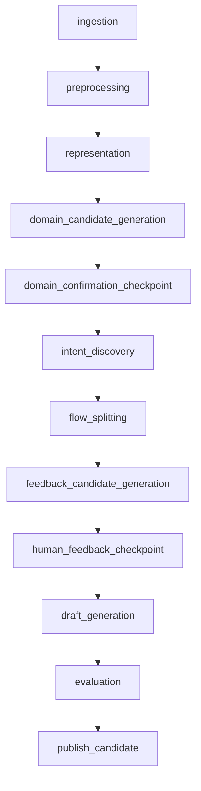

# Airflow stage runner와 failure reporter 분리

## Goal

`domain_pack_generation` DAG가 task orchestration에 집중하도록 Airflow stage runner 선택/실행 책임과 실패 callback 보고 책임을 분리한다.

## Problem

`ml/src/dags/domain_pack_generation.py`가 DAG 구성, direct/ECS stage 실행 모드 선택, XCom 결과 payload 처리, direct 실행 실패 manifest 작성, Airflow 실패 callback payload 생성과 전송을 함께 담당한다. 이 구조에서는 stage 실행 런타임 변경이나 실패 보고 정책 변경이 DAG 파일 전체에 영향을 주고, direct/ECS 경계와 callback payload contract를 독립적으로 검증하기 어렵다.

## Scope

- `ml/src/dags/domain_pack_generation.py`
- `ml/src/pipeline/airflow_stage_runner.py`
- `ml/src/pipeline/airflow_failure_reporter.py`
- `ml/src/pipeline/common/airflow_context.py`
- `ml/tests/test_domain_pack_generation_dag.py`
- `ml/tests/test_airflow_stage_runner.py`
- `ml/tests/test_airflow_failure_reporter.py`

## Non-Goals

- DAG task 순서, task id, replay mode 분기, checkpoint callback 동작을 변경하지 않는다.
- 개별 pipeline stage 구현이나 stage artifact schema를 변경하지 않는다.
- ECS task 실행 세부 구현(`ml/src/pipeline/ecs_stage_task.py`)을 재설계하지 않는다.
- Spring callback API 경로나 callback type을 변경하지 않는다.

## DAG Diagram

## Stage Interface

### Input

| 필드 | 타입 | 설명 |
| --- | --- | --- |
| `stage_name` | `str` | 실행할 pipeline stage 이름 |
| `stage_context` | `StageContext` | Airflow DAG/run/task 및 workspace/dataset/job context |
| `runtime_config` | `PipelineRuntimeConfig` | artifact store, backend callback, runtime profile 설정 |
| `upstream_manifest_path` | `str \| None` | 이전 task XCom에서 전달된 manifest 경로 |
| `stage_callable` | `Callable \| None` | direct 실행에서 사용할 stage `run()` 함수 |
| `raw_object_key` | `str \| None` | ECS ingestion에 전달할 raw object key |

### Output

모든 stage runner는 Airflow XCom payload로 아래 contract를 유지한다.

| 필드 | 타입 | 설명 |
| --- | --- | --- |
| `artifact_manifest_path` | `str` | 다음 task가 읽을 stage manifest 경로 또는 URI |

## Design Diff

| 영역 | As-is | To-be |
| --- | --- | --- |
| Stage runner 선택 | DAG 내부 `_stage_execution_mode()`와 `_run_stage()`가 direct/ECS 분기 처리 | `pipeline.airflow_stage_runner`가 실행 모드 검증, runner factory, direct/ECS runner를 담당 |
| Direct 실행 | DAG가 stage callable 실행, manifest 작성, 실패 manifest 작성 처리 | `DirectStageRunner`가 direct 실행과 manifest/XCom contract 처리를 담당 |
| ECS 실행 | DAG가 `run_stage_task()`를 직접 호출 | `EcsStageRunner`가 ECS task 경계를 담당 |
| Failure callback | DAG가 실패 payload 구성과 callback 전송 처리 | `pipeline.airflow_failure_reporter`가 payload fixture 가능한 형태로 구성/전송 |
| Airflow context 값 추출 | DAG 내부 helper에 고정 | `pipeline.common.airflow_context`에서 재사용 |

## Requirements

- `PIPELINE_STAGE_EXECUTION_MODE=direct`일 때 direct stage callable이 실행되고 기존 manifest/XCom payload contract가 유지된다.
- `PIPELINE_STAGE_EXECUTION_MODE=ecs`일 때 ECS stage task 실행으로 위임되고 ingestion raw object key가 보존된다.
- 잘못된 stage execution mode는 기존처럼 `PipelineConfigurationError`를 발생시킨다.
- direct stage가 이미 `artifact_manifest_path`를 반환하면 새 manifest를 쓰지 않고 해당 XCom payload를 재사용한다.
- direct stage 실패 시 기존처럼 실패 manifest를 쓰고 원 예외를 다시 발생시킨다.
- Airflow failure callback payload는 `externalEventId`, `dagId`, `dagRunId`, `failedStage`, `reason`, `message`, `occurredAt`, `error` 필드를 유지한다.
- callback 비활성화 또는 `pipeline_job_id` 누락 시 기존처럼 실패 callback 전송을 건너뛴다.

## Acceptance Criteria

- `domain_pack_generation` DAG import와 task dependency 테스트가 계속 통과한다.
- direct/ECS 모드별 stage runner 선택 테스트가 존재한다.
- direct runner의 XCom payload contract와 실패 manifest 작성 테스트가 존재한다.
- failure callback payload fixture 검증 테스트가 존재한다.
- DAG task 순서와 task id가 변경되지 않는다.

## Validation

- `cd ml && uv run pytest tests/test_domain_pack_generation_dag.py tests/test_airflow_stage_runner.py tests/test_airflow_failure_reporter.py`
- `cd ml && uv run pytest tests/test_domain_pack_generation_dag.py`

## Open Questions

- 없음.
