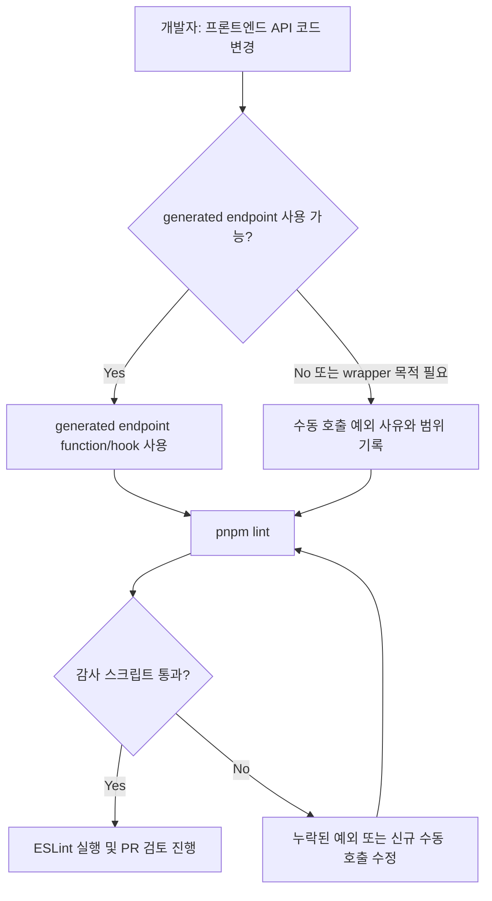

# Frontend 수동 API 호출 감사 제한

## Goal

프론트엔드에서 `apiClient`/`customFetch` 직접 호출을 명시적 예외 목록으로 제한하여, generated API가 기본 경로라는 정책을 자동 검증 가능하게 만든다.

## User Flow Chart



## Design Diff

### As-is vs To-be

| 영역               | As-is                                             | To-be                                          | 변경 내용                               |
| ------------------ | ------------------------------------------------- | ---------------------------------------------- | --------------------------------------- |
| 수동 API 호출 관리 | `apiClient`/`customFetch` 사용 여부를 검색해야 함 | production source 수동 호출을 스크립트가 검사  | 신규 직접 호출이 lint 단계에서 드러남   |
| 예외 사유          | 파일 주석에 흩어짐                                | allowlist에 파일, 호출 대상, 사유, 범위를 기록 | 기존 호출을 단계적으로 정리할 목록 제공 |
| generated API 정책 | `frontend/README.md`에 문서화                     | `pnpm lint`가 정책 위반을 차단                 | 문서 정책을 개발 워크플로우에 연결      |

## Component Tree

UI 컴포넌트 변경은 없다.

```text
frontend/
├─ scripts/
│  ├─ audit-manual-api-calls.mjs
│  └─ manual-api-call-allowlist.json
├─ package.json
└─ README.md
```

## API Integration

새로운 backend HTTP API는 추가하지 않는다. 변경 범위는 프론트엔드 개발 도구와 문서다.

### Manual Call Categories

| 분류                    | 허용 목적                                                                                       |
| ----------------------- | ----------------------------------------------------------------------------------------------- |
| OpenAPI 미생성 endpoint | backend OpenAPI/Orval 생성물이 아직 없는 endpoint 호출                                          |
| wrapper 목적            | unwrap/select, query key 표준화, toast/error mapping, optimistic update, response normalization |

## Data Flow

```text
frontend/src production files
        │
        ▼
audit-manual-api-calls.mjs
        │  scans apiClient/customFetch call expressions
        ▼
manual-api-call-allowlist.json
        │  compares file + callee + endpoint fingerprint + occurrence count
        ▼
pnpm lint
```

## 수정 대상 파일

| 파일                                              | 변경 유형 | 설명                                                          |
| ------------------------------------------------- | --------- | ------------------------------------------------------------- |
| `frontend/scripts/audit-manual-api-calls.mjs`     | new       | production source의 수동 API 호출을 수집하고 allowlist와 비교 |
| `frontend/scripts/manual-api-call-allowlist.json` | new       | 기존 예외 호출의 사유, 범위, 정리 분류 기록                   |
| `frontend/package.json`                           | update    | `audit:api` 스크립트 추가 및 `lint` 선행 검증 연결            |
| `frontend/README.md`                              | update    | 수동 API 예외 등록/검증 절차 문서화                           |

## State Management

클라이언트/서버 상태 변경은 없다.

## Tests

### Test Strategy

| 구분        | 방법                | 도구             | 비고                                        |
| ----------- | ------------------- | ---------------- | ------------------------------------------- |
| 정적 검증   | 수동 API 호출 감사  | `pnpm audit:api` | allowlist 누락/과잉 항목 실패               |
| 린트 통합   | 감사 후 ESLint 실행 | `pnpm lint`      | 신규 직접 호출을 lint 단계에서 노출         |
| 테스트 통합 | 감사 후 Vitest 실행 | `pnpm test`      | CI형 테스트 실행에서도 수동 호출 drift 노출 |

### Test Environment & 사전 조건

| 항목      | 값                  |
| --------- | ------------------- |
| 실행 위치 | `frontend/`         |
| 사전 조건 | `pnpm install` 완료 |

### Test Scenarios

#### Happy Path

| #   | 시나리오            | 사전 조건                               | 조작                      | 기대 결과                    |
| --- | ------------------- | --------------------------------------- | ------------------------- | ---------------------------- |
| 1   | 기존 예외 호출 감사 | allowlist가 현재 production 호출과 일치 | `pnpm audit:api` 실행     | 성공하고 감사된 호출 수 출력 |
| 2   | lint 통합           | 감사와 ESLint 모두 통과                 | `pnpm lint` 실행          | 감사 후 ESLint까지 성공      |
| 3   | test 통합           | 감사와 Vitest 모두 통과                 | `pnpm test -- --run` 실행 | 감사 후 Vitest까지 성공      |

#### Error & Edge Cases

| #   | 시나리오            | 조작                                                    | 기대 결과                                          |
| --- | ------------------- | ------------------------------------------------------- | -------------------------------------------------- |
| 1   | 신규 수동 호출 추가 | allowlist 없이 `apiClient`/`customFetch` 직접 호출 추가 | 감사 스크립트가 파일/호출 정보를 출력하고 실패     |
| 2   | stale allowlist     | 삭제된 수동 호출이 allowlist에 남음                     | 감사 스크립트가 사용되지 않은 예외를 출력하고 실패 |
| 3   | 예외 설명 누락      | reason/scope/wrapperPurpose 누락                        | 감사 스크립트가 allowlist 형식 오류로 실패         |

## Acceptance Criteria

- generated endpoint가 있는지 여부와 관계없이 신규 `apiClient`/`customFetch` 직접 호출은 allowlist에 등록되지 않으면 `pnpm lint` 또는 `pnpm test`에서 드러난다.
- 직접 호출 예외는 allowlist에 파일, 호출 대상, endpoint fingerprint, 사유, 범위, wrapper 목적을 남긴다.
- 기존 수동 호출은 allowlist로 단계적 정리 목록을 제공한다.
- generated 파일은 직접 수정하지 않는다.

## Non-goals

- 기존 수동 호출을 generated endpoint로 일괄 전환하지 않는다.
- backend OpenAPI 생성물 또는 Orval 생성 파일을 갱신하지 않는다.
- UI 동작, API 계약, 인증/인가 로직을 변경하지 않는다.

## Open Questions

- 기존 수동 호출 중 generated endpoint가 이미 생긴 항목을 어떤 우선순위로 제거할지는 후속 정리 이슈에서 결정한다.
