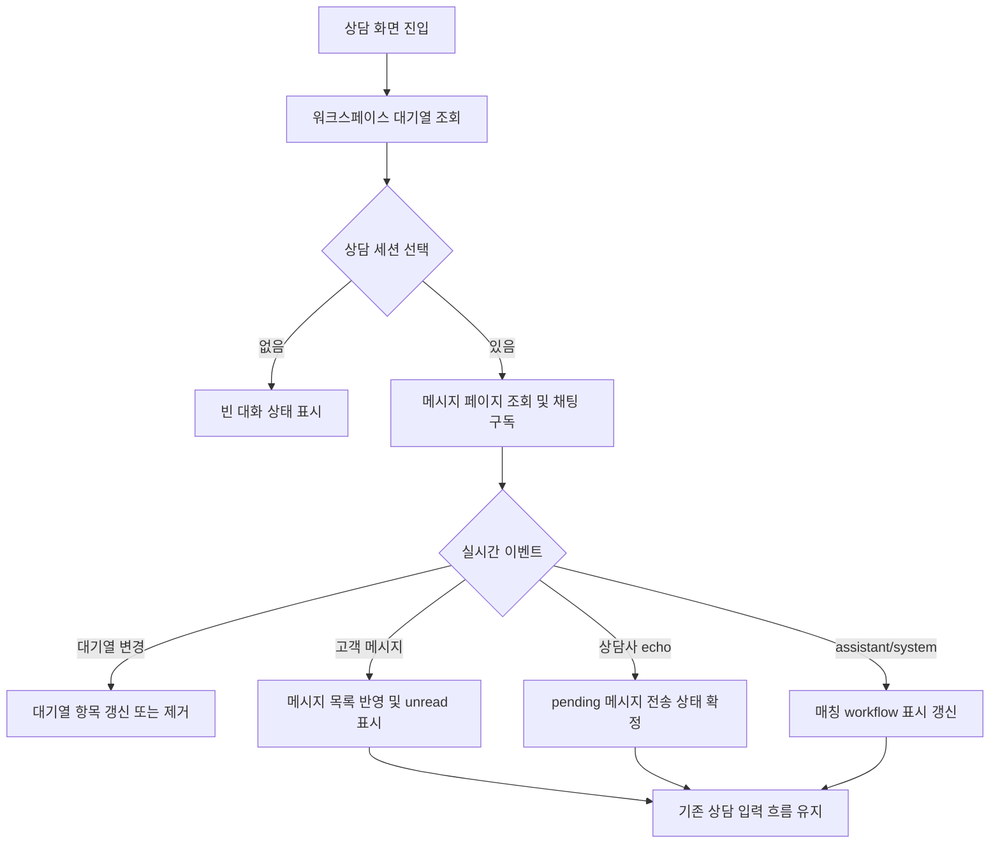

# ConsultationPage realtime state 분리

## Goal

`ConsultationPage`가 상담 UI 조합에 집중하도록 상담 대기열 이벤트, 활성 세션 메시지 이벤트, pending message, assignment, workflow 표시 렌더링 책임을 분리한다.

## User Flow Chart



## Design Diff

| 영역 | As-is | To-be | 변경 내용 |
|------|-------|-------|----------|
| 실시간 연결 | `ConsultationPage.tsx` 내부에서 STOMP 연결과 topic 구독 처리 | page-local realtime hook에서 workspace queue/chat topic 구독 처리 | websocket/event handling 책임 분리 |
| 메시지 상태 | 페이지 내부에서 메시지 목록, 이전 페이지, pending echo를 직접 관리 | 메시지 변환/정렬/pending 유틸과 hook 경계를 분리 | 메시지 list와 pending message 책임 명확화 |
| assignment 상태 | 페이지 내부에서 배정/해제/실패 동기화 로직과 렌더링 혼재 | assignment 계산 유틸과 대화 헤더 렌더링 분리 | 사용자 흐름은 유지하면서 변경 범위 축소 |
| workflow/input 렌더링 | 매칭 workflow bar, 상담 입력, 고객 상세가 페이지 JSX에 혼재 | conversation/detail pane 컴포넌트로 표시 책임 분리 | workflow execution 표시와 상담 입력 UI 경계 분리 |

## Component Tree

```text
ConsultationPage
├─ QueuePanel
├─ ConsultationConversationPane
│  ├─ ConversationHeader
│  └─ ChatPanel
├─ ConsultationDetailPane
│  ├─ MatchedWorkflowBar | MatchedWorkflowBarSkeleton
│  ├─ MessageDetailPanel
│  └─ CustomerPanel
├─ EndSessionModal
└─ ReleaseAssignmentModal
```

## API Integration

| API wrapper | Description |
|-------------|-------------|
| `frontend/src/features/consultation/api/consultationApi.ts` | 대기열, 메시지 페이지, 배정/해제, 상담 종료, metrics, 답변 초안 생성을 기존 wrapper로 유지 |
| `frontend/src/features/consultation/api/consultationEvidenceApi.ts` | 선택 메시지의 Domain Pack 근거 조회 유지 |
| `frontend/src/features/consultation/api/llmToolWorkflowApi.ts` | 매칭 workflow 표시 조회 유지 |

## Data Flow

```text
ConsultationPage
  -> useConsultationRealtime
       -> workspace queue topic event
       -> active chat topic event
       -> STOMP sendTo for counselor messages
  -> queue/session state helpers
       -> QueuePanel props
  -> active message/pending state helpers
       -> ChatPanel props
  -> workflow/detail render panes
       -> MatchedWorkflowBar, MessageDetailPanel, CustomerPanel
```

## 수정 대상 파일

| 파일 | 변경 유형 | 설명 |
|------|----------|------|
| `frontend/src/pages/consultation/ui/ConsultationPage.tsx` | modify | 페이지 orchestration 중심으로 축소 |
| `frontend/src/pages/consultation/ui/model/useConsultationRealtime.ts` | new | STOMP 연결과 queue/chat topic 구독 분리 |
| `frontend/src/pages/consultation/ui/model/consultationPageState.ts` | new | 메시지, queue, assignment 상태 계산 유틸 분리 |
| `frontend/src/pages/consultation/ui/sections/ConsultationConversationPane.tsx` | new | active session header와 상담 입력 영역 렌더링 |
| `frontend/src/pages/consultation/ui/sections/ConsultationDetailPane.tsx` | new | workflow execution 표시와 메시지/고객 상세 렌더링 |
| `frontend/src/pages/consultation/ui/sections/ConsultationStatusRight.tsx` | new | topbar metrics 표시 렌더링 |
| `frontend/src/pages/consultation/ui/ConsultationPage.test.tsx` | existing | 분리 후 상담 송수신, assignment, workflow 흐름 회귀 테스트 유지 |

## State Management

- 서버 상태는 기존 generated API wrapper와 `consultationApi`, `consultationEvidenceApi`, `getCurrentWorkflow`를 그대로 사용한다.
- 클라이언트 상태는 page-local React state를 유지하되, 변환/정렬/assignment 계산과 STOMP 구독을 별도 모듈로 분리한다.
- pending counselor message는 서버 echo 또는 서버 error/timeout으로만 `sent`/`failed` 상태로 전이한다.
- queue event는 활성 세션 여부에 따라 unread 표시와 세션 제거 처리를 유지한다.

## Tests

### Test Strategy

| 구분 | 방법 | 도구 | 비고 |
|------|------|------|------|
| 컴포넌트 회귀 | 기존 `ConsultationPage.test.tsx`로 회귀 검증 | Vitest + React Testing Library | loading/error/empty, 송수신, assignment, workflow 표시 |
| generated API 회귀 | 기존 `ConsultationPage.generated-api.test.tsx` 유지 | Vitest | generated endpoint wrapper 연동 |
| 로컬 검증 | frontend targeted test/build | pnpm | 변경 파일 중심 검증 후 필요 시 CI 스크립트 |

### Test Scenarios

| # | 시나리오 | 기대 결과 |
|---|---------|----------|
| 1 | 워크스페이스 없이 상담 화면 진입 | 대기열 빈 상태와 metrics empty 상태가 유지된다 |
| 2 | 대기열 조회 실패 후 재시도 | error toast 중복 없이 retry로 대기열이 복구된다 |
| 3 | 세션 선택 후 메시지 송신 | STOMP counselor endpoint로 전송되고 optimistic pending 메시지가 표시된다 |
| 4 | 서버 echo 또는 timeout 수신 | pending 메시지가 sent 또는 failed로 전이된다 |
| 5 | queue websocket upsert/remove 수신 | unread, active selection, URL root 이동 흐름이 유지된다 |
| 6 | assistant/system 메시지 수신 | 매칭 workflow 표시가 재조회된다 |
| 7 | 상담 배정/해제/종료 | 기존 confirmation, toast, queue 갱신, metrics refresh 흐름이 유지된다 |

## Non-goals

- 상담 API endpoint 또는 generated API 구조는 변경하지 않는다.
- UI 디자인, 문구, 라우팅 URL은 변경하지 않는다.
- 전역 상태 관리 도구를 새로 도입하지 않는다.
- chat demo 이외의 workflow/runtime 화면은 변경하지 않는다.

## Open Questions

- 없음. 이슈는 내부 구조 분리와 기존 상담 데모 흐름 보존을 요구하며, API/UX 변경 요구는 포함하지 않는다.
