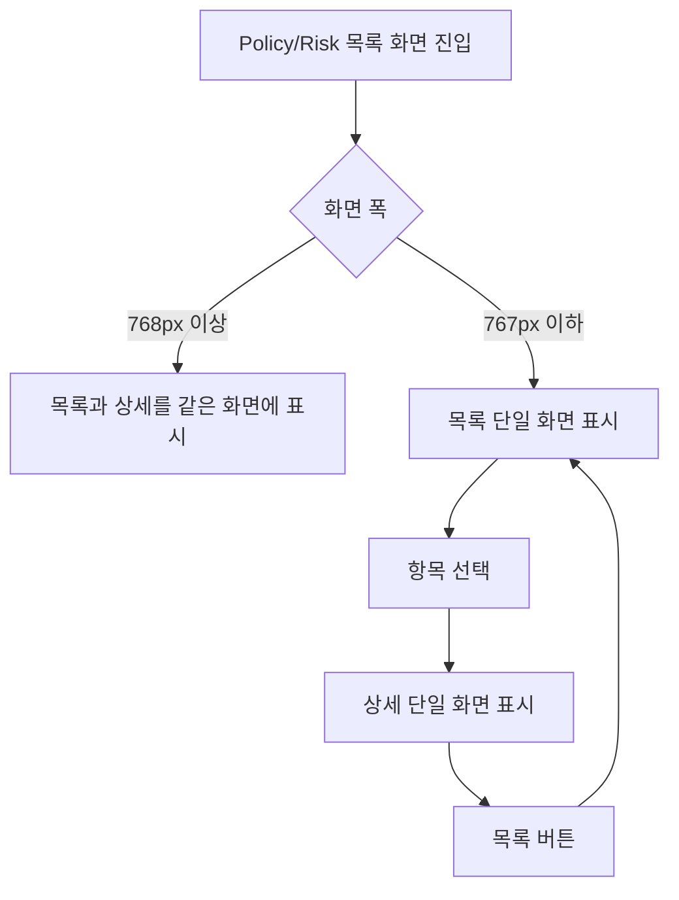

# Frontend FSD Spec: Policy/Risk 목록-상세 반응형 전환 기준 정리

## Goal

Policy/Risk 초안 상세 화면에서 일반 데스크톱/노트북 폭은 목록과 상세를 함께 보여주고, 좁은 화면에서만 목록 또는 상세 단일 화면 탐색으로 전환한다.

## User Flow Chart



## Design Diff

### As-is vs To-be

| 영역 | As-is | To-be | 변경 내용 |
| --- | --- | --- | --- |
| Policy 목록-상세 breakpoint | 이슈 기준 1599px 이하에서 단일 화면 전환 가능 | 767px 이하에서만 단일 화면 전환 | 1440px급 노트북에서 목록과 상세를 동시에 유지 |
| Risk 목록-상세 breakpoint | 이슈 기준 1599px 이하에서 단일 화면 전환 가능 | 767px 이하에서만 단일 화면 전환 | Policy와 동일한 기준 적용 |
| 좁은 화면 복귀 | 상세에서 목록으로 돌아가는 명시적 동선 필요 | 상세 선택 상태에서 모바일 전용 목록 버튼 제공 | 선택 없는 section URL로 replace 이동 |
| 포커스 흐름 | 목록 복귀 후 포커스 기준 불명확 | 목록 영역으로 프로그램 포커스 이동 | 키보드 사용자가 복귀 지점을 잃지 않도록 보조 |

## Component Tree

```text
PolicyDraftReadPage
├─ OstoneShell
└─ pageWrapper
   ├─ backButton (선택 상태에서 렌더링, CSS로 모바일에서만 표시)
   └─ twoPane
      ├─ listSlot -> PolicyListPanel
      └─ detailSlot -> PolicyDetailPanel / PolicyEditPanel

RiskDraftReadPage
├─ OstoneShell
└─ pageWrapper
   ├─ backButton (선택 상태에서 렌더링, CSS로 모바일에서만 표시)
   └─ twoPane
      ├─ listSlot -> RiskListPanel
      └─ detailSlot -> RiskDetailPanel / RiskEditPanel
```

## API Integration

이번 변경은 레이아웃과 클라이언트 라우팅만 다룬다. Backend API, generated endpoint, query key, 서버 상태 계약은 변경하지 않는다.

## Data Flow

```text
URL route param(policyId/riskId)
  -> hasSelection 계산
  -> 768px 이상: listSlot + detailSlot 동시 표시
  -> 767px 이하: hasSelection 여부로 listSlot/detailSlot 중 하나만 표시
  -> 목록 버튼: /policies 또는 /risks section URL로 replace 이동
```

## 수정 대상 파일

| 파일 | 변경 유형 | 설명 |
| --- | --- | --- |
| `frontend/src/pages/domain-pack/ui/PolicyDraftReadPage.tsx` | update | 선택된 정책 상세에서 목록 URL로 돌아가는 버튼과 목록 포커스 이동 추가 |
| `frontend/src/pages/domain-pack/ui/RiskDraftReadPage.tsx` | update | 선택된 위험요소 상세에서 목록 URL로 돌아가는 버튼과 목록 포커스 이동 추가 |
| `frontend/src/pages/domain-pack/ui/policy-draft-read-page.module.css` | update | Policy 단일 화면 전환 기준을 모바일 폭으로 유지하고 목록 버튼 focus-visible 보강 |
| `frontend/src/pages/domain-pack/ui/risk-draft-read-page.module.css` | update | Risk 단일 화면 전환 기준을 모바일 폭으로 유지 |
| `frontend/src/pages/domain-pack/ui/PolicyDraftReadPage.test.tsx` | update | 정책 상세의 목록 버튼 URL replace 동작 검증 |
| `frontend/src/pages/domain-pack/ui/RiskDraftReadPage.test.tsx` | update | 위험요소 상세의 목록 버튼 URL replace 동작 검증 |
| `frontend/src/pages/domain-pack/ui/DomainPackDraftReadBreakpoints.test.ts` | new | Policy/Risk breakpoint가 767px 기준이며 1599/1500px 기준으로 회귀하지 않는지 검증 |

## State Management

- 추가 서버 상태는 없다.
- `PolicyDraftReadPage`, `RiskDraftReadPage` 내부에 목록 복귀 후 포커스를 한 번 이동하기 위한 로컬 boolean state를 둔다.
- 선택 상태와 상세 URL은 기존 route param 기반 흐름을 유지한다.

## Tests

### Test Strategy

| 구분 | 방법 | 도구 | 비고 |
| --- | --- | --- | --- |
| 페이지 컴포넌트 테스트 | 목록 버튼 클릭 시 section URL로 replace 이동 확인 | Vitest + React Testing Library | URL 파라미터 유지 확인 |
| CSS 회귀 테스트 | Policy/Risk CSS breakpoint 기준 확인 | Vitest | 1599/1500px 기준 재발 방지 |
| 수동 QA | 1440px, 767px 이하 화면 폭에서 목록/상세 표시 확인 | 브라우저 또는 Playwright | 실제 CSS 적용 확인 |

### Acceptance Criteria

- 1440px급 화면에서 `PolicyDraftReadPage`는 목록과 상세를 동시에 표시한다.
- 1440px급 화면에서 `RiskDraftReadPage`는 목록과 상세를 동시에 표시한다.
- 767px 이하 좁은 화면에서는 선택 전 목록, 선택 후 상세 단일 화면 탐색을 유지한다.
- 상세 단일 화면에서 목록 버튼을 누르면 `versionId`를 유지한 선택 없는 목록 URL로 이동한다.
- 목록/상세 전환 중 선택 상태와 URL 파라미터가 깨지지 않는다.

## Non-goals

- Policy/Risk JSON 표시 방식 개선은 다루지 않는다.
- Slot/Policy/Risk 진입성 전반 개선은 다루지 않는다.
- Backend API, DB schema, generated API 변경은 다루지 않는다.

## Open Questions

- 없음. 이슈의 확인 내용과 현재 `frontend/DESIGN.md` breakpoint 기준으로 767px 이하를 단일 화면 전환 기준으로 삼는다.
