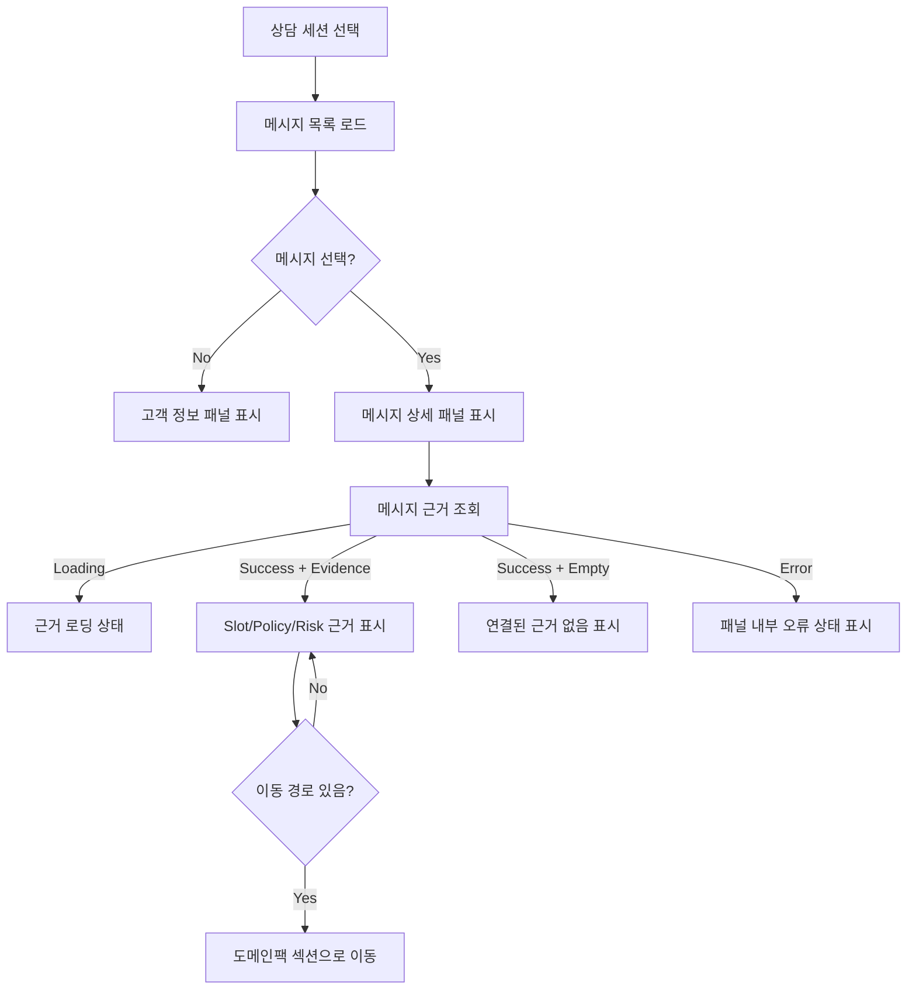

# Frontend FSD Spec: 상담 메시지 상세 도메인팩 근거 연결

## Goal

상담사가 메시지를 선택했을 때 현재 상담 런타임에서 확인된 Slot/Policy/Risk 근거를 메시지 상세 패널에 표시한다.

## User Flow Chart



## Design Diff

| 영역             | As-is                                                                        | To-be                                               | 변경 내용                                              |
| ---------------- | ---------------------------------------------------------------------------- | --------------------------------------------------- | ------------------------------------------------------ |
| 메시지 상세 근거 | `MessageDetailPanel`이 props는 지원하지만 실제 상담 페이지에서 전달하지 않음 | 선택 메시지 기준으로 상담 런타임 근거를 조회해 전달 | `ConsultationPage`가 근거 로딩/성공/실패 상태를 관리   |
| 빈 상태          | props 미전달 또는 빈 배열이 동일하게 빈 근거로 보임                          | 로딩, 실패, 근거 없음 상태를 구분                   | 패널 내부 상태 문구 분리                               |
| 이동             | 근거 항목 클릭 경로 없음                                                     | 가능한 항목은 도메인팩 상세 섹션으로 이동           | pack/version/section 경로가 있는 경우 링크성 버튼 제공 |

## Component Tree

```text
ConsultationPage
├─ QueuePanel
├─ ChatPanel
└─ detailPane
   ├─ MatchedWorkflowBar
   └─ MessageDetailPanel
      ├─ message header
      ├─ evidence loading/error/empty state
      ├─ SlotTagItem
      ├─ PolicyTagItem
      └─ RiskTagItem
```

## API Integration

| Method | Path                                                                                  | Description                                                           |
| ------ | ------------------------------------------------------------------------------------- | --------------------------------------------------------------------- |
| GET    | `/api/v1/consultation/sessions/{sessionId}/messages/{messageId}/domain-pack-elements` | 선택 메시지가 속한 상담 세션의 최신 런타임 Slot/Policy/Risk 근거 조회 |

`frontend/src/features/consultation/api/consultationEvidenceApi.ts`는 generated endpoint가 없는 상담 근거 조회만 `customFetch`로 호출한다. 응답은 `MessageDetailPanel`의 `domainPackElements` props 형태로 정규화한다.

## Data Flow

```text
runtime workflow execution
  ├─ slot_values_json
  ├─ policy_snapshot_json
  └─ risk_snapshot_json
        ↓
ConsultationEvidenceService
        ↓
ConsultationController evidence endpoint
        ↓
consultationEvidenceApi.getMessageDomainPackElements()
        ↓
ConsultationPage selectedMessage evidence state
        ↓
MessageDetailPanel domainPackElements/loading/error
```

## 수정 대상 파일

| 파일                                                                                                    | 변경 유형 | 설명                                                          |
| ------------------------------------------------------------------------------------------------------- | --------- | ------------------------------------------------------------- |
| `backend/src/main/java/com/init/workflowruntime/application/ConsultationEvidenceService.java`           | new       | 메시지 소유권/워크스페이스 권한 검증 후 최신 런타임 근거 조회 |
| `backend/src/main/java/com/init/workflowruntime/application/dto/MessageDomainPackElementsResponse.java` | new       | 메시지 상세 근거 응답 DTO                                     |
| `backend/src/main/java/com/init/workflowruntime/presentation/ConsultationController.java`               | update    | 상담 메시지 근거 조회 endpoint 추가                           |
| `frontend/src/features/consultation/api/consultationEvidenceApi.ts`                                     | new       | OpenAPI 미생성 endpoint 호출 및 패널 props 정규화             |
| `frontend/src/features/consultation/ui/MessageDetailPanel.tsx`                                          | update    | loading/error 상태 및 근거 항목 이동 액션 표시                |
| `frontend/src/pages/consultation/ui/ConsultationPage.tsx`                                               | update    | 선택 메시지별 근거 조회와 패널 전달                           |
| `frontend/src/features/consultation/ui/MessageDetailPanel.test.tsx`                                     | update    | 연결/빈/로딩/실패/이동 상태 테스트                            |
| `frontend/src/pages/consultation/ui/ConsultationPage.test.tsx`                                          | update    | 실제 상담 페이지에서 근거 조회 및 실패 degrade 테스트         |

## State Management

- `ConsultationPage`는 `activeCustomerId`, `selectedMessageId` 조합이 바뀌면 근거 조회 상태를 초기화한다.
- 선택 메시지가 없거나 메시지 목록이 다른 세션으로 전환되면 근거 상태를 비운다.
- 근거 조회 실패는 상담 화면 전체를 깨지 않으며 `MessageDetailPanel` 내부 오류 상태로만 표시한다.

## Tests

| 구분                    | 방법                                                     | 도구                          |
| ----------------------- | -------------------------------------------------------- | ----------------------------- |
| Backend unit/controller | service ownership/authz, controller parameter forwarding | JUnit 5, Mockito, MockMvc     |
| Frontend component      | panel loading/error/empty/evidence/link behavior         | Vitest, React Testing Library |
| Frontend page           | 메시지 선택 시 API 호출 및 실패 degrade                  | Vitest, React Testing Library |

## Acceptance Criteria

- 메시지 선택 시 관련 Slot/Policy/Risk 근거가 있으면 상세 패널에 표시된다.
- 근거가 없는 경우 “연결된 근거 없음” 상태가 명확히 표시된다.
- 근거 조회 로딩 상태와 실패 상태가 빈 상태와 구분된다.
- 근거 조회 실패 시 상담 화면 전체가 깨지지 않는다.
- pack/version/section 경로를 만들 수 있는 근거 항목은 도메인팩 상세 섹션으로 이동할 수 있다.

## Non-goals

- Slot/Policy/Risk 매칭 알고리즘 품질 개선은 다루지 않는다.
- 메시지별 decision log 정밀 매핑 스키마를 새로 설계하지 않는다.
- 상담 우측 컨텍스트 패널의 반응형 구조는 변경하지 않는다.

## Open Questions

- 현재 런타임 데이터 구조에서는 decision log가 개별 `chat_message.id`와 직접 연결되어 있지 않다. 이번 범위는 선택 메시지의 세션 소유권을 검증하고 최신 실행 근거를 표시하는 방식으로 제한한다.
