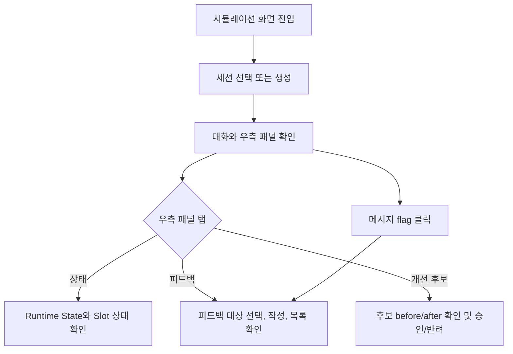

# 시뮬레이션 우측 패널 탭 분리

## Goal

상담 시뮬레이션 화면의 우측 패널을 상태, 피드백, 개선 후보 작업으로 분리해 현재 runtime 확인과 후속 개선 작업을 쉽게 구분할 수 있게 한다.

## Problem

`frontend/src/pages/workspace/ui/WorkspaceSimulationPage.tsx`의 우측 `statePane`은 runtime state, 수집된 slot, 검증 케이스, 피드백 작성 폼, workspace feedback 목록, improvement candidates 목록을 한 흐름에 모두 렌더링한다. 우측 패널이 길어질수록 사용자는 현재 실험 상태, 피드백 작성, 후보 승인/반려 작업을 한 화면에서 구분하기 어렵다.

## Scope

- `frontend/src/pages/workspace/ui/WorkspaceSimulationPage.tsx`
- `frontend/src/pages/workspace/ui/WorkspaceSimulationPage.test.tsx`
- `frontend/src/pages/workspace/ui/simulation/workspace-simulation-page.module.css`
- 기존 검증 케이스 섹션은 상태 탭 하단에 유지하되 저장/replay 동작은 변경하지 않는다.

## Non-Goals

- golden case replay 기능 범위는 변경하지 않는다.
- 시뮬레이션 기반 대시보드 추천 기능은 변경하지 않는다.
- 개선 후보 승인/반려 API 또는 상태 전이 로직은 변경하지 않는다.
- backend API, database schema, generated API client는 변경하지 않는다.

## User Flow Chart



## Design Diff

| 영역           | As-is                                                              | To-be                                                                              | 변경 내용                                   |
| -------------- | ------------------------------------------------------------------ | ---------------------------------------------------------------------------------- | ------------------------------------------- |
| 우측 패널 구조 | 모든 상태와 작업이 세로로 누적됨                                   | 상태, 피드백, 개선 후보 탭으로 분리                                                | 작업 맥락별 정보 밀도를 낮춘다              |
| 상태 영역      | Runtime State, Slot, 검증 케이스, 피드백/후보가 같은 스크롤에 존재 | 상태 탭에 Runtime State와 Slot 상태를 우선 표시하고 검증 케이스 섹션은 하단에 유지 | 현재 실험 상태를 즉시 확인한다              |
| 피드백 영역    | 작성 폼과 workspace feedback 목록이 다른 영역 사이에 묻힘          | 피드백 탭에 대상 선택, 작성 폼, workspace feedback 목록 배치                       | 메시지 flag 이후 작성 지점을 찾기 쉽게 한다 |
| 후보 영역      | 후보 목록과 승인/반려가 피드백 아래에 이어짐                       | 개선 후보 탭에 후보 목록, 승인/반려, before/after 요약 배치                        | 후보 검토 작업을 독립적으로 수행한다        |
| 반응형         | 1180px 이하에서 패널들이 세로로 전환됨                             | 동일 전환 안에서 탭 버튼과 탭 패널이 폭에 맞게 유지됨                              | 좁은 화면에서도 탭 구조가 깨지지 않는다     |

## Component Tree

```text
WorkspaceSimulationPage
├─ Session pane
├─ Chat pane
│  └─ MessageBubble
└─ Simulation side pane
   ├─ Tab list: 상태 / 피드백 / 개선 후보
   ├─ 상태 tab panel
   │  ├─ Runtime State
   │  ├─ Slot panel
   │  └─ Golden case panel
   ├─ 피드백 tab panel
   │  ├─ Feedback form
   │  └─ Workspace feedback list
   └─ 개선 후보 tab panel
      └─ Improvement candidate list and actions
```

## State Management

- 새 클라이언트 상태는 우측 패널의 active tab 값만 추가한다.
- 메시지 flag 버튼을 누르면 기존 피드백 대상 선택 상태를 해당 메시지로 갱신하고 피드백 탭을 활성화한다.
- 기존 세션 선택, 메시지 전송, 피드백 저장, 후보 생성/승인/반려, 검증 케이스 저장/replay 상태는 유지한다.

## API Integration

- 신규 API endpoint는 없다.
- 기존 `simulationApi` 호출 계약과 query parameter 초기화(`feedbackStatus`, `candidateStatus`)는 유지한다.
- generated API 파일은 변경하지 않는다.

## Acceptance Criteria

- 사용자는 우측 패널에서 상태, 피드백, 개선 후보 탭을 명확히 구분할 수 있다.
- 상태 탭에는 runtime state와 slot 상태가 유지된다.
- 피드백 탭에는 피드백 대상 선택, 작성 폼, workspace feedback 목록이 함께 표시된다.
- 개선 후보 탭에는 후보 목록, 승인/반려 액션, before/after/근거 요약이 함께 표시된다.
- 메시지 flag 액션은 피드백 대상을 선택하고 피드백 탭을 활성화한다.
- 1180px 이하 레이아웃에서도 탭 버튼과 탭 패널이 한 열 레이아웃 안에서 유지된다.
- 기존 세션 생성, 메시지 전송, 피드백 저장, 후보 생성/승인/반려 동작이 유지된다.

## Tests

| 구분       | 시나리오          | 기대 결과                                                                    |
| ---------- | ----------------- | ---------------------------------------------------------------------------- |
| Component  | 기본 렌더링       | 상태 탭에서 runtime state와 slot 값을 확인할 수 있다                         |
| Component  | 메시지 flag 클릭  | 피드백 탭이 활성화되고 대상 선택 값이 해당 turn으로 설정된다                 |
| Component  | 개선 후보 탭 선택 | 후보 목록, before/after 요약, 승인/반려 액션이 피드백 폼과 분리되어 표시된다 |
| Regression | 기존 피드백 작성  | 피드백 저장 API payload가 유지된다                                           |
| Regression | 기존 후보 액션    | 후보 생성, 리뷰 요청, 승인, 반려 API 호출이 유지된다                         |

## Validation

- `pnpm --dir frontend test -- WorkspaceSimulationPage.test.tsx --run`
- `pnpm run ci:frontend`

## Open Questions

- 없음.
