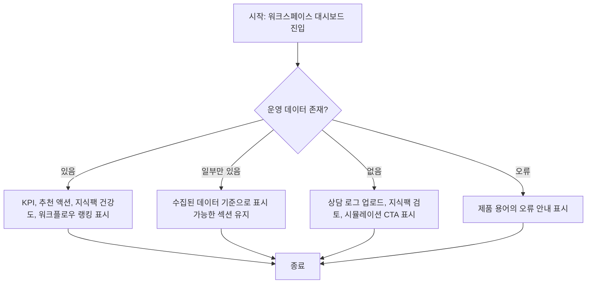

# Frontend FSD Spec: 대시보드 준비 문구와 Placeholder 정리

## Goal

워크스페이스 대시보드에서 구현 준비 상태를 암시하는 문구와 더 이상 의미 없는 placeholder 영역을 제거하고, 운영자가 현재 데이터 조건을 제품 화면의 정상 상태로 이해할 수 있게 한다.

## User Flow Chart



## Design Diff

### As-is vs To-be

| 영역              | As-is                                        | To-be                                                                      | 변경 내용                                  |
| ----------------- | -------------------------------------------- | -------------------------------------------------------------------------- | ------------------------------------------ |
| 대시보드 subtitle | 필터와 배치 구조를 먼저 고정한다는 준비 문구 | 운영자가 상담 처리 흐름, 자동화 커버리지, 지식팩 상태를 확인하는 화면 설명 | 구현 준비 표현 제거                        |
| partial 상태      | 후속 데이터 연결을 기다린다는 표현           | 선택 기간에 수집된 로그 기준으로 표시 가능한 데이터와 미집계 항목을 설명   | 데이터 없음과 미구현을 구분                |
| empty 상태 CTA    | 상담 업로드, 지식팩 생성, 시뮬레이션 시작    | 상담 업로드, 지식팩 검토, 시뮬레이션 시작                                  | 실제 이동 경로와 운영자의 다음 행동을 맞춤 |
| 하단 placeholder  | Metric/Chart/Table `DashboardSlot` 카드 노출 | 실제 데이터 섹션만 노출                                                    | 의미 없는 placeholder 제거                 |

## Component Tree

```
WorkspaceDashboardPage
├─ DashboardFilters
├─ FilterSummary
├─ ActionRecommendationsPanel
├─ DashboardMetricsGrid
├─ AutomationCoveragePanel
├─ KnowledgePackHealthPanel
├─ HotpathWorkflowRankingPanel
└─ DashboardStatePanel
```

## API Integration

### Endpoints

이번 변경은 기존 대시보드 API 호출 방식을 바꾸지 않는다.

| Method | Path                                                                                                    | Description                     |
| ------ | ------------------------------------------------------------------------------------------------------- | ------------------------------- |
| GET    | 확인된 상위 경로: `frontend/src/features/consultation/api/consultationApi.ts`                           | 상담 KPI와 워크플로우 랭킹 조회 |
| GET    | 확인된 상위 경로: `frontend/src/features/workspace-dashboard-health/api/workspaceDashboardHealthApi.ts` | 추천 액션 조회                  |

## Data Flow

기존 `WorkspaceDashboardPage`의 로컬 상태와 API 응답 흐름을 유지한다. `DashboardStatePanel`은 `loading`, `error`, `empty`, `partial` 상태를 그대로 받되, 화면 문구만 운영 데이터 조건 중심으로 정리한다.

## 수정 대상 파일

| 파일                                                                  | 변경 유형 | 설명                                                              |
| --------------------------------------------------------------------- | --------- | ----------------------------------------------------------------- |
| `frontend/src/pages/workspace/ui/WorkspaceDashboardPage.tsx`          | modify    | subtitle, 상태 문구, empty CTA label 정리 및 `DashboardSlot` 제거 |
| `frontend/src/pages/workspace/ui/workspace-dashboard-page.module.css` | modify    | 제거된 slot placeholder 전용 스타일 정리                          |
| `frontend/src/pages/workspace/ui/WorkspaceDashboardPage.test.tsx`     | modify    | 준비 문구와 placeholder가 렌더링되지 않는지 회귀 검증             |

## State Management

- 서버 상태: 기존 `consultationApi.getMetrics`, `consultationApi.getWorkflowRankings`, `fetchWorkspaceDashboardActionRecommendations` 호출을 유지한다.
- 클라이언트 상태: 기존 필터 상태와 `DashboardDataState` 계산을 유지한다.
- 신규 전역 상태나 query key는 추가하지 않는다.

## Tests

### Test Strategy

| 구분                 | 방법                                                                      | 도구                          | 비고                              |
| -------------------- | ------------------------------------------------------------------------- | ----------------------------- | --------------------------------- |
| 컴포넌트 회귀 테스트 | 대시보드 렌더링 결과에서 준비 문구/placeholder 부재와 기존 섹션 유지 확인 | Vitest, React Testing Library | `WorkspaceDashboardPage.test.tsx` |
| 수동 확인            | 화면에서 subtitle, partial/empty copy, CTA label 확인                     | 브라우저                      | 필요한 경우 로컬 Vite 화면 확인   |

### Acceptance Criteria

- 대시보드에 구현 준비 상태를 설명하는 문구가 보이지 않는다.
- 데이터 없음은 기능 미구현이 아니라 선택 기간과 운영 로그 조건으로 설명된다.
- `DashboardSlot` placeholder 카드가 렌더링되지 않는다.
- empty CTA가 상담 업로드, 지식팩 검토, 시뮬레이션 시작 경로와 일치한다.
- 기존 KPI, 자동화 커버리지, 추천 액션, 운영 지식팩 건강도, 핫패스 워크플로우 랭킹 렌더링은 유지된다.

## Non-goals

- 신규 KPI, 차트, 시뮬레이션 기반 추천 추가는 포함하지 않는다.
- API contract, 라우팅 구조, generated API 파일은 변경하지 않는다.
- 대시보드 레이아웃의 전면 재설계는 포함하지 않는다.

## Open Questions

- 없음. issue #633의 범위는 기존 화면에 남은 준비 문구와 placeholder 정리로 충분히 특정되어 있다.
