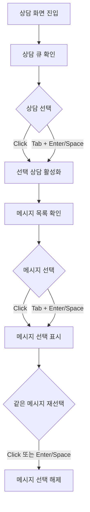

# Frontend FSD Spec: 상담 선택 요소 접근성 개선

## Goal

상담 큐와 채팅 메시지 선택 요소를 네이티브 버튼 기반 인터랙션으로 정리하여 상담사가 키보드와 스크린리더에서 동일하게 선택 상태와 동작을 인지할 수 있게 한다.

## User Flow Chart



## Design Diff

### As-is vs To-be

| 영역               | As-is                               | To-be                           | 변경 내용                                                       |
| ------------------ | ----------------------------------- | ------------------------------- | --------------------------------------------------------------- |
| 상담 큐 항목       | `div role="button"` + 수동 keydown  | 네이티브 `button`               | 기본 버튼 semantics와 Enter/Space 동작 사용                     |
| 상담 큐 선택 상태  | `aria-current`를 custom role에 부여 | `button`에 `aria-current` 유지  | 현재 선택 상담이 스크린리더에 전달되도록 유지                   |
| 메시지 선택        | `div role="button"` + 수동 keydown  | 메시지 본문 선택 `button`       | 메시지 선택 동작을 사용자 관점 role/name으로 검증 가능하게 변경 |
| 메시지 선택 상태   | `aria-pressed`를 custom role에 부여 | 선택 버튼에 `aria-pressed` 유지 | 선택/해제 가능한 toggle 의미 유지                               |
| 실패 메시지 재전송 | 선택 그룹 내부 재전송 버튼          | 선택 버튼과 재전송 버튼 분리    | 네이티브 버튼 중첩을 피하고 재전송 액션 독립성 유지             |

## Component Tree

```text
ConsultationPage
├─ QueuePanel
│  ├─ 검색 input
│  ├─ 필터 button group
│  ├─ 정렬 button group
│  └─ 상담 큐 button list
└─ ChatPanel
   ├─ 메시지 목록
   │  ├─ 시스템/내부 메모 표시
   │  └─ 선택 가능한 메시지 button
   └─ 메시지 입력 영역
```

## API Integration

API 계약 변경은 없다. `frontend/src/features/consultation/ui/QueuePanel.tsx`와 `frontend/src/features/consultation/ui/ChatPanel.tsx`의 DOM semantics 및 접근성 속성만 변경한다.

## Data Flow

```text
QueuePanel
└─ button 선택 -> onSelectCustomer(customerId)

ChatPanel
└─ message button 선택 -> onSelectMessage(messageId | null)
```

## 수정 대상 파일

| 파일                                                           | 변경 유형 | 설명                                                                |
| -------------------------------------------------------------- | --------- | ------------------------------------------------------------------- |
| `frontend/src/features/consultation/ui/QueuePanel.tsx`         | modify    | 큐 아이템을 네이티브 버튼으로 전환                                  |
| `frontend/src/features/consultation/ui/queue-panel.module.css` | modify    | 버튼 기본 스타일 제거 및 기존 행 레이아웃 유지                      |
| `frontend/src/features/consultation/ui/ChatPanel.tsx`          | modify    | 메시지 선택 요소를 네이티브 버튼으로 전환하고 재전송 버튼 중첩 제거 |
| `frontend/src/features/consultation/ui/chat-panel.module.css`  | modify    | 메시지 선택 버튼/그룹 레이아웃 유지                                 |
| `frontend/src/features/consultation/ui/QueuePanel.test.tsx`    | modify    | role/name 기반 큐 선택 테스트로 변경                                |
| `frontend/src/features/consultation/ui/ChatPanel.test.tsx`     | modify    | role/name 및 `aria-pressed` 기반 메시지 선택 테스트로 변경          |
| `frontend/src/pages/consultation/ui/ConsultationPage.test.tsx`  | modify    | 페이지 통합 테스트의 큐/메시지 선택 쿼리를 role/name 기반으로 변경 |
| `frontend/src/pages/consultation/ui/ConsultationPage.generated-api.test.tsx` | modify | generated API 통합 테스트의 큐 선택 쿼리를 role/name 기반으로 변경 |
| `frontend/src/pages/consultation/ui/sections/Queue.tsx`         | modify    | section queue 항목을 네이티브 버튼으로 전환                         |
| `frontend/src/pages/consultation/ui/sections/consultation-sections.test.tsx` | modify | section queue 키보드 테스트를 네이티브 버튼 동작 기준으로 변경 |
| `frontend/e2e/consultation.spec.ts`                             | modify    | 상담 큐 E2E selector를 네이티브 button role 기준으로 변경           |

## State Management

새 상태는 추가하지 않는다. 기존 `activeCustomerId`, `selectedMessageId`, `onSelectCustomer`, `onSelectMessage` 계약을 유지한다.

## Tests

### Test Strategy

| 구분            | 방법                       | 도구                           | 비고                                   |
| --------------- | -------------------------- | ------------------------------ | -------------------------------------- |
| 컴포넌트 테스트 | 사용자 관점 role/name 쿼리 | Vitest + React Testing Library | `closest('[role="button"]')` 의존 제거 |
| 키보드 테스트   | focus 후 Enter/Space 입력  | `@testing-library/user-event`  | 네이티브 버튼 동작 검증                |

### Test Scenarios

| #   | 시나리오                       | 기대 결과                                            |
| --- | ------------------------------ | ---------------------------------------------------- |
| 1   | 큐 아이템 클릭                 | `onSelectCustomer(customerId)` 호출                  |
| 2   | 큐 아이템 focus 후 Enter/Space | `onSelectCustomer(customerId)` 호출                  |
| 3   | active 큐 아이템               | `aria-current="true"` 표현                           |
| 4   | 메시지 클릭 또는 Enter/Space   | `onSelectMessage(messageId)` 호출                    |
| 5   | 선택된 메시지 재선택           | `onSelectMessage(null)` 호출                         |
| 6   | 실패 메시지 재전송 버튼 클릭   | `onRetryMessage(messageId)` 호출, 메시지 선택 미발생 |

## Non-goals

- 상담 큐 정렬/필터 로직은 변경하지 않는다.
- 메시지 순서 race condition은 #557 범위로 유지한다.
- API 응답, WebSocket 동기화, 채팅 전송 로직은 변경하지 않는다.

## Open Questions

- 없음. 이 이슈 범위에서는 semantic button 패턴으로 요구사항을 충족한다.
