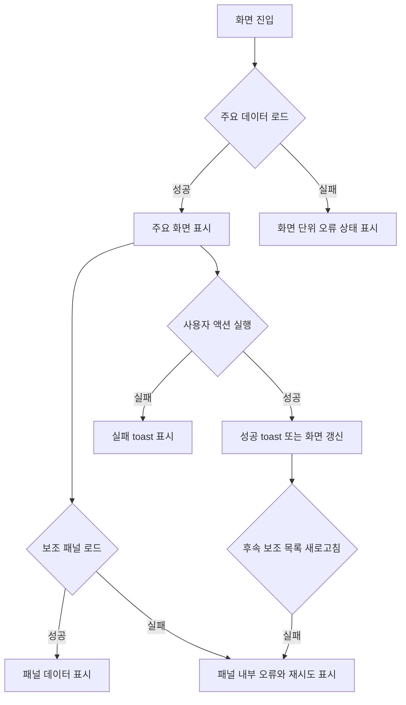

# Frontend FSD Spec: 보조 데이터 오류 표시와 toast 정책 정리

## Goal

대시보드와 시뮬레이션 화면에서 보조 데이터 로드 실패는 패널 내부 오류로 안내하고, 사용자가 직접 실행한 중요한 액션 실패만 toast로 즉시 알린다.

---

## User Flow Chart



---

## Design Diff

### As-is vs To-be

| 영역                       | As-is                                                                  | To-be                             | 변경 내용                                                     |
| -------------------------- | ---------------------------------------------------------------------- | --------------------------------- | ------------------------------------------------------------- |
| 대시보드 보조 패널         | 추천 액션/워크플로우 랭킹 로드 실패 시 패널 오류와 toast가 함께 노출됨 | 패널 내부 오류 상태만 노출        | 보조 패널 실패로 여러 toast가 연속 표시되지 않도록 정리       |
| 대시보드 전체 실패         | 모든 대시보드 요청 실패 시 화면 하단의 오류 상태가 표시됨              | 화면 단위 오류 상태로 유지        | passive load 실패는 toast 없이 화면 상태로 표현               |
| 시뮬레이션 보조 목록       | 피드백/개선 후보/검증 케이스 목록 로드 실패가 toast로 표시됨           | 각 목록 영역에 오류와 재시도 제공 | 보조 목록 실패를 작업 흐름을 가로막지 않는 panel error로 전환 |
| 사용자 액션 실패           | 세션 생성, 메시지 전송, 저장, 승인, 반려, replay 실패가 toast로 표시됨 | 유지                              | 사용자가 방금 실행한 action 실패는 즉시 인지 가능해야 함      |
| 액션 후 후속 새로고침 실패 | primary action 성공 뒤 보조 목록 새로고침 실패도 toast로 표시됨        | 관련 패널 오류로 표시             | 성공 toast와 보조 오류 toast가 연속되는 상황을 줄임           |

---

## Component Tree

```text
WorkspaceDashboardPage
├─ DashboardFilters
├─ ActionRecommendationsPanel
│  └─ ErrorState
├─ DashboardMetricsGrid
├─ AutomationCoveragePanel
├─ KnowledgePackHealthPanel
├─ HotpathWorkflowRankingPanel
│  └─ ErrorState
└─ DashboardStatePanel

WorkspaceSimulationPage
├─ sessionPane
├─ chatPane
└─ statePane
   ├─ Runtime State
   │  └─ GoldenCasePanel
   │     └─ ErrorState(onRetry)
   ├─ FeedbackPanel
   │  └─ FeedbackListPanel
   │     └─ ErrorState(onRetry)
   └─ CandidatesPanel
      └─ ErrorState(onRetry)
```

---

## API Integration

### Endpoints

| Method         | Path                                                                                          | Description                                                  |
| -------------- | --------------------------------------------------------------------------------------------- | ------------------------------------------------------------ |
| GET            | 확인됨: `frontend/src/features/consultation/api/consultationApi.ts`                           | 대시보드 지표와 워크플로우 랭킹 조회                         |
| GET            | 확인됨: `frontend/src/features/workspace-dashboard-health/api/workspaceDashboardHealthApi.ts` | 대시보드 추천 액션 조회                                      |
| GET/POST/PATCH | 확인됨: `frontend/src/features/simulation/api/simulationApi.ts`                               | 시뮬레이션 세션, 피드백, 개선 후보, 검증 케이스 조회 및 액션 |

### Error Policy

| 오류 유형                                     | 표시 정책                                       |
| --------------------------------------------- | ----------------------------------------------- |
| fatal screen load failure                     | 화면 단위 `ErrorState` 또는 기존 전체 오류 상태 |
| secondary panel load failure                  | 해당 패널 내부 `ErrorState`와 `다시 시도`       |
| user-triggered primary action failure         | `toast.error` 유지                              |
| user-triggered action success                 | 기존 `toast.success` 유지                       |
| action success 이후 secondary refresh failure | 관련 패널 내부 `ErrorState`                     |

---

## Data Flow

```text
Page load
  -> passive data request
  -> success: panel data state
  -> failure: panel error state, no toast

User action
  -> mutation/request
  -> success: success toast where already expected
  -> failure: error toast
  -> secondary refresh failure: panel error state
```

---

## 수정 대상 파일

| 파일                                                                              | 변경 유형 | 설명                                                                      |
| --------------------------------------------------------------------------------- | --------- | ------------------------------------------------------------------------- |
| `frontend/src/pages/workspace/ui/WorkspaceDashboardPage.tsx`                      | modify    | passive dashboard load failure toast 제거, 기존 패널 오류 상태 유지       |
| `frontend/src/pages/workspace/ui/WorkspaceDashboardPage.test.tsx`                 | modify    | 보조/전체 load failure가 toast를 발생시키지 않는지 검증                   |
| `frontend/src/pages/workspace/ui/WorkspaceSimulationPage.tsx`                     | modify    | 피드백/개선 후보/검증 케이스 목록 오류 상태와 재시도 추가                 |
| `frontend/src/pages/workspace/ui/WorkspaceSimulationPage.test.tsx`                | modify    | 보조 목록 실패가 패널 오류로 표시되고 action 실패 toast는 유지되는지 검증 |
| `frontend/src/pages/workspace/ui/simulation/workspace-simulation-page.module.css` | modify    | 보조 패널 오류 상태 레이아웃 추가                                         |

---

## State Management

### Local UI State

- `feedbackError`, `candidateError`, `goldenCaseError`를 시뮬레이션 페이지 내부 상태로 관리한다.
- passive load 성공 시 해당 오류 상태를 해제한다.
- passive load 실패 시 목록을 비우고 관련 오류 상태를 설정한다.
- 재시도 버튼은 기존 list API를 다시 호출한다.

---

## Tests

### Test Strategy

| 구분        | 방법                       | 도구                    | 비고                               |
| ----------- | -------------------------- | ----------------------- | ---------------------------------- |
| 통합 테스트 | 페이지 렌더링 + mocked API | Vitest, Testing Library | 대시보드/시뮬레이션 오류 정책 검증 |
| 수동 확인   | 필요 시 브라우저 확인      | Vite dev server         | 이번 범위는 상태 전환 테스트 중심  |

### Test Scenarios

#### Error & Edge Cases

| #   | 시나리오                                                        | 기대 결과                                                              |
| --- | --------------------------------------------------------------- | ---------------------------------------------------------------------- |
| 1   | 대시보드 passive load 요청들이 실패                             | 패널/화면 오류가 표시되고 toast는 호출되지 않음                        |
| 2   | 시뮬레이션 피드백 목록 로드 실패                                | 피드백 패널에 오류와 재시도 버튼이 표시되고 toast는 호출되지 않음      |
| 3   | 시뮬레이션 개선 후보 목록 로드 실패                             | 개선 후보 패널에 오류와 재시도 버튼이 표시되고 toast는 호출되지 않음   |
| 4   | 시뮬레이션 검증 케이스 목록 로드 실패                           | 검증 케이스 패널에 오류와 재시도 버튼이 표시되고 toast는 호출되지 않음 |
| 5   | 세션 생성/메시지 전송/피드백 저장/후보 승인 등 사용자 액션 실패 | 기존 실패 toast 유지                                                   |
| 6   | 액션 성공 후 보조 목록 새로고침 실패                            | 성공 toast는 유지되고 보조 오류는 패널 내부에 표시                     |

### 반응형 & 접근성

| #   | 확인 항목       | 기대 결과                                               |
| --- | --------------- | ------------------------------------------------------- |
| 1   | 키보드 탐색     | 패널 내부 `다시 시도` 버튼이 포커스 가능                |
| 2   | 스크린 리더     | `ErrorState` 메시지와 버튼 텍스트가 읽힘                |
| 3   | 모바일 레이아웃 | 기존 단일 컬럼 전환에서 오류 상태가 목록 영역 안에 유지 |

---

## Non-goals

- API 에러 메시지 표준화 전체 개편은 하지 않는다.
- 백엔드 에러 코드 체계는 변경하지 않는다.
- 모든 화면의 toast 정책을 전역 유틸리티로 추상화하지 않는다.
- generated API 파일은 직접 수정하지 않는다.

---

## Open Questions

- 다른 workspace 하위 화면에도 동일 정책을 확장할지는 후속 이슈에서 판단한다.
