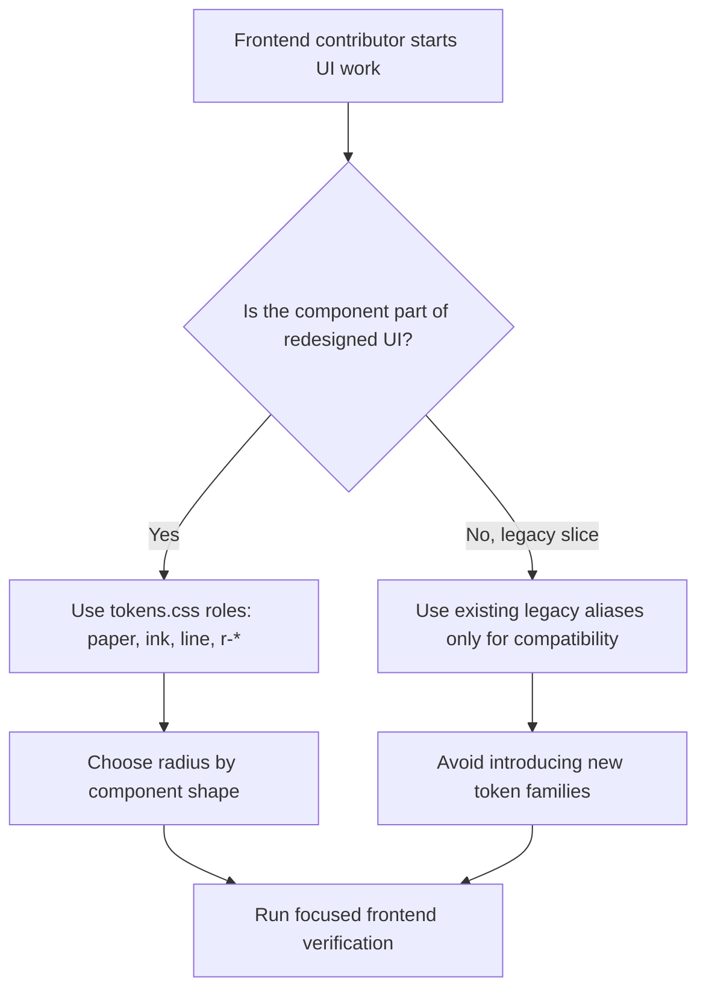

# Frontend FSD Spec: 디자인 토큰과 radius 기준 정리

## Goal

프론트엔드 리뉴얼 이후 함께 남아 있는 legacy token과 Ostone redesign token의 역할을 분리하고, 신규 UI가 사용할 색상, typography, radius 기준을 명확히 한다.

## Issue Summary

GitHub Issue #638은 `frontend/src/app/index.css`의 legacy 변수(`--text-primary`, `--bg-color`, `--radius-card`, `--radius-xl` 등)와 `frontend/src/shared/ui/ostone/tokens.css`의 redesign 변수(`--paper`, `--ink`, `--r-1`~`--r-3`, `--r-pill` 등)가 혼재되어 화면별 색상, 간격, radius, typography 기준이 달라질 위험을 다룬다.

## User Flow Chart



## Design Diff

| 영역 | As-is | To-be | 변경 내용 |
| --- | --- | --- | --- |
| Token source | `index.css` legacy token과 `tokens.css` redesign token이 병렬로 존재 | `tokens.css`를 redesign source of truth로 명시 | legacy app token은 compatibility alias로 남긴다 |
| Radius 기준 | `--radius-card: 12px`, `--radius-xl`, `--r-1`~`--r-3`, hardcoded `12px`가 혼재 | card/panel/input은 `--r-3`, compact control은 `--r-2`, pill은 `--r-pill` 기준 | 문서와 일부 안전한 CSS 치환으로 기준을 고정한다 |
| Hardcoded 색상/radius | 일부 공유 UI와 페이지 섹션에 raw `rgba(...)`, `12px`, `999px` 사용 | 토큰 역할이 명확한 항목부터 치환 | 광범위한 전면 교체는 후속 audit 대상으로 남긴다 |
| 신규 컴포넌트 판단 기준 | 어느 token family를 써야 하는지 파일마다 다름 | `frontend/src/shared/ui/ostone/TOKENS.md`에서 역할과 사용 범위를 확인 | 신규 Ostone UI는 redesign token을 우선 사용한다 |

## Component Tree

이번 작업은 신규 화면이나 컴포넌트를 추가하지 않는다. 영향을 받는 frontend shared/style surface는 다음과 같다.

```text
frontend/src/app/index.css
└─ legacy app alias tokens

frontend/src/shared/ui/ostone/
├─ tokens.css
└─ TOKENS.md

frontend/src/shared/ui/
├─ button/button.module.css
└─ input/input.module.css

frontend/src/pages/consultation/ui/sections/
└─ MatchedWorkflowBar.module.css
```

## API Integration

API 변경은 없다. Orval generated API, query key, backend contract, 데이터 모델에는 영향이 없다.

## Data Flow

상태 관리나 서버 데이터 흐름 변경은 없다. 변경 범위는 CSS token resolution과 문서화에 한정한다.

```text
tokens.css
  ↓ import
index.css legacy aliases
  ↓ cascade
existing CSS modules and inline styles
```

## 수정 대상 파일

| 파일 | 변경 유형 | 설명 |
| --- | --- | --- |
| `frontend/src/shared/ui/ostone/tokens.css` | modify | redesign token source of truth와 radius scale 역할을 명시 |
| `frontend/src/app/index.css` | modify | legacy token을 redesign token compatibility alias로 연결 |
| `frontend/src/shared/ui/ostone/TOKENS.md` | new | 신규 UI token 선택 기준, radius baseline, phased audit 기준 문서화 |
| `frontend/src/shared/ui/button/button.module.css` | modify | shared button 색상/radius 중 token 대체 가능한 항목 치환 |
| `frontend/src/shared/ui/input/input.module.css` | modify | shared input background/border/focus/radius를 token 기준으로 정리 |
| `frontend/src/pages/consultation/ui/sections/MatchedWorkflowBar.module.css` | modify | hardcoded card/panel radius를 `--r-3`로 정리 |

## State Management

클라이언트 상태, 서버 상태, URL 상태 변경은 없다.

## Acceptance Criteria

- 새 UI에서 사용할 색상, radius, typography token 기준이 `frontend/src/shared/ui/ostone/TOKENS.md`에 명확히 기록된다.
- legacy token을 유지하는 이유와 사용 범위가 문서화된다.
- `frontend/src/app/index.css`의 legacy color/radius token은 가능한 범위에서 `frontend/src/shared/ui/ostone/tokens.css`의 redesign token을 참조한다.
- card/panel/input/pill radius 기준이 문서와 구현에서 같은 token 이름으로 판단 가능하다.
- hardcoded radius와 raw color의 전면 교체는 제외하고, 우선순위가 있는 phased audit 기준을 남긴다.
- API, 라우팅, FSD import boundary 변경이 없어야 한다.

## Non-goals

- 대규모 시각 리디자인은 하지 않는다.
- 모든 CSS 파일의 raw `rgba(...)`와 hardcoded radius를 한 번에 제거하지 않는다.
- 개별 화면 UX 구조나 정보 설계는 변경하지 않는다.
- backend, ML pipeline, database schema, generated API 파일은 변경하지 않는다.

## Validation

검증은 frontend 범위에서 수행한다.

| 검증 | 목적 |
| --- | --- |
| `pnpm --dir frontend lint` | FSD import boundary, manual API audit, ESLint 확인 |
| `pnpm --dir frontend build` | CSS token 변경이 production build를 깨지 않는지 확인 |

시각 회귀는 변경 범위가 CSS token과 radius baseline이므로, PR 리뷰에서 shared button/input과 consultation matched workflow bar를 우선 확인한다.

## Open Questions

- 기존 legacy slice 전체를 redesign token으로 완전히 전환할 시점과 범위는 별도 이슈에서 결정한다.
- raw alpha shadow와 overlay 값을 token화할지, 컴포넌트별 표현값으로 남길지는 후속 audit에서 판단한다.
