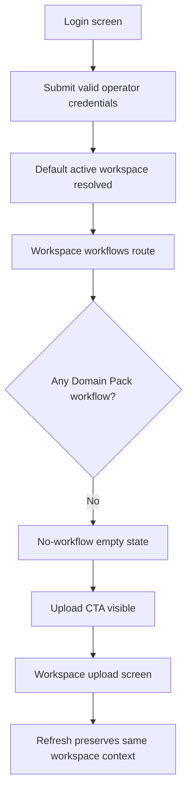

# Frontend E2E Spec: Domain Pack 없는 워크스페이스 업로드 시작

## Goal

운영자가 기존 계정으로 로그인했을 때 Domain Pack이 없는 기본 워크스페이스에 진입하고, 이전 계정의 데이터 없이 상담 로그 업로드를 시작할 수 있음을 E2E로 보장한다.

## Issue Summary

GitHub Issue #691은 운영자가 하나 이상의 워크스페이스에 속해 있고 기본 워크스페이스에 운영 중인 Domain Pack이 없을 때, 로그인 직후 접근 가능한 워크스페이스 컨텍스트와 업로드 시작 행동이 명확해야 한다는 Critical E2E 시나리오를 다룬다.

현재 코드 기준 기본 로그인 목적지는 `frontend/src/features/auth/model/resolveDefaultPostLoginDestination.test.ts`에서 확인되는 `/workspaces/{id}/workflows`다. 따라서 이 작업은 초기 진입 정책을 업로드 화면으로 바꾸지 않고, 로그인 후 워크플로우 빈 상태에서 업로드로 이어지는 CTA와 E2E 검증을 추가한다.

## User Flow Chart



## Design Diff

| 영역                | As-is                                                               | To-be                                                                                                 | 변경 내용                                                    |
| ------------------- | ------------------------------------------------------------------- | ----------------------------------------------------------------------------------------------------- | ------------------------------------------------------------ |
| Login E2E           | 로그인 성공 후 워크스페이스 워크플로우 진입만 확인                  | Domain Pack 없는 워크스페이스의 빈 상태, 업로드 CTA, 새로고침 컨텍스트 유지까지 확인                  | Critical 사용자 시나리오를 독립 mocked E2E로 고정            |
| 워크플로우 빈 상태  | 도메인팩 관리 이동 CTA만 제공                                       | 상담 로그 업로드 CTA를 함께 제공                                                                      | Domain Pack이 없는 신규 워크스페이스의 다음 행동을 명확히 함 |
| Workspace isolation | 기존 로그인 E2E에서 이전 workspace 데이터 부재를 직접 검증하지 않음 | 테스트 fixture에 이전 계정처럼 보이는 workspace/domain pack 데이터를 넣고 화면에 노출되지 않음을 검증 | 테스트 간 상태 공유와 이전 계정 데이터 회귀를 방지           |

## Component Tree

```text
frontend/e2e/auth-login.spec.ts
└─ Login screen E2E scenario

frontend/src/pages/workspace/ui/WorkspaceWorkflowsPage.tsx
└─ Empty workflow state
   ├─ EmptyState
   ├─ 상담 로그 업로드 CTA
   └─ 도메인팩 관리 CTA

frontend/src/pages/upload/ui/WorkspaceUploadPage.tsx
└─ LogUploadForm
```

## API Integration

테스트는 Playwright route mock을 사용한다.

| Method | Path                                            | 목적                                            |
| ------ | ----------------------------------------------- | ----------------------------------------------- |
| `POST` | `/api/v1/auth/login`                            | 기존 운영자 로그인 성공                         |
| `GET`  | `/api/v1/workspaces`                            | 접근 가능한 기본 workspace 목록 조회            |
| `GET`  | `/api/v1/workspaces/{workspaceId}`              | shell/topbar workspace 이름 조회                |
| `GET`  | `/api/v1/workspaces/{workspaceId}/domain-packs` | 기본 workspace가 Domain Pack 없는 상태임을 응답 |
| `GET`  | `/api/v1/workspaces/{workspaceId}/subscription` | 업로드 화면 entitlement 조회                    |

## 수정 대상 파일

| 파일                                                                  | 변경 유형 | 설명                                                                  |
| --------------------------------------------------------------------- | --------- | --------------------------------------------------------------------- |
| `.agent/specs/691.md`                                                 | new       | Issue #691 요구사항과 검증 기준 기록                                  |
| `frontend/src/pages/workspace/ui/WorkspaceWorkflowsPage.tsx`          | modify    | Domain Pack 없는 워크플로우 빈 상태에서 상담 로그 업로드 CTA 제공     |
| `frontend/src/pages/workspace/ui/workspace-workflows-page.module.css` | modify    | 빈 상태 CTA 그룹 레이아웃 조정                                        |
| `frontend/src/pages/workspace/ui/WorkspaceWorkflowsPage.test.tsx`     | modify    | 빈 상태 CTA 목적지 검증                                               |
| `frontend/e2e/auth-login.spec.ts`                                     | modify    | 로그인부터 업로드 화면 및 refresh 컨텍스트 유지까지 Critical E2E 추가 |

## State Management

- 서버 상태는 기존 TanStack Query 흐름을 유지한다.
- 로그인 세션은 기존 `localStorage` 저장 정책을 그대로 사용한다.
- E2E는 각 테스트 안에서 API mock과 browser storage를 격리하여 다른 테스트 상태에 의존하지 않는다.
- 새로고침 후에도 같은 workspace URL과 workspace marker가 유지되는지 화면 기준으로 검증한다.

## Acceptance Criteria

- 운영자가 로그인하면 기본 active workspace의 `/workspaces/{id}/workflows`로 진입한다.
- Domain Pack이 없는 기본 workspace에서는 workspace 이름이 shell에 표시된다.
- 이전 계정 또는 다른 workspace처럼 보이는 이름과 Domain Pack 데이터가 화면에 표시되지 않는다.
- 워크플로우 빈 상태에서 상담 로그 업로드 CTA가 보이고 `/workspaces/{id}/upload`로 이동한다.
- 업로드 화면에서 `상담 로그 업로드` 제목과 업로드 UI가 보인다.
- 업로드 화면을 새로고침해도 같은 workspace context가 유지된다.
- E2E는 mocked API만 사용하며 단독 실행해도 필요한 auth/workspace/domain-pack/subscription 상태를 자체 구성한다.

## Non-goals

- 로그인 후 기본 목적지를 업로드 화면으로 변경하지 않는다.
- backend API contract, OpenAPI generated file, database schema는 변경하지 않는다.
- 실제 파일 업로드 성공 플로우는 기존 업로드 E2E와 단위 테스트 범위로 두고, 이 시나리오에서는 업로드 시작 가능성까지만 검증한다.
- live E2E나 운영 백엔드 데이터 의존 테스트를 추가하지 않는다.

## Validation

| 검증                                                                                                                                                              | 목적                                                      |
| ----------------------------------------------------------------------------------------------------------------------------------------------------------------- | --------------------------------------------------------- |
| `pnpm --dir frontend test -- src/pages/workspace/ui/WorkspaceWorkflowsPage.test.tsx --run`                                                                        | 빈 상태 CTA 단위 검증                                     |
| `pnpm --dir frontend e2e -- auth-login.spec.ts`                                                                                                                   | 로그인 후 no-pack workspace 업로드 시작 Critical E2E 검증 |
| `pnpm --dir frontend exec eslint e2e/auth-login.spec.ts src/pages/workspace/ui/WorkspaceWorkflowsPage.tsx src/pages/workspace/ui/WorkspaceWorkflowsPage.test.tsx` | 변경된 TypeScript 파일 ESLint 확인                        |

## Open Questions

- 없음.
