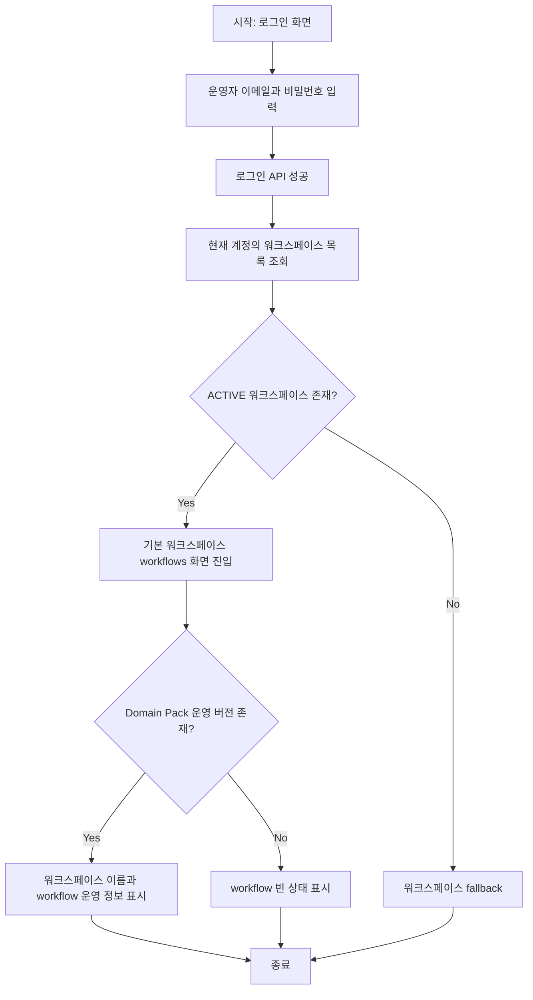

# Frontend E2E Spec: Domain Pack 보유 워크스페이스 로그인 운영 진입

## Goal

운영자가 active 또는 published Domain Pack이 있는 워크스페이스에 로그인하면 현재 계정의 워크스페이스 운영 화면으로 진입하고, 빈 업로드 시작 화면이나 이전 계정의 워크스페이스 정보가 보이지 않음을 E2E로 검증한다.

---

## User Flow Chart



---

## Design Diff

### As-is vs To-be

| 영역 | As-is | To-be | 변경 내용 |
|------|-------|-------|----------|
| 로그인 E2E | 로그인 성공 후 workspace workflows 진입과 세션 저장만 검증 | active/published Domain Pack이 있는 workspace의 운영 시작 화면까지 검증 | 현재 workspace 이름, Domain Pack 기반 workflow 정보, stale workspace 미노출, upload 화면 미진입을 함께 확인 |
| API fixture | 로그인 테스트가 빈 Domain Pack 목록만 고정 | Domain Pack 목록, 상세, version workflow 목록을 현재 화면 분기와 맞춰 구성 | 하드코딩된 단일 문구보다 화면이 실제로 호출하는 API 흐름을 검증 |
| 사용자 기대 | 다음 업무 이동 가능 여부가 단위/기존 E2E에 흩어짐 | workflow 화면의 dashboard/domain pack 내비게이션과 workflow 상세 진입 액션이 로그인 플로우에서 확인됨 | 운영 시작 화면으로서의 진입 안정성을 E2E로 보강 |

---

## Component Tree

```text
LoginPage
└─ LoginForm
   └─ resolveDefaultPostLoginDestination
      └─ listWorkspaces

WorkspaceLayout
├─ OstoneShell
│  ├─ WorkspaceMarker
│  ├─ Sidebar
│  └─ Topbar
└─ WorkspaceWorkflowsPage
   └─ WorkflowListView
      └─ WorkflowRow
```

---

## API Integration

### Endpoints

| Method | Path | Description |
|--------|------|-------------|
| POST | `/api/v1/auth/login` | 운영자 로그인 |
| GET | `/api/v1/workspaces` | 로그인 후 기본 워크스페이스 결정 및 shell workspace marker 조회 |
| GET | `/api/v1/workspaces/{workspaceId}` | WorkspaceLayout 현재 워크스페이스 조회 |
| GET | `/api/v1/workspaces/{workspaceId}/domain-packs` | workspace workflow 목록 구성을 위한 Domain Pack 목록 조회 |
| GET | `/api/v1/workspaces/{workspaceId}/domain-packs/{packId}` | 운영 버전 확인을 위한 Domain Pack 상세 조회 |
| GET | `/api/v1/workspaces/{workspaceId}/domain-packs/{packId}/versions/{versionId}/workflows` | 운영 시작 화면 workflow 목록 조회 |

### Query Key Pattern

기존 generated endpoint와 query key를 그대로 사용한다.

- `frontend/src/features/auth/model/resolveDefaultPostLoginDestination.ts`
- `frontend/src/entities/workflow/api/useListAllWorkspaceWorkflows.ts`
- `frontend/src/shared/api/generated/endpoints/workspace-controller/workspace-controller.ts`
- `frontend/src/shared/api/generated/endpoints/domain-pack-controller/domain-pack-controller.ts`
- `frontend/src/shared/api/generated/endpoints/workflow-definition-controller/workflow-definition-controller.ts`

---

## Data Flow

```text
LoginForm submit
  -> loginApi
  -> saveAuthSession
  -> resolveDefaultPostLoginDestination
  -> listWorkspaces
  -> navigate /workspaces/{workspaceId}/workflows
  -> WorkspaceLayout fetches workspace
  -> WorkspaceWorkflowsPage
       -> listDomainPacks
       -> getDomainPack
       -> listWorkflows
  -> WorkflowListView renders pack/workflow operating data
```

---

## 수정 대상 파일

| 파일 | 변경 유형 | 설명 |
|------|----------|------|
| `.agent/specs/692.md` | new | 이슈 692 요구사항과 검증 기준 문서화 |
| `frontend/e2e/auth-login.spec.ts` | update | Domain Pack 보유 workspace 로그인 운영 진입 E2E 추가 |

---

## State Management

- 새 클라이언트 상태는 추가하지 않는다.
- 로그인 성공 후 `saveAuthSession`이 localStorage의 auth session을 현재 계정 정보로 갱신한다.
- E2E는 이전 계정 흔적을 localStorage에 사전 주입한 뒤 현재 계정 로그인 결과로 덮어쓰이고, 화면에는 현재 workspace만 노출되는지 확인한다.

---

## Tests

### Test Strategy

| 구분 | 방법 | 도구 | 비고 |
|------|------|------|------|
| E2E 테스트 | 로그인 폼 조작 + API route mocking | Playwright | 핵심 사용자 시나리오 |
| 로컬 검증 | auth-login spec 단독 실행 | `pnpm e2e auth-login.spec.ts` | preview mock 환경 |

### Test Environment & 사전 조건

| 항목 | 값 |
|------|---|
| 환경 | `frontend/playwright.config.ts` preview mock 환경 |
| API Mock | Playwright `page.route("**/api/v1/**")` |
| 사전 조건 | 현재 계정에 ACTIVE workspace가 있고 해당 workspace에 PUBLISHED version workflow가 있는 Domain Pack이 존재 |

### Test Scenarios

#### Happy Path

| # | 시나리오 | 사전 조건 | 조작 | 기대 결과 |
|---|---------|---------|------|----------|
| 1 | Domain Pack 보유 workspace 로그인 | 현재 계정 workspace에 active/published Domain Pack과 workflow 존재 | 로그인 화면에서 이메일/비밀번호 입력 후 시스템 로그인 | `/workspaces/1/workflows` 진입, 현재 workspace 이름과 Domain Pack 기반 workflow 표시 |
| 2 | 운영 다음 업무 이동 가능성 | workflows 화면 진입 완료 | 화면의 주요 navigation과 workflow row action 확인 | dashboard/domain pack 이동 링크와 workflow 상세 진입 액션이 현재 workspace 기준으로 표시 |

#### Error & Edge Cases

| # | 시나리오 | 조작 | 기대 결과 |
|---|---------|------|----------|
| 1 | 이전 계정 흔적 존재 | 로그인 전 localStorage에 이전 사용자 session 값 주입 | 로그인 후 이전 workspace 이름과 `/workspaces/999` URL이 보이지 않음 |
| 2 | upload start 오진입 방지 | Domain Pack fixture가 active/published 상태 | 로그인 후 상담 로그 업로드 heading과 `/upload` URL이 보이지 않음 |

#### 반응형 & 접근성

| # | 확인 항목 | 기대 결과 |
|---|---------|----------|
| 1 | 접근 가능한 로그인 입력 | `이메일 주소`, `비밀번호`, `시스템 로그인` label/role로 조작 가능 |
| 2 | 운영 화면 heading | `워크플로우` heading이 role 기반으로 조회 가능 |
| 3 | workspace marker | 현재 workspace 이름이 shell marker에 표시 |

---

## Non-goals

- 로그인 후 기본 진입 화면 정책 자체를 변경하지 않는다. 현재 코드에서 기본 운영 시작 화면은 `/workspaces/{id}/workflows`이다.
- 실제 운영 백엔드를 호출하는 live E2E를 추가하지 않는다.
- Domain Pack 생성, publish, activate 절차를 이 테스트에서 수행하지 않는다.
- OpenAPI generated 파일은 직접 수정하지 않는다.

---

## Acceptance Criteria

- `.agent/specs/692.md` 파일명이 이슈 번호만 포함한다.
- `frontend/e2e/auth-login.spec.ts`에 Domain Pack 보유 workspace 로그인 시나리오가 추가된다.
- 테스트는 로그인 후 현재 workspace 이름과 Domain Pack 기반 workflow 정보를 확인한다.
- 테스트는 빈 업로드 시작 화면으로 보내지지 않았음을 URL과 heading으로 확인한다.
- 테스트는 이전 계정 workspace 이름 또는 `/workspaces/999` URL이 노출되지 않음을 확인한다.
- 테스트는 unmocked API가 발생하면 실패하도록 구성한다.

---

## Open Questions

- 제품 정책상 기본 운영 시작 화면이 향후 dashboard로 변경되면 `resolveDefaultPostLoginDestination`과 이 E2E의 기대 URL을 함께 갱신해야 한다.
- active Domain Pack과 published Domain Pack의 백엔드 응답 status/lifecycle 용어가 추가로 정규화되면 fixture 명칭을 실제 API 계약에 맞춰 조정해야 한다.
