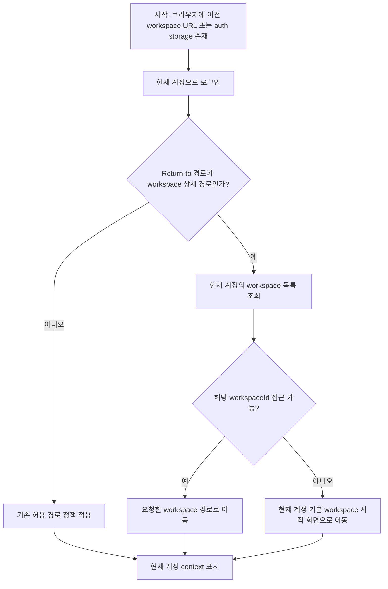

# Frontend FSD Spec: 이전 계정 workspace context 격리

## Goal

로그인 직전 브라우저에 이전 계정의 workspace URL이나 auth storage가 남아 있어도, 로그인 후에는 현재 계정이 접근 가능한 workspace context만 사용한다.

---

## User Flow Chart



---

## Design Diff

### As-is vs To-be

| 영역 | As-is | To-be | 변경 내용 |
|------|-------|-------|----------|
| 로그인 후 return-to | 허용 prefix의 `/workspaces/:id/...`를 그대로 사용 | workspace 상세 return-to는 현재 계정 workspace 목록에 포함될 때만 사용 | 이전 계정 workspace URL 재사용 방지 |
| 기본 landing | return-to가 없을 때만 `GET /workspaces` 기준 기본 workspace 선택 | stale workspace return-to도 `GET /workspaces` 기준 fallback 가능 | 현재 계정의 안전한 시작 화면 보장 |
| E2E 검증 | 정상 로그인 happy path 중심 | 이전 계정 URL/history/storage가 남은 상태에서 현재 계정 workspace만 표시 검증 | context isolation 회귀 방지 |

---

## Component Tree

```text
LoginPage
└─ LoginForm
   ├─ loginApi
   ├─ saveAuthSession
   └─ resolveAuthenticatedPostLoginDestination
      ├─ resolveReturnToPostLoginDestination
      └─ resolveDefaultPostLoginDestination

WorkspaceRootRedirect
└─ useListWorkspaces
   └─ selectDefaultWorkspace
```

---

## API Integration

### Endpoints

| Method | Path | Description |
|--------|------|-------------|
| POST | `/api/v1/auth/login` | 현재 계정 로그인 |
| GET | `/api/v1/workspaces` | 현재 계정이 접근 가능한 workspace 목록 조회 및 stale workspaceId 검증 |

신규 API는 만들지 않는다. Backend membership 판정은 기존 workspace 목록 API 응답을 기준으로 사용한다.

---

## 수정 대상 파일

| 파일 | 변경 유형 | 설명 |
|------|----------|------|
| `frontend/src/features/auth/model/resolveDefaultPostLoginDestination.ts` | modify | 현재 계정 workspace 목록을 기준으로 post-login return-to와 fallback destination을 결정 |
| `frontend/src/features/auth/ui/login-form/LoginForm.tsx` | modify | 로그인 성공 후 membership-aware resolver 사용 |
| `frontend/src/features/auth/model/resolveDefaultPostLoginDestination.test.ts` | modify | stale workspace return-to와 접근 가능한 workspace return-to 검증 |
| `frontend/src/features/auth/ui/login-form/LoginForm.test.tsx` | modify | 로그인 폼이 stale workspace URL 대신 현재 계정 기본 workspace로 이동하는지 검증 |
| `frontend/e2e/auth-login.spec.ts` | modify | 이전 계정 URL/history/storage가 남은 브라우저에서 현재 계정 workspace만 노출되는 E2E 추가 |

---

## State Management

### Auth storage

- 확인된 auth storage key는 `frontend/src/shared/lib/auth.ts`의 `accessToken`, `refreshToken`, `user`다.
- 로그인 성공 시 `saveAuthSession`은 현재 계정 토큰과 사용자 정보를 저장하고 legacy refresh token을 제거한다.
- 별도의 persisted selected workspace storage key는 확인되지 않았다.

### Navigation state

- stale workspace context의 주요 재현 경로는 `PrivateRoute`가 `/login`으로 전달하는 `location.state.from`이다.
- `/workspaces` 루트 return-to는 기존처럼 안전한 workspace 선택 화면으로 유지한다.
- `/workspaces/:workspaceId/...` return-to는 현재 계정의 `GET /workspaces` 응답에 해당 id가 있을 때만 유지한다.

---

## Tests

### Test Strategy

| 구분 | 방법 | 도구 | 비고 |
|------|------|------|------|
| 단위 테스트 | destination resolver와 LoginForm navigation 검증 | Vitest + React Testing Library | 빠른 회귀 방지 |
| E2E 테스트 | stale URL/history/storage 후 현재 계정 로그인 | Playwright mocked E2E | 화면상 context isolation 우선 검증 |

### Test Scenarios

#### Happy Path

| # | 시나리오 | 사전 조건 | 조작 | 기대 결과 |
|---|---------|---------|------|----------|
| 1 | 접근 가능한 workspace return-to 유지 | 현재 계정 workspace 목록에 return-to workspaceId 포함 | 로그인 | 기존 return-to 경로로 이동 |
| 2 | return-to 없음 | 현재 계정 ACTIVE workspace 존재 | 로그인 | 현재 계정 기본 workspace workflows 화면으로 이동 |

#### Error & Edge Cases

| # | 시나리오 | 조작 | 기대 결과 |
|---|---------|------|----------|
| 1 | 이전 계정 workspace return-to | `/workspaces/99/...`에서 로그인으로 이동 후 현재 계정 로그인 | `/workspaces/99/...`가 아니라 현재 계정 workspace로 이동 |
| 2 | 이전 계정 auth storage 존재 | stale `accessToken`, `refreshToken`, `user`가 남은 상태에서 로그인 | 현재 계정 auth session으로 교체되고 이전 workspace 이름이 노출되지 않음 |
| 3 | workspace 목록 조회 실패 | 로그인 후 workspace 목록 API 실패 | 기존 fallback인 `/workspaces`로 이동 |
| 4 | 비운영자 admin return-to | OPERATOR가 `/admin/...` return-to로 로그인 | 현재 계정 기본 workspace로 이동 |

---

## Acceptance Criteria

- 로그인 성공 후 OPERATOR 계정은 현재 계정 `GET /workspaces` 응답에 없는 `/workspaces/:id/...` return-to 경로로 이동하지 않는다.
- stale workspace 이름, URL, 상담 데이터, Domain Pack 데이터가 화면에 노출되지 않는다.
- 현재 계정의 workspace context가 URL, sidebar marker, 주요 화면 heading에서 일관되게 표시된다.
- 권한 없는 workspace URL로 자동 redirect되지 않는다.
- 사용자는 빈 화면이 아니라 현재 계정 기준의 안전한 시작 화면을 본다.
- 신규 동작은 unit test와 mocked Playwright E2E로 검증한다.

---

## Non-goals

- Backend workspace membership API 또는 권한 정책을 변경하지 않는다.
- workspace별 persisted UI 설정 key를 새로 만들거나 삭제하지 않는다.
- live E2E 계정, 운영 데이터, 실제 외부 인증 플로우는 이 이슈에서 다루지 않는다.
- Domain Pack, 상담 기록, 결제 등 workspace 내부 화면의 데이터 조회 로직은 변경하지 않는다.

---

## Validation

- `pnpm --dir frontend test -- resolveDefaultPostLoginDestination LoginForm --run`
- `pnpm --dir frontend e2e -- auth-login.spec.ts`
- 필요 시 `pnpm run ci:frontend`와 `pnpm run e2e:frontend`로 CI basic frontend 범위를 재현한다.

---

## Open Questions

- 현재 코드 기준으로 별도의 selected workspace storage key는 확인되지 않았다. 이후 새 key가 도입되면 로그인 계정 전환 시 정리 대상인지 별도 이슈로 판단한다.
