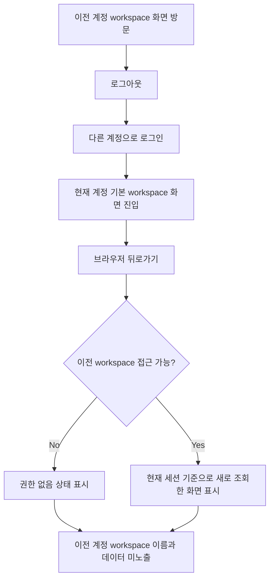

# Frontend Spec: 로그인 후 뒤로가기 workspace 캐시 노출 방지

## Goal

같은 브라우저 탭에서 다른 계정으로 다시 로그인한 뒤 브라우저 뒤로가기를 눌러도 이전 계정의 workspace 화면, marker, 본문 데이터가 노출되지 않도록 한다.

## User Flow Chart



## Design Diff

### As-is vs To-be

| 영역 | As-is | To-be | 변경 내용 |
|------|-------|-------|----------|
| 세션 전환 | 로그인/로그아웃 시 localStorage 인증 값만 변경한다. | 로그인/로그아웃 같은 인증 세션 변경 시 TanStack Query 캐시도 정리한다. | 이전 계정의 workspace query 결과가 새 계정 화면에서 재사용되지 않는다. |
| 뒤로가기 | 히스토리에 남은 `/workspaces/{id}/*` 경로가 이전 계정 캐시를 재사용할 수 있다. | 뒤로가기 후 workspace 상세를 현재 계정 기준으로 다시 판정한다. | 403이면 기존 `ErrorState` 기반 권한 없음 상태를 보여준다. |
| 사용자 표시 | workspace marker와 본문이 이전 계정 데이터를 가리킬 수 있다. | marker와 본문 모두 현재 계정 권한에 맞는 데이터만 표시한다. | workspace marker, dashboard/workflow 본문 간 불일치를 방지한다. |

## Component Tree

```
AppProviders
└─ QueryClientProvider
   └─ auth session change listener
      └─ queryClient.clear()

LoginForm
└─ saveAuthSession()
   └─ auth session change event

AccountMenu / useLogout / PrivateRoute / ApiClient
└─ clearAuthSession()
   └─ auth session change event

WorkspaceLayout
└─ useGetWorkspace(workspaceId)
   ├─ success: OstoneShell + Outlet
   └─ 403 WORKSPACE_ACCESS_DENIED: ErrorState("접근 권한이 없습니다.")
```

## API Integration

### Endpoints

| Method | Path | Description |
|--------|------|-------------|
| GET | `/api/v1/workspaces` | 현재 계정의 workspace 목록 조회 |
| GET | `/api/v1/workspaces/{workspaceId}` | 현재 계정 기준 workspace 상세 및 접근 권한 확인 |
| POST | `/api/v1/auth/login` | 새 인증 세션 생성 |

### Generated API

- workspace 조회는 기존 `frontend/src/shared/api/generated/endpoints/workspace-controller/workspace-controller.ts` hook/function을 계속 사용한다.
- generated 파일은 직접 수정하지 않는다.

## Data Flow

```
┌─────────────────────────────────────────────────────────┐
│ Auth session mutation                                    │
│  - saveAuthSession 또는 clearAuthSession                 │
└─────────────────────────────────────────────────────────┘
                           │
                           ▼
┌─────────────────────────────────────────────────────────┐
│ Shared auth event                                        │
│  - 브라우저 탭 내부에 세션 변경 알림                     │
└─────────────────────────────────────────────────────────┘
                           │
                           ▼
┌─────────────────────────────────────────────────────────┐
│ AppProviders                                             │
│  - TanStack Query 캐시 정리                              │
└─────────────────────────────────────────────────────────┘
                           │
                           ▼
┌─────────────────────────────────────────────────────────┐
│ Workspace route                                          │
│  - 뒤로가기 URL도 현재 계정 기준 API 응답으로 렌더링     │
└─────────────────────────────────────────────────────────┘
```

## 수정 대상 파일

| 파일 | 변경 유형 | 설명 |
|------|----------|------|
| `frontend/src/shared/lib/auth.ts` | modify | 인증 세션 저장/삭제 시 세션 변경 이벤트를 발생시킨다. |
| `frontend/src/app/providers.tsx` | modify | 세션 변경 이벤트를 구독해 QueryClient 캐시를 정리한다. |
| `frontend/src/app/providers.test.tsx` | modify | 세션 변경 이벤트 발생 시 query cache가 정리되는지 검증한다. |
| `frontend/e2e/navigation.spec.ts` | modify | 교차 계정 로그인 후 뒤로가기 시 이전 workspace 데이터가 노출되지 않는 E2E를 추가한다. |

## State Management

- 인증 값은 기존 localStorage/memory fallback 저장 방식을 유지한다.
- 서버 상태 캐시는 세션 경계를 넘겨 재사용하지 않는다.
- 세션 변경 이벤트는 같은 탭의 React tree와 auth 저장 유틸 사이를 연결하는 클라이언트 내부 신호로만 사용한다.

## Tests

### Test Strategy

| 구분 | 방법 | 도구 | 비고 |
|------|------|------|------|
| 단위 테스트 | auth 세션 변경 이벤트 후 query cache 정리 검증 | Vitest | cache clearing 회귀 방지 |
| E2E 테스트 | 이전 계정 workspace 방문 → 로그아웃 → 다른 계정 로그인 → 브라우저 뒤로가기 | Playwright | 사용자 시나리오 검증 |

### Test Scenarios

| # | Given | When | Then |
|---|-------|------|------|
| 1 | 이전 계정으로 `/workspaces/1/dashboard`를 방문해 workspace query가 캐시에 남아 있다. | 로그아웃 후 다른 계정으로 로그인하고 브라우저 뒤로가기를 누른다. | `/workspaces/1/dashboard`는 현재 계정 기준으로 403 처리되고 이전 workspace 이름/본문 데이터가 보이지 않는다. |
| 2 | 새 계정의 workspace 목록에는 `/workspaces/2`만 있다. | 로그인 직후 기본 workspace 화면으로 이동한다. | marker와 URL은 현재 계정 workspace를 기준으로 표시된다. |

## Non-goals

- 서버의 workspace 권한 정책을 변경하지 않는다.
- 로그인 후 return-to 허용 경로 정책을 변경하지 않는다.
- workspace 선택 UI나 권한 없음 화면 디자인을 새로 만들지 않는다.
- 브라우저 전체 storage clearing 정책을 추가하지 않는다.

## Acceptance Criteria

- 로그인 성공 또는 로그아웃으로 인증 세션이 바뀌면 기존 TanStack Query 캐시가 비워진다.
- 브라우저 history에 이전 계정의 workspace URL이 있어도 뒤로가기 후 이전 계정 workspace 이름이 marker나 breadcrumb에 노출되지 않는다.
- 권한 없는 workspace 상세 URL은 기존 `WORKSPACE_ACCESS_DENIED` 매핑에 따라 "접근 권한이 없습니다."를 표시한다.
- 화면의 workspace marker와 본문 데이터가 서로 다른 workspace를 가리키지 않는다.
- 새 회귀 테스트는 앞으로가기/새로고침과 동일한 정책 판단에 사용할 수 있도록 현재 계정 기준 API 응답만 신뢰한다.

## Open Questions

- 없음. 권한 없는 workspace의 최종 화면은 현재 구현된 `ErrorState` 기반 차단 화면을 유지한다.
