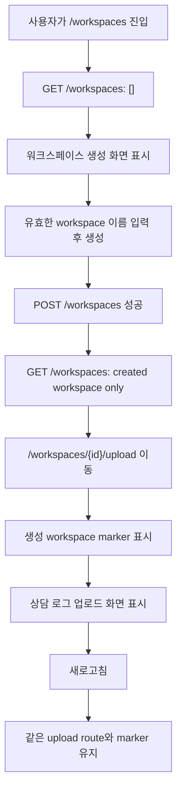

# 신규 사용자의 workspace 생성 후 업로드 진입 E2E

## Goal

workspace가 없는 신규 사용자가 workspace를 만든 직후 생성된 workspace context에서 상담 로그 업로드를 시작할 수 있음을 E2E로 보장한다.

## Problem

신규 사용자의 첫 workspace 생성 플로우는 온보딩의 첫 관문이다. 생성 직후 이동 대상, sidebar workspace marker, 상담 로그 업로드 CTA, 새로고침 후 context 유지가 서로 다른 화면과 API cache에 걸쳐 있어 회귀가 발생해도 단일 사용자 시나리오에서 감지하기 어렵다.

## Scope

- mock E2E에서 `GET /workspaces`가 생성 전에는 빈 목록, 생성 후에는 방금 생성한 workspace만 반환하도록 상태 기반 fixture를 구성한다.
- workspace 생성 성공 후 `/workspaces/{created.id}/upload`로 이동하는 정책을 검증한다.
- 생성된 workspace 이름이 shell marker와 workspace 선택 메뉴에 표시되는지 검증한다.
- 업로드 화면에서 상담 로그 업로드를 바로 시작할 수 있는 상태인지 검증한다.
- 새로고침 후에도 같은 workspace upload route와 marker가 유지되는지 검증한다.
- 같은 생성 정책을 직접 확인하는 live workspace 생성 smoke의 기대 URL을 현재 제품 코드에 맞춘다.

## Non-goals

- workspace 생성 API contract를 변경하지 않는다.
- 상담 로그 파일 업로드 자체나 pipeline 생성까지 이 시나리오에서 검증하지 않는다.
- 기존 로그인, 결제, dashboard, workflow 목록 정책을 변경하지 않는다.
- live smoke에서 운영 계정의 데이터 보유 상태를 새롭게 가정하지 않는다.

## Affected Paths

아래 경로는 repository에서 존재 확인을 완료했다.

| Path | Role | Change |
| --- | --- | --- |
| `frontend/e2e/workspace-create.spec.ts` | mocked Playwright workspace 생성 시나리오 | 신규 사용자 생성 후 upload context, marker, reload 유지 검증 강화 |
| `frontend/e2e/live/workspace-create.live.spec.ts` | 실제 백엔드 대상 workspace 생성 smoke | 생성 후 upload route 기준으로 기대값 정렬 |
| `frontend/src/pages/workspace/ui/WorkspaceRootRedirect.tsx` | workspace 없음/있음 redirect 정책 | 제품 정책 확인용, 직접 수정하지 않음 |
| `frontend/src/pages/upload/ui/WorkspaceUploadPage.tsx` | workspace upload route 화면 | 제품 정책 확인용, 직접 수정하지 않음 |
| `frontend/src/shared/ui/ostone/chrome/WorkspaceMarker.tsx` | sidebar workspace marker | 제품 정책 확인용, 직접 수정하지 않음 |
| `frontend/src/features/workspace/ui/CreateWorkspaceDialog.tsx` | workspace 생성 dialog | 제품 정책 확인용, 직접 수정하지 않음 |

## User Flow Chart

## Requirements

1. `POST /api/v1/workspaces` 요청 body는 사용자가 입력한 name과 생성된 workspaceKey를 포함해야 한다.
2. 생성 성공 후 URL은 `/workspaces/{created.id}/upload`여야 한다.
3. 생성 직후 shell의 workspace marker는 생성한 workspace 이름을 표시해야 한다.
4. workspace 선택 메뉴에는 생성한 workspace만 표시되어야 한다.
5. 생성 직후 화면은 `상담 로그 업로드` heading과 업로드 UI를 표시해야 한다.
6. sidebar upload link는 생성된 workspace id 기반 path여야 한다.
7. 새로고침 후에도 URL, marker, upload 화면은 같은 workspace context를 유지해야 한다.

## API Integration

| Method | Path | Mock behavior |
| --- | --- | --- |
| `GET` | `/api/v1/workspaces` | 생성 전 `[]`, 생성 후 `[createdWorkspace]` |
| `POST` | `/api/v1/workspaces` | 생성 요청 검증 후 `createdWorkspace` 반환 |
| `GET` | `/api/v1/workspaces/{created.id}` | 생성된 workspace 단건 반환 |
| `GET` | `/api/v1/workspaces/{created.id}/subscription` | 신규 workspace의 구독 없음 상태 반환 |

## Validation

- `pnpm --dir frontend exec playwright test e2e/workspace-create.spec.ts`
- `git diff --check`

## Acceptance Criteria

- 신규 사용자가 workspace 생성 후 생성한 workspace의 upload 화면으로 이동한다.
- 생성한 workspace 이름이 sidebar marker와 선택 메뉴에 표시된다.
- 이전 workspace context가 route, marker, menu, API 호출에 남지 않는다.
- 새로고침해도 생성한 workspace의 upload context가 유지된다.
- live workspace 생성 smoke도 현재 제품 정책인 upload route를 기대한다.

## Open Questions

- 없음. 생성 후 이동 대상은 `frontend/src/pages/workspace/ui/WorkspaceRootRedirect.tsx` 기준 `/workspaces/{id}/upload`로 확인했다.
