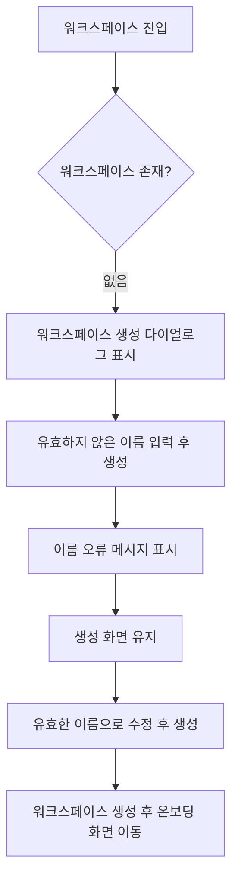

# Frontend FSD Spec: 워크스페이스 이름 검증 E2E

## Goal

신규 사용자가 유효하지 않은 워크스페이스 이름으로 생성할 수 없고, 같은 생성 화면에서 오류를 확인한 뒤 올바른 이름으로 수정해 생성 흐름을 이어갈 수 있음을 E2E로 보장한다.

## User Flow Chart



## Design Diff

| 영역 | As-is | To-be | 변경 내용 |
| --- | --- | --- | --- |
| 생성 입력 라벨 | 생성 다이얼로그의 이름 입력 라벨이 `제목`으로 표시됨 | `이름`으로 표시됨 | 오류 메시지와 백엔드 필드명에 맞춰 사용자 수정 대상이 명확해짐 |
| E2E 검증 | 워크스페이스 생성 성공 경로만 검증 | invalid name 실패 후 valid name 재시도까지 검증 | 빈 값, 공백만 있는 값, 255자 초과 값을 API 호출 없이 차단하는지 확인 |

## Component Tree

```text
WorkspaceRootRedirect
└─ CreateWorkspaceDialog
   ├─ name Input
   ├─ field error alert
   ├─ cancel Button
   └─ submit Button
```

## API Integration

| Method | Path | Description |
| --- | --- | --- |
| GET | `/api/v1/workspaces` | 접근 가능한 워크스페이스 목록 조회 |
| POST | `/api/v1/workspaces` | 유효한 이름으로 워크스페이스 생성 |
| GET | `/api/v1/workspaces/{id}` | 생성 후 이동 대상 워크스페이스 조회 |
| GET | `/api/v1/workspaces/{id}/domain-packs` | 생성 후 온보딩 화면의 도메인팩 상태 조회 |

유효하지 않은 이름은 클라이언트 폼 검증에서 차단하므로 `POST /api/v1/workspaces`가 발생하지 않아야 한다. 서버 정책은 `backend/src/main/java/com/init/workspace/presentation/dto/CreateWorkspaceRequest.java`의 `@NotBlank @Size(max = 255)`와 `backend/src/main/java/com/init/workspace/domain/model/Workspace.java`의 이름 가드 기준을 따른다.

## Data Flow

```text
CreateWorkspaceDialog local name state
  -> validateCreateWorkspaceForm(name, "")
  -> invalid: fieldErrors.name + dialog 유지
  -> valid: generated workspace-controller createWorkspace mutation
  -> success: listWorkspaces cache 갱신 + /workspaces/{id}/upload 이동
```

## 수정 대상 파일

| 파일 | 변경 유형 | 설명 |
| --- | --- | --- |
| `frontend/src/features/workspace/ui/CreateWorkspaceDialog.tsx` | update | 생성 입력 라벨을 이름 검증 문구와 같은 `이름`으로 정렬 |
| `frontend/src/features/workspace/ui/CreateWorkspaceDialog.test.tsx` | update | 라벨 변경에 맞춰 컴포넌트 테스트 조회 기준 갱신 |
| `frontend/e2e/workspace-create.spec.ts` | update | invalid name 실패와 valid name 재시도 E2E 추가 |
| `.agent/specs/697.md` | new | 이슈 요구사항과 검증 기준 기록 |

## State Management

- 이름 입력값과 필드 오류는 `CreateWorkspaceDialog`의 로컬 상태로 유지한다.
- invalid submit은 다이얼로그를 닫지 않고 `fieldErrors.name`만 갱신한다.
- invalid submit 중에는 생성 mutation을 호출하지 않으므로 서버 상태나 TanStack Query cache를 변경하지 않는다.
- valid submit 성공 시 기존처럼 워크스페이스 목록 cache를 갱신하고 성공 콜백으로 이동한다.

## Tests

| 구분 | 방법 | 도구 |
| --- | --- | --- |
| 컴포넌트 회귀 | 라벨 변경 후 생성 다이얼로그 테스트 유지 | Vitest, React Testing Library |
| E2E | 빈 값, 공백 값, 255자 초과 값이 생성 API 없이 오류를 표시하고, 유효한 이름으로 수정하면 생성 흐름이 진행됨을 검증 | Playwright |

## Acceptance Criteria

- 워크스페이스 생성 화면의 이름 입력이 사용자에게 `이름`으로 표시된다.
- 빈 값, 공백만 있는 값, 255자 초과 값 제출 시 워크스페이스가 생성되지 않는다.
- invalid name 제출 후 사용자는 같은 생성 화면에 남아 이름 오류 메시지를 볼 수 있다.
- invalid name 제출은 `POST /api/v1/workspaces`를 호출하지 않는다.
- 유효한 이름으로 수정한 뒤 생성하면 기존 온보딩 이동 흐름을 계속 진행할 수 있다.

## Non-Goals

- 백엔드 workspace validation 정책을 변경하지 않는다.
- workspace key 생성 알고리즘을 변경하지 않는다.
- live E2E가 실제 운영 데이터에 invalid 요청을 보내는 시나리오는 추가하지 않는다.

## Open Questions

- 없음. 현재 확인된 정책은 이름 필수, 공백 불가, 255자 이하이다.
