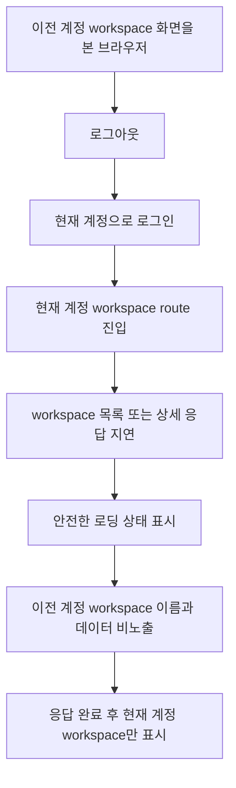

# Frontend FSD Spec: workspace 로딩 중 이전 계정 정보 비노출

## Goal

현재 계정의 workspace 정보를 불러오는 동안 sidebar, header, 본문 어디에도 이전 계정의 workspace 이름이나 데이터가 표시되지 않음을 mocked E2E로 보장한다.

## User Flow Chart



## Design Diff

| 영역 | As-is | To-be | 변경 내용 |
| --- | --- | --- | --- |
| E2E 검증 | 이전 계정 route/history 재진입 후 권한 오류 화면에서 stale 데이터가 없는지 검증 | workspace 상세 응답이 지연되는 로딩 순간에도 stale workspace 이름과 데이터가 없는지 검증 | 느린 네트워크 fixture에서 P1 노출 회귀를 직접 관찰 |
| Loading UI | `WorkspaceLayout`이 workspace 상세 로딩 중 안전 문구와 spinner를 표시 | 기존 안전 로딩 UI를 회귀 테스트로 고정 | `워크스페이스 정보를 불러오는 중입니다.` 상태에서 이전 계정 정보가 나타나지 않아야 함 |
| Workspace marker | `WorkspaceMarker`가 workspace 목록 query로 현재 marker 이름을 계산 | 지연 응답 중 이전 계정 목록/상세 정보가 marker에 표시되지 않음을 검증 | API 호출 자체보다 화면 노출 여부를 우선 단언 |

## Component Tree

```text
App
└─ PrivateRoute
   └─ WorkspaceLayout
      ├─ useGetWorkspace
      └─ OstoneShell
         ├─ Sidebar
         │  └─ WorkspaceMarker
         │     └─ useListWorkspaces
         ├─ Topbar
         └─ loading body
```

## API Integration

| Method | Path | Mock behavior |
| --- | --- | --- |
| `POST` | `/api/v1/auth/login` | 현재 계정 세션을 반환하고 mock account scope를 current로 전환 |
| `GET` | `/api/v1/workspaces` | 로그인 destination 결정을 위한 첫 현재 계정 목록 응답은 즉시 반환하고, workspace 화면 marker가 재조회하는 후속 응답을 지연 |
| `GET` | `/api/v1/workspaces/2` | 현재 계정 workspace 상세 응답을 지연시켜 shell loading 상태를 관찰 |
| `GET` | `/api/v1/workspaces/1/*` | 이전 계정 화면을 먼저 렌더링하기 위한 기존 fixture 유지 |

신규 API는 만들지 않는다. 테스트는 현재 제품 코드의 generated workspace controller 호출 흐름을 mock한다.

## Data Flow

```text
previous account dashboard render
  -> previous workspace name and pack visible
  -> logout clears auth session and query cache
  -> current account login
  -> destination GET /workspaces resolves current workspace
  -> navigate /workspaces/2/workflows
  -> delayed subsequent GET /workspaces and delayed GET /workspaces/2
  -> loading shell shows safe loading text only
  -> delayed responses resolve
  -> current workspace marker and empty workflows state render
```

## 수정 대상 파일

| 파일 | 변경 유형 | 설명 |
| --- | --- | --- |
| `.agent/specs/699.md` | new | 이슈 요구사항과 검증 기준 기록 |
| `frontend/e2e/navigation.spec.ts` | update | 느린 workspace 조회 중 이전 계정 workspace 정보가 보이지 않는 E2E 추가 |
| `frontend/src/pages/workspace/ui/WorkspaceLayout.tsx` | inspect | workspace 상세 로딩 UI와 shell 구성 확인, 직접 수정은 새 E2E 실패 시에만 수행 |
| `frontend/src/shared/ui/ostone/chrome/WorkspaceMarker.tsx` | inspect | marker가 workspace 목록 query로 이름을 계산하는 흐름 확인, 직접 수정은 새 E2E 실패 시에만 수행 |
| `frontend/src/app/providers.tsx` | inspect | 인증 세션 변경 시 query cache 정리 흐름 확인, 직접 수정은 새 E2E 실패 시에만 수행 |

## State Management

- `saveAuthSession`과 `clearAuthSession`은 `AUTH_SESSION_CHANGED_EVENT`를 발생시키며, `AppProviders`는 이 이벤트에서 TanStack Query cache를 정리한다.
- 별도 persisted selected workspace storage key는 확인되지 않았다.
- 테스트는 이전 계정 화면을 먼저 렌더링해 query/UI state에 stale 데이터가 실제로 존재했던 조건을 만든다.
- 현재 계정 로그인 후 workspace 목록과 상세 응답을 지연시키고, pending 상태의 DOM에서 이전 계정 workspace 이름과 pack 이름이 보이지 않는지 확인한다.

## Tests

| 구분 | 방법 | 도구 |
| --- | --- | --- |
| E2E 회귀 | 이전 계정 dashboard 표시 후 현재 계정 로그인, workspace 조회 지연 중 stale 데이터 비노출 검증 | Playwright mocked E2E |
| 정적 검증 | 변경 diff와 포맷 확인 | `git diff --check` |

## Acceptance Criteria

- 브라우저가 이전 계정의 workspace 화면을 본 뒤에도 현재 계정 로그인 후 로딩 중 이전 workspace 이름이 sidebar, header, 본문에 나타나지 않는다.
- 로딩 중 사용자는 현재 workspace 정보를 불러오는 중임을 알 수 있다.
- 느린 `GET /workspaces`와 느린 `GET /workspaces/{id}` fixture에서도 이전 계정 pack/dashboard 데이터가 나타나지 않는다.
- 조회가 끝나면 현재 계정 workspace marker와 현재 계정 화면만 표시된다.
- 테스트는 API 호출 횟수보다 사용자에게 노출되는 텍스트를 우선 단언한다.

## Non-Goals

- Backend workspace membership API 또는 권한 정책을 변경하지 않는다.
- 로그인 destination resolver의 stale workspace return-to 정책을 새로 변경하지 않는다.
- live E2E나 실제 외부 계정 데이터에 의존하는 시나리오는 추가하지 않는다.
- workspace 내부 dashboard, domain pack, billing 데이터 조회 정책을 변경하지 않는다.

## Validation

- `pnpm --dir frontend exec playwright test e2e/navigation.spec.ts --grep "current workspace loading"`
- `git diff --check`

## Open Questions

- 없음. 이슈의 디스클레이머에 따라 세부 API 호출보다 로딩 중 화면 노출 여부를 기준으로 확정한다.
