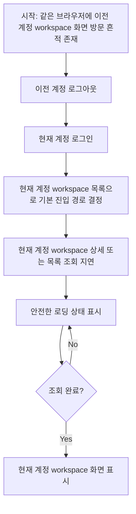

# Frontend Spec: workspace 로딩 중 이전 계정 정보 미노출

## Goal

로그인 직후 현재 계정의 workspace 목록과 상세 정보를 불러오는 동안, 이전 계정의 workspace 이름이나 Domain Pack 데이터가 sidebar, header, 본문에 표시되지 않도록 E2E로 보장한다.

---

## User Flow Chart



---

## Design Diff

### As-is vs To-be

| 영역 | As-is | To-be | 변경 내용 |
|------|-------|-------|----------|
| 로딩 중 검증 | 로그인 후 최종 화면에서 stale workspace 미노출을 확인한다. | workspace 목록/상세 API를 지연시킨 pending 상태에서도 stale workspace 미노출을 확인한다. | 느린 네트워크에서 이전 계정 정보가 깜빡이는 회귀를 잡는다. |
| Shell 표시 | `WorkspaceLayout` loading shell과 `WorkspaceMarker`가 별도 query를 사용한다. | pending shell은 neutral loading copy만 표시하고 이전 workspace name/data를 렌더링하지 않아야 한다. | sidebar, header, 본문을 함께 단언한다. |
| E2E fixture | 이전 계정 URL/history/storage 격리 중심이다. | 이전 계정 workflow 화면을 먼저 방문해 cache에 남을 수 있는 workspace/pack 데이터를 만든 뒤 현재 계정 loading을 지연한다. | 같은 workspace id 재사용 상황에서도 세션 경계를 검증한다. |

---

## Component Tree

```text
LoginPage
└─ LoginForm
   ├─ saveAuthSession
   └─ resolveAuthenticatedPostLoginDestination
      └─ listWorkspaces

WorkspaceLayout
├─ useGetWorkspace
└─ OstoneShell
   ├─ WorkspaceMarker
   │  └─ useListWorkspaces
   ├─ Topbar
   └─ Outlet
      └─ WorkspaceWorkflowsPage
         └─ useListAllWorkspaceWorkflows
```

---

## API Integration

### Endpoints

| Method | Path | Description |
|--------|------|-------------|
| POST | `/api/v1/auth/login` | 현재 계정 로그인 |
| GET | `/api/v1/workspaces` | 현재 계정 workspace 목록 조회 및 marker 표시 데이터 |
| GET | `/api/v1/workspaces/{workspaceId}` | 현재 계정 workspace 상세 조회 및 workspace layout gate |
| GET | `/api/v1/workspaces/{workspaceId}/domain-packs` | workspace workflow 본문 데이터의 진입점 |

신규 API는 만들지 않는다. Frontend는 기존 generated endpoint와 React Query cache 경계를 그대로 사용한다.

---

## 수정 대상 파일

| 파일 | 변경 유형 | 설명 |
|------|----------|------|
| `frontend/e2e/auth-login.spec.ts` | modify | 이전 계정 workflow 화면을 먼저 방문한 뒤 현재 계정 workspace 로딩을 지연시키고 stale workspace/pack 미노출을 검증하는 Playwright 시나리오 추가 |
| `.agent/specs/699.md` | new | 이슈 요구사항, 범위, 검증 기준 기록 |

---

## State Management

- 인증 값 저장/삭제는 기존 `frontend/src/shared/lib/auth.ts`의 `saveAuthSession`, `clearAuthSession`을 사용한다.
- 인증 세션 변경 시 `frontend/src/app/providers.tsx`가 TanStack Query cache를 정리하는 기존 정책을 유지한다.
- 테스트는 이전 계정과 현재 계정에 같은 numeric workspace id를 사용해, cache가 남으면 marker나 body에 이전 계정 정보가 노출될 수 있는 조건을 만든다.
- 별도의 selected workspace storage key는 확인되지 않았으므로 이 이슈에서 새 storage 정리 정책을 추가하지 않는다.

---

## Tests

### Test Strategy

| 구분 | 방법 | 도구 | 비고 |
|------|------|------|------|
| E2E 테스트 | 이전 계정 workspace workflow 화면 방문 후 로그아웃, 현재 계정 로그인, 현재 workspace 조회 지연 | Playwright mocked E2E | 이슈에서 요구한 느린 네트워크 loading 상태 우선 단언 |
| 정적 검증 | 변경 경로와 기존 cache/session 정책 diff 확인 | Git diff | product code 변경 없이 현재 보장을 regression test로 고정 |

### Test Scenarios

| # | Given | When | Then |
|---|-------|------|------|
| 1 | 이전 계정의 workspace marker와 workflow pack 데이터가 같은 브라우저에서 표시된 적이 있다. | 현재 계정으로 로그인하고 현재 workspace 상세/list 응답이 지연된다. | loading shell은 `워크스페이스 정보를 불러오는 중입니다.`를 표시하고 이전 계정 workspace name, operator name, Domain Pack, workflow name을 표시하지 않는다. |
| 2 | 현재 계정 workspace 응답이 완료된다. | workflow 화면의 후속 Domain Pack/workflow 조회가 완료된다. | marker와 본문은 현재 계정 workspace와 workflow 데이터만 표시한다. |

---

## Acceptance Criteria

- 로딩 중 sidebar workspace marker에 이전 계정 workspace 이름이 나타나지 않는다.
- 로딩 중 header breadcrumb나 본문에 이전 계정 workspace 이름, 사용자명, Domain Pack 이름, workflow 이름이 나타나지 않는다.
- 사용자는 현재 계정 workspace 정보를 불러오는 중임을 알 수 있는 안전한 loading copy를 본다.
- 조회 완료 후에는 현재 계정 workspace marker와 workflow 본문만 표시된다.
- 테스트는 workspace 조회 응답을 지연시켜 loading 상태를 관찰한다.
- API 호출 자체보다 화면 노출 여부를 우선 단언한다.

---

## Non-goals

- Backend workspace membership, auth, API 응답 계약은 변경하지 않는다.
- Workspace marker 디자인이나 shell layout을 새로 설계하지 않는다.
- live E2E 계정, 운영 데이터, 실제 네트워크 throttling 설정은 다루지 않는다.
- 이전 이슈에서 다룬 return-to 검증과 뒤로가기 권한 없음 흐름을 중복 구현하지 않는다.

---

## Validation

- `pnpm --dir frontend e2e -- auth-login.spec.ts --grep "workspace loading keeps previous account data hidden"`
- 필요 시 `pnpm run e2e:frontend`로 전체 mocked frontend E2E를 재현한다.

---

## Open Questions

- 없음. 이 이슈는 현재 확인된 frontend loading surface와 mocked E2E fixture 범위에서 검증한다.
