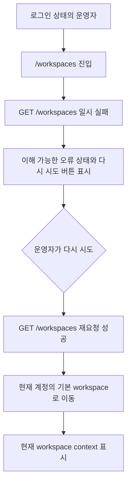

# Frontend FSD Spec: workspace 조회 실패 재시도 보장

## Goal

이미 로그인된 운영자가 workspace 진입 화면에서 목록 조회 실패 상태에 갇히지 않고 안전한 오류 안내와 재시도 행동을 통해 현재 계정 workspace로 다시 진입할 수 있음을 mocked E2E로 보장한다.

## User Flow Chart



## Design Diff

| 영역 | As-is | To-be | 변경 내용 |
| --- | --- | --- | --- |
| E2E 검증 | 로그인 성공, stale workspace 무시, workspace-less 계정 흐름은 검증됨 | 인증된 `/workspaces` 진입에서 workspace 목록 조회가 일시 실패한 뒤 재시도 성공으로 현재 workspace에 진입하는 `@critical` E2E 추가 | 이슈의 Given/When/Then을 제품 진입 경로에서 고정 |
| 오류 상태 | `WorkspaceRootRedirect`가 non-401 실패에 `ErrorState`와 retry를 표시 | 기존 안전 오류 UI가 E2E에서 사용자 관점으로 검증됨 | 실패 중 이전 계정 workspace 텍스트가 보이지 않아야 함 |
| 인증 실패 분기 | 401은 `/login`으로 리다이렉트하는 unit coverage 존재 | 신규 E2E는 일반 5xx/네트워크성 실패를 대상으로 함 | 401/403 정책 변경은 범위에서 제외 |

## Component Tree

```text
App
└─ PrivateRoute
   └─ WorkspaceRootRedirect
      ├─ useListWorkspaces
      ├─ ErrorState(onRetry)
      ├─ CreateWorkspaceDialog
      └─ Navigate(/workspaces/{id}/dashboard)
```

## API Integration

| Method | Path | Mock behavior |
| --- | --- | --- |
| `GET` | `/api/v1/workspaces` | 첫 요청은 일시 실패 응답을 반환하고, retry 요청은 현재 계정 workspace 목록을 반환한다. |
| `GET` | `/api/v1/workspaces/{id}` | retry 성공 후 진입한 workspace shell에서 현재 workspace 상세를 반환한다. |
| `GET` | `/api/v1/workspaces/{id}/dashboard/*` | workspace root redirect의 기본 dashboard 진입에 필요한 mocked 응답을 반환한다. |

신규 API는 만들지 않는다. 테스트는 generated workspace controller hook이 호출하는 현재 `/workspaces` 계약을 mock한다.

## Data Flow

```text
valid existing auth session
  -> /workspaces renders WorkspaceRootRedirect
  -> first GET /workspaces fails with non-401 server error
  -> ErrorState shows retryable safe state
  -> retry refetch succeeds with current workspace list
  -> selectDefaultWorkspace chooses current active workspace
  -> navigate /workspaces/{id}/dashboard
  -> WorkspaceLayout loads current workspace detail and dashboard
```

## 수정 대상 파일

| 파일 | 변경 유형 | 설명 |
| --- | --- | --- |
| `.agent/specs/700.md` | new | 이슈 요구사항과 검증 기준 기록 |
| `frontend/e2e/navigation.spec.ts` | update | 인증된 workspace 진입에서 목록 조회 실패 후 재시도 성공 E2E 시나리오 추가 |
| `frontend/src/pages/workspace/ui/WorkspaceRootRedirect.tsx` | inspect | 기존 retryable 오류 상태와 401 분기 확인, E2E 실패 시에만 수정 |
| `frontend/src/app/providers.tsx` | inspect | 인증 세션 변경 시 query cache 정리 확인 |

## State Management

- 로그인 직후 destination 결정은 `resolveAuthenticatedPostLoginDestination`이 별도로 처리하므로, 신규 E2E는 이슈 Given에 맞춰 이미 인증된 `/workspaces` 진입 화면을 대상으로 한다.
- `saveAuthSession`은 `AUTH_SESSION_CHANGED_EVENT`를 발생시키고, `AppProviders`는 이 이벤트에서 TanStack Query cache를 정리한다.
- `WorkspaceRootRedirect`는 `useListWorkspaces`의 `refetch`를 retry 행동으로 전달한다.
- retry 성공 후 `selectDefaultWorkspace`가 현재 응답의 active workspace를 선택한다.
- 실패 상태에서는 `workspacesData`를 화면에 표시하지 않으며, 이전 계정 workspace 이름이나 domain pack 이름이 노출되지 않아야 한다.

## Tests

| 구분 | 방법 | 도구 |
| --- | --- | --- |
| E2E 회귀 | 인증된 `/workspaces` 진입 후 첫 `GET /workspaces` 실패, 오류 상태와 retry 확인, retry 성공 후 현재 workspace dashboard 진입 검증 | Playwright mocked E2E |
| Unit 회귀 | 기존 `WorkspaceRootRedirect.test.tsx`가 401/403/network 분기와 retry callback을 검증 | Vitest + React Testing Library |
| 정적 검증 | 변경 diff와 포맷 확인 | `git diff --check` |

## Acceptance Criteria

- 첫 workspace 목록 조회 실패 시 빈 화면 대신 사용자에게 이해 가능한 오류 문구가 표시된다.
- 오류 상태에는 `다시 시도` 버튼 또는 같은 역할의 행동이 제공된다.
- 실패 상태에서 이전 계정 workspace 이름, 이전 계정 사용자 이름, legacy domain pack 데이터가 보이지 않는다.
- retry 성공 후 현재 계정 workspace route로 진입하고 현재 workspace context가 표시된다.
- 401 인증 실패를 retryable 일반 장애로 고정하지 않는다.

## Non-Goals

- Backend workspace API, membership authorization, schema를 변경하지 않는다.
- 401/403 인증·인가 정책을 새로 정의하지 않는다.
- workspace 생성, dashboard, domain pack 상세 동작을 변경하지 않는다.
- live E2E나 실제 외부 계정 데이터에 의존하는 시나리오는 추가하지 않는다.

## Validation

- `pnpm --dir frontend exec playwright test e2e/navigation.spec.ts --grep "workspace lookup can be retried"`
- `pnpm --dir frontend test -- --run src/pages/workspace/ui/WorkspaceRootRedirect.test.tsx`
- `git diff --check`

## Open Questions

- 없음. 이슈의 기술 확인 메모에 따라 신규 E2E는 5xx/일반 네트워크성 실패를 대상으로 하고, 401/403 분기는 기존 unit coverage와 제품 정책을 유지한다.
