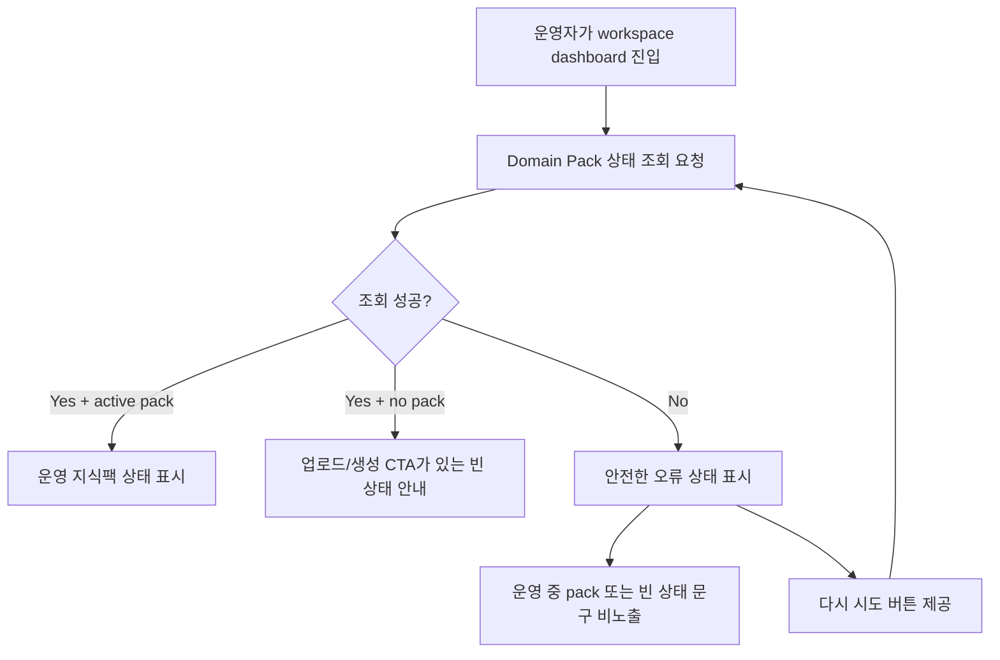

# Frontend FSD Spec: Domain Pack 상태 조회 실패 오류 상태

## Goal

운영자가 workspace dashboard에 진입했을 때 Domain Pack 상태 조회가 실패하면 빈 상태나 운영 중 상태로 오해하지 않고, 안전한 오류 상태와 복구 행동을 확인할 수 있게 한다.

## Issue Summary

GitHub Issue #701은 Domain Pack 상태 조회 실패가 실제 Domain Pack 없음 또는 운영 중 상태로 보이면 안 된다는 P2 Critical E2E 후보다. 현재 코드 기준 workspace dashboard의 운영 지식팩 상태는 `KnowledgePackHealthPanel`이 `/api/v1/workspaces/{workspaceId}/dashboard/knowledge-pack-health`를 조회해 표시한다. 조회 실패 fixture와 빈 상태 fixture를 분리하고, 실패 시 현재 workspace context를 유지한 오류 상태와 재시도 행동을 사용자 시나리오로 고정한다.

## User Flow Chart



## Design Diff

| 영역 | As-is | To-be | 변경 내용 |
| --- | --- | --- | --- |
| 오류 UI | `KnowledgePackHealthPanel`이 오류 문구를 표시하지만 명시적 복구 행동은 없음 | 오류 문구와 `다시 시도` 버튼을 함께 표시 | 조회 실패 후 재시도 행동을 화면에서 바로 제공 |
| 상태 구분 | mocked E2E가 정상 dashboard health fixture만 검증 | 조회 실패 fixture를 별도로 두고 빈 상태/운영 중 상태 문구가 보이지 않음을 검증 | 실패와 실제 Domain Pack 없음 상태를 테스트 데이터에서 분리 |
| Workspace context | dashboard route는 현재 workspace URL을 유지 | 오류 상태에서도 `/workspaces/{id}/dashboard` context 유지 | 실패 때문에 잘못된 초기 화면 또는 다른 workspace 상태로 이동하지 않음 |

## Component Tree

```text
WorkspaceDashboardPage
└─ KnowledgePackHealthPanel
   ├─ useWorkspaceDashboardHealth(workspaceId)
   ├─ LoadingSpinner
   ├─ ErrorState(onRetry)
   └─ buildWorkspaceDashboardHealthView(success data)

frontend/e2e/workspace-core.spec.ts
└─ Workspace dashboard health failure scenario
   └─ installAppApiMocks({ dashboardKnowledgePackHealth: "error" })
```

## API Integration

테스트와 제품 코드는 기존 dashboard endpoint를 유지한다.

| Method | Path | 목적 |
| --- | --- | --- |
| `GET` | `/api/v1/workspaces/{workspaceId}/dashboard/knowledge-pack-health` | 운영 지식팩 상태 조회 |
| `GET` | `/api/v1/workspaces/{workspaceId}/consultation/metrics` | dashboard 본문 지표 유지 확인 |
| `GET` | `/api/v1/workspaces/{workspaceId}/dashboard/action-recommendations` | dashboard 추천 액션 유지 확인 |
| `GET` | `/api/v1/workspaces/{workspaceId}/dashboard/workflow-rankings` | dashboard workflow ranking 유지 확인 |

신규 backend API, OpenAPI generated client, DB schema는 만들지 않는다. 해당 dashboard health endpoint는 아직 OpenAPI generated 함수가 없어 기존 `customFetch` wrapper를 유지한다.

## Data Flow

```text
workspace route id
  -> KnowledgePackHealthPanel
  -> useWorkspaceDashboardHealth(workspaceId)
     -> success: buildWorkspaceDashboardHealthView(data)
     -> error: ErrorState(message, refetch)
  -> user clicks 다시 시도
     -> same workspace query refetch
```

## 수정 대상 파일

| 파일 | 변경 유형 | 설명 |
| --- | --- | --- |
| `.agent/specs/701.md` | new | Issue #701 요구사항과 검증 기준 기록 |
| `frontend/src/features/workspace-dashboard-health/ui/KnowledgePackHealthPanel.tsx` | modify | 조회 실패 시 `ErrorState`에 재시도 핸들러 전달 |
| `frontend/src/features/workspace-dashboard-health/ui/KnowledgePackHealthPanel.test.tsx` | modify | 오류 상태의 재시도 버튼과 stale/빈 상태 비노출 검증 |
| `frontend/e2e/support/app-mocks.ts` | modify | dashboard knowledge pack health 실패 fixture 옵션 추가 |
| `frontend/e2e/workspace-core.spec.ts` | modify | Domain Pack 상태 조회 실패 시 안전한 오류 상태와 재시도 요청을 검증 |

## State Management

- TanStack Query key는 `["workspace-dashboard-health", workspaceId]` 형태를 유지한다.
- `isError` 상태에서는 `data`가 남아 있어도 성공 view를 렌더링하지 않는다.
- 재시도는 같은 workspace id로 `refetch`만 호출하며 route, workspace marker, dashboard filters를 변경하지 않는다.
- 조회 실패 fixture는 빈 Domain Pack fixture가 아니라 HTTP 실패 응답으로 구성한다.

## Acceptance Criteria

- `GET /workspaces/{workspaceId}/dashboard/knowledge-pack-health` 실패 시 `운영 지식팩 상태를 불러오지 못했습니다.` 오류 상태가 보인다.
- 오류 상태에는 `다시 시도` 버튼이 있고 클릭하면 같은 health endpoint를 다시 요청한다.
- 오류 상태에서 `운영 지식팩 건강도`, `v1`, `Generated API Pack`, `운영 지식팩이 아직 반영되지 않았습니다.`, `상담 업로드`, `지식팩 생성`이 보이지 않는다.
- dashboard URL과 workspace marker는 현재 workspace context를 유지한다.
- 정상 dashboard health fixture와 빈 상태 fixture의 의미를 테스트에서 섞지 않는다.

## Non-goals

- Backend dashboard health API, authorization, schema, 또는 response contract를 변경하지 않는다.
- workspace dashboard의 상담 KPI, 추천 액션, workflow ranking 동작을 변경하지 않는다.
- Domain Pack list/detail 화면의 빈 상태 정책을 변경하지 않는다.
- live E2E나 실제 외부 데이터에 의존하는 검증은 추가하지 않는다.

## Validation

| 검증 | 목적 |
| --- | --- |
| `pnpm --dir frontend test -- src/features/workspace-dashboard-health/ui/KnowledgePackHealthPanel.test.tsx --run` | health panel 오류/재시도 컴포넌트 회귀 검증 |
| `pnpm --dir frontend e2e -- workspace-core.spec.ts --grep "Domain Pack 상태 조회가 실패"` | mocked E2E 사용자 시나리오 검증 |
| `pnpm --dir frontend exec eslint e2e/workspace-core.spec.ts e2e/support/app-mocks.ts src/features/workspace-dashboard-health/ui/KnowledgePackHealthPanel.tsx src/features/workspace-dashboard-health/ui/KnowledgePackHealthPanel.test.tsx` | 변경 TypeScript 파일 lint 확인 |
| `git diff --check` | 공백/패치 형식 확인 |

## Open Questions

- 없음. 이슈의 디스클레이머에 따라 API 세부 구현보다 사용자가 실패 상태를 오해하지 않는 화면 단언을 기준으로 확정한다.
