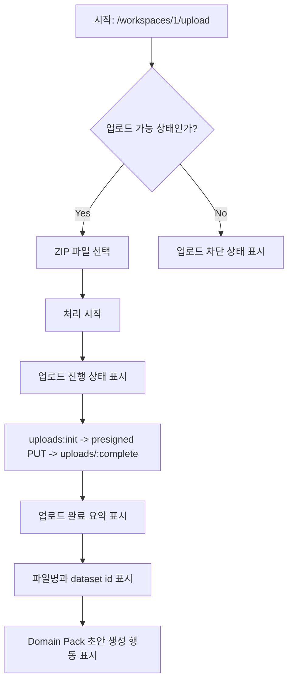

# Frontend E2E Spec: 상담 로그 ZIP 업로드 완료 확인

## Goal

운영자가 상담 로그 ZIP 파일을 업로드했을 때 진행 상태, 업로드 완료 상태, 다음 단계 행동 가능 여부를 화면 기준으로 검증하는 critical E2E 시나리오를 보강한다.

## User Flow Chart



## Design Diff

### As-is vs To-be

| 영역 | As-is | To-be | 변경 내용 |
|------|-------|-------|----------|
| E2E 보장 | Domain Pack 초안 생성 테스트 내부 helper에서 업로드 완료를 선행 확인 | ZIP 업로드 완료 자체를 `@critical` 시나리오로 독립 검증 | 업로드 완료 회귀를 더 빠르게 식별 |
| 중복 제출 방지 | 업로드 컴포넌트가 진행 상태를 표시하고 후속 버튼을 완료 후 노출 | 진행 중에는 완료/다음 행동이 보이지 않고, 완료 후 다음 행동이 보이는지 단언 | 화면 상태 전이를 Given/When/Then에 맞춰 고정 |
| fixture 안정성 | 성공/실패 generation fixture가 같은 파일 안에서 사용됨 | 성공 업로드 시나리오는 generation 요청을 하지 않고 업로드 API 호출만 확인 | 실패 fixture와 완료 상태 혼선을 줄임 |

## Component Tree

```text
WorkspaceUploadPage
└─ LogUploadForm
   ├─ FileUploader
   ├─ file preview / 처리 시작
   └─ afterUpload
      ├─ uploadSummary
      └─ PipelineJobStatusPanel 또는 generationPanel
```

## API Integration

### 조사 결과

| Method | Path | 용도 | 확인 경로 |
|--------|------|------|-----------|
| POST | `/api/v1/workspaces/1/datasets/uploads:init` | raw ZIP 업로드 초기화 | `frontend/src/features/log-upload/api/rawFileUpload.ts` |
| PUT | `/e2e-upload/raw-log.zip` | presigned URL 업로드 mock | `frontend/e2e/support/app-mocks.ts` |
| POST | `/api/v1/workspaces/1/datasets/uploads/77:complete` | raw ZIP 업로드 완료 처리 | `frontend/src/features/log-upload/api/rawFileUpload.ts` |
| GET | `/api/v1/workspaces/1/datasets/77/pipeline-jobs/latest?jobType=INGESTION` | 완료 후 자동 파이프라인 상태 조회 | `frontend/src/features/log-upload/model/useLatestDatasetPipelineJob.ts` |

실제 제품 플로우는 `useRawFileUpload`가 init 요청, presigned PUT, complete 요청을 순서대로 실행한다. mocked E2E에서는 `frontend/e2e/support/app-mocks.ts`가 동일한 순서를 fixture로 제공한다.

## Data Flow

```text
FileUploader
  -> LogUploadForm.handleFileSelect
  -> LogUploadForm.handleUpload
  -> useRawFileUpload.start
  -> initRawFileUpload
  -> putPresignedFile
  -> completeRawFileUpload
  -> uploadedDataset state
  -> uploadSummary + next action
```

## 수정 대상 파일

| 파일 | 변경 유형 | 설명 |
|------|----------|------|
| `.agent/specs/702.md` | new | 이슈 702 요구사항과 검증 기준 명세 |
| `frontend/e2e/upload-domain-pack-generation.spec.ts` | update | ZIP 업로드 완료 critical E2E 시나리오 추가 |
| `frontend/e2e/support/app-mocks.ts` | update | 업로드 진행 상태를 안정적으로 검증하기 위한 테스트 전용 presigned PUT 지연 옵션 추가 |

## State Management

- `LogUploadForm`의 `status`는 `idle -> uploading -> success` 흐름을 가진다.
- `uploadedDataset`은 complete 응답의 `datasetId`와 사용자가 선택한 파일명을 저장한다.
- 업로드 완료 후 `PipelineJobStatusPanel` 또는 generation panel이 다음 행동을 노출한다.
- 이 이슈는 상태 구조를 변경하지 않고, 기존 상태 전이가 화면에 안정적으로 드러나는지 E2E로 검증한다.

## Tests

### Test Strategy

| 구분 | 방법 | 도구 | 비고 |
|------|------|------|------|
| E2E | 업로드 화면 진입 후 ZIP 선택, 처리 시작, 완료 상태 확인 | Playwright | `@critical` 태그 적용 |
| API 보조 검증 | mock route 호출 순서/횟수 확인 | Playwright route seen log | 화면 단언을 우선하고 API 호출은 보조 검증 |

### Test Environment & 사전 조건

| 항목 | 값 |
|------|---|
| 환경 | `frontend/playwright.config.ts` mocked E2E |
| 인증 | `frontend/e2e/support/generated-api-auth.ts` |
| API Mock | `frontend/e2e/support/app-mocks.ts` |
| 업로드 가능 상태 | workspace 1, 무료 온보딩 사용 가능 또는 활성 구독 상태 |

### Test Scenarios

#### Happy Path

| # | 시나리오 | 사전 조건 | 조작 | 기대 결과 |
|---|---------|---------|------|----------|
| 1 | ZIP 업로드 완료 확인 | 운영자가 `/workspaces/1/upload`에 있고 업로드 가능 | `refund-log.zip` 선택 후 `처리 시작` 클릭 | 업로드 진행 상태가 표시되고 완료 후 `업로드 완료`, 파일명, `dataset 77`, Domain Pack 초안 생성 행동이 보인다 |

#### Error & Edge Cases

| # | 시나리오 | 조작 | 기대 결과 |
|---|---------|------|----------|
| 1 | 업로드 중 다음 단계 오진입 방지 | 업로드 시작 직후 확인 | 완료 전 `도메인팩 초안 생성 시작` 버튼과 완료 메시지가 보이지 않는다 |
| 2 | generation 실패 fixture 혼선 방지 | 업로드 완료 시나리오에서 generation 버튼을 누르지 않음 | generation API는 호출되지 않고 업로드 완료 상태만 검증한다 |

## Non-goals

- 백엔드 업로드 API, presigned URL 정책, 파일 크기/확장자 정책을 변경하지 않는다.
- Domain Pack 초안 생성 요청, 재시도, review 화면 진입 동작은 기존 E2E 시나리오에서 계속 검증한다.
- drag-and-drop 브라우저 이벤트 세부 구현은 이번 이슈의 필수 범위로 고정하지 않는다. Playwright 파일 선택으로 동일한 업로드 경로를 검증한다.

## Acceptance Criteria

- `frontend/e2e/upload-domain-pack-generation.spec.ts`에 이슈 702의 Given/When/Then을 반영한 `@critical` E2E가 추가된다.
- 테스트는 화면상 업로드 진행 상태, 완료 메시지, 파일명, dataset id, 다음 행동 노출을 단언한다.
- 업로드 중에는 완료 메시지와 Domain Pack 초안 생성 행동이 보이지 않음을 단언한다.
- 업로드 완료 시나리오에서는 generation request가 호출되지 않음을 확인하여 성공/실패 fixture 혼선을 방지한다.
- 모든 경로 참조는 이 저장소에서 확인된 실제 파일만 사용한다.

## Open Questions

- drag-and-drop 자체를 별도 critical E2E로 둘지는 제품 정책에 따라 후속 이슈에서 결정한다.
