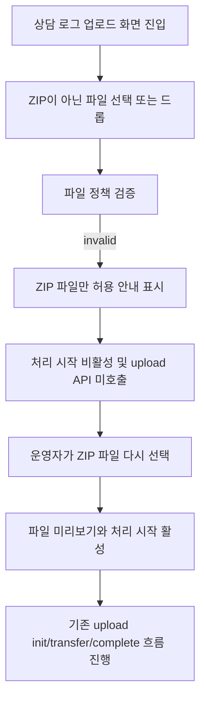

# Frontend FSD Spec: ZIP이 아닌 상담 로그 업로드 차단 E2E

## Goal

상담 로그 업로드 화면에서 운영자가 ZIP이 아닌 파일을 선택하거나 드래그앤드롭해도 업로드가 시작되지 않고, ZIP 파일만 허용된다는 안내와 유효한 ZIP 재선택 가능 상태를 E2E로 보장한다.

---

## User Flow Chart



---

## Design Diff

### As-is vs To-be

| 영역 | As-is | To-be | 변경 내용 |
| --- | --- | --- | --- |
| E2E 검증 | 파일 미선택과 ZIP happy path는 mocked E2E로 검증됨 | ZIP이 아닌 파일 선택/드롭이 업로드를 시작하지 않음을 별도 E2E로 검증 | 이슈의 invalid file Given/When/Then을 사용자 화면 기준으로 고정 |
| 파일 정책 | `validateRawLogUploadFile`이 `.zip` 확장자를 요구하고 4GB 제한을 적용 | 기존 정책 유지 | 정책 변경 없이 화면 레벨 회귀 테스트 추가 |
| 재시도 흐름 | 유효한 ZIP 선택 후 기존 upload flow 진행 | invalid file 이후에도 ZIP 파일을 다시 선택해 업로드 가능해야 함 | invalid 상태가 성공/완료 상태로 오인되지 않음을 검증 |

---

## Component Tree

```text
WorkspaceUploadPage
└─ LogUploadForm
   ├─ FileUploader
   │  └─ input[type=file] / drag-and-drop drop zone
   ├─ filePreview
   │  └─ Button(처리 시작)
   ├─ PipelineJobStatusPanel
   └─ generationPanel
```

---

## API Integration

### Endpoints

| Method | Path | Description |
| --- | --- | --- |
| POST | `/workspaces/{workspaceId}/datasets/uploads:init` | 유효한 ZIP 파일 업로드 시작 시 raw dataset 업로드 초기화 |
| PUT | presigned upload URL | 유효한 ZIP 파일 업로드 시작 시 raw file 전송 |
| POST | `/workspaces/{workspaceId}/datasets/uploads/{datasetId}:complete` | 유효한 ZIP 파일 업로드 완료 처리 |
| GET | `/workspaces/{workspaceId}/datasets/{datasetId}/pipeline-jobs/latest?jobType=INGESTION` | 업로드 완료 후 자동 파이프라인 상태 조회 |

ZIP이 아닌 파일을 선택하거나 드롭한 상태에서는 upload init, presigned PUT, upload complete, domain-pack generation 요청이 발생하지 않아야 한다.

---

## Data Flow

```text
FileUploader
  -> onFileSelect(file)
  -> LogUploadForm.handleFileSelect
       -> validateRawLogUploadFile(file)
       -> invalid: toast.error("ZIP 파일만 업로드할 수 있습니다.") + invalid file 미반영
       -> valid: file state 갱신 + previous upload/generation state reset

처리 시작
  -> file이 있을 때만 useRawFileUpload.start()
```

---

## 수정 대상 파일

| 파일 | 변경 유형 | 설명 |
| --- | --- | --- |
| `.agent/specs/703.md` | new | 이슈 요구사항과 검증 기준 기록 |
| `frontend/e2e/workspace-core.spec.ts` | modify | non-ZIP 선택/드롭 차단, API 미호출, ZIP 재선택 가능 E2E 추가 |
| `frontend/src/features/log-upload/ui/LogUploadForm.tsx` | inspect | 기존 `validateRawLogUploadFile` 적용 위치 확인, E2E 실패 시에만 수정 |
| `frontend/src/shared/lib/rawLogUploadPolicy.ts` | inspect | 기존 ZIP 확장자/크기 정책 확인, 정책 변경은 범위 밖 |

---

## State Management

- 서버 상태 또는 전역 상태를 추가하지 않는다.
- invalid file은 `LogUploadForm`의 `file` state에 반영되지 않아야 하며 기존 `status`는 `idle`을 유지한다.
- invalid file 후 `처리 시작`은 disabled 상태로 남아야 한다.
- 유효한 ZIP 파일을 다시 선택하면 기존 `handleFileSelect` reset 흐름으로 upload/generation 상태가 초기화되고 `처리 시작`이 활성화된다.
- 드래그앤드롭은 `FileUploader`가 지원하는 입력 경로이므로 클릭 선택과 동일한 `onFileSelect` 정책을 통과해야 한다.

---

## Tests

### Test Strategy

| 구분 | 방법 | 도구 | 비고 |
| --- | --- | --- | --- |
| E2E 회귀 | 업로드 화면에서 non-ZIP 선택/드롭 후 upload 요청 미발생과 ZIP 재시도 검증 | Playwright mocked E2E | `frontend/e2e/workspace-core.spec.ts` |
| 정적 검증 | diff와 포맷 확인 | git / frontend test scripts | 변경 파일 중심 검증 |

### Test Environment & 사전 조건

| 항목 | 값 |
| --- | --- |
| 환경 | `frontend` package mocked E2E |
| API Mock | `frontend/e2e/support/app-mocks.ts` |
| 사전 조건 | 인증된 workspace operator가 `/workspaces/1/upload`에 진입 |

### Test Scenarios

#### Error & Edge Cases

| # | Given | When | Then |
| --- | --- | --- | --- |
| 1 | 운영자가 상담 로그 업로드 화면에 있다. | `notes.txt` 같은 ZIP이 아닌 파일을 file input으로 선택한다. | ZIP 파일만 허용 안내가 표시되고 upload API가 호출되지 않으며 처리 시작은 비활성 상태로 남는다. |
| 2 | 운영자가 상담 로그 업로드 화면에 있다. | `logs.csv` 같은 ZIP이 아닌 파일을 drop zone에 드롭한다. | 클릭 선택과 동일하게 ZIP 안내가 표시되고 upload API가 호출되지 않는다. |
| 3 | invalid file 선택/드롭이 거절된 뒤 같은 화면에 있다. | `refund-log.zip`을 다시 선택하고 처리 시작을 누른다. | 기존 upload init/transfer/complete와 파이프라인 상태 조회 흐름이 정상 진행된다. |

#### 반응형 & 접근성

| # | 확인 항목 | 기대 결과 |
| --- | --- | --- |
| 1 | 키보드/보조기술 문맥 | invalid file 후에도 기존 파일 선택 안내와 disabled 처리 시작 버튼이 유지된다. |
| 2 | 화면 안내 | 허용 형식 안내는 기존 ZIP 업로드 정책 문구와 toast 오류로 확인된다. |

---

## Acceptance Criteria

- ZIP이 아닌 파일을 클릭 선택하면 `ZIP 파일만 업로드할 수 있습니다.` 안내가 표시된다.
- ZIP이 아닌 파일을 드래그앤드롭해도 동일한 제한이 적용된다.
- invalid file 상태에서는 `POST /workspaces/1/datasets/uploads:init`, presigned PUT, upload complete, domain-pack generation 요청이 발생하지 않는다.
- invalid file 이후에도 유효한 ZIP 파일을 다시 선택해 기존 업로드 성공 흐름을 진행할 수 있다.
- 기존 파일 미선택, ZIP happy path, 도메인팩 생성 fallback E2E 흐름은 유지된다.

---

## Non-goals

- 백엔드 upload, dataset, pipeline job API 계약은 변경하지 않는다.
- ZIP 허용 정책을 MIME 기반으로 새로 바꾸지 않는다.
- 파일 크기 제한, 무료 온보딩/구독 gating, 자동 파이프라인 생성 정책은 변경하지 않는다.
- live E2E 또는 실제 외부 저장소 업로드 검증은 포함하지 않는다.

---

## Validation

- `cd frontend && pnpm exec playwright test e2e/workspace-core.spec.ts --grep "ZIP이 아닌"`
- `cd frontend && pnpm exec vp test run src/features/log-upload/ui/LogUploadForm.test.tsx src/shared/lib/rawLogUploadPolicy.test.ts`
- `git diff --check`

## Open Questions

- 없음. 현재 확인된 제품 정책은 파일명 `.zip` 확장자와 4GB 크기 제한이며, 이 이슈는 해당 정책이 사용자 입력 경로에서 upload 시작 전에 적용되는지를 검증한다.
