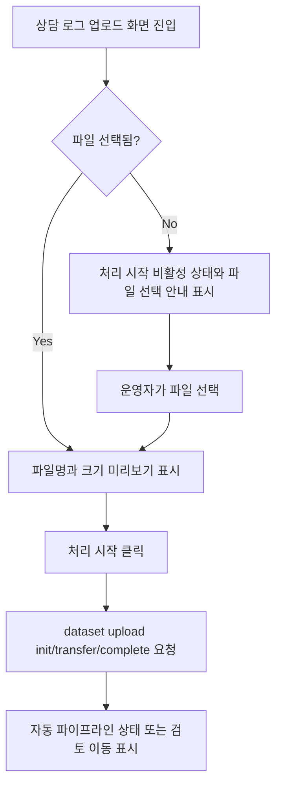

# Frontend FSD Spec: 파일 미선택 상태 처리 시작 방지

## Goal

상담 로그 업로드 화면에서 파일을 선택하지 않은 운영자가 처리 시작 흐름을 진행할 수 없고, 먼저 파일을 선택해야 한다는 상태를 명확히 확인할 수 있게 한다.

---

## User Flow Chart



---

## Design Diff

### As-is vs To-be

| 영역                  | As-is                                          | To-be                                                             | 변경 내용                                                                   |
| --------------------- | ---------------------------------------------- | ----------------------------------------------------------------- | --------------------------------------------------------------------------- |
| 파일 미선택 idle 상태 | 업로드 박스만 표시되고 `처리 시작` 액션은 없음 | `처리 시작` 액션을 비활성으로 표시하고 파일 선택 안내를 함께 표시 | 운영자가 현재 처리 시작이 막힌 이유를 화면에서 즉시 확인                    |
| 처리 시작 가능 조건   | 파일 선택 후에만 버튼 렌더링                   | 파일 선택 전에는 disabled, 파일 선택 후에는 enabled               | 파일 없이 dataset/pipeline 요청이 발생하지 않는 조건을 UI와 테스트에서 명시 |
| 이전 업로드 완료 상태 | 새 파일 선택 또는 초기화 시 상태 reset         | 기존 reset 동작 유지                                              | 이전 업로드 완료 상태가 현재 선택 상태로 오인되지 않게 유지                 |

---

## Component Tree

```text
WorkspaceUploadPage
└─ LogUploadForm
   ├─ FileUploader
   ├─ filePreview / pendingAction
   │  └─ Button(처리 시작)
   ├─ PipelineJobStatusPanel
   └─ generationPanel
```

---

## API Integration

### Endpoints

| Method | Path                                                                                    | Description                                         |
| ------ | --------------------------------------------------------------------------------------- | --------------------------------------------------- |
| POST   | `/workspaces/{workspaceId}/datasets/uploads:init`                                       | 파일 선택 후 처리 시작 시 raw dataset 업로드 초기화 |
| PUT    | presigned upload URL                                                                    | 파일 선택 후 처리 시작 시 raw file 전송             |
| POST   | `/workspaces/{workspaceId}/datasets/uploads/{datasetId}:complete`                       | 파일 선택 후 업로드 완료 처리                       |
| GET    | `/workspaces/{workspaceId}/datasets/{datasetId}/pipeline-jobs/latest?jobType=INGESTION` | 업로드 완료 후 자동 파이프라인 상태 조회            |
| POST   | `/workspaces/{workspaceId}/datasets/{datasetId}/pipeline-jobs/domain-pack-generation`   | 자동 파이프라인이 없을 때 수동 생성 fallback        |

파일이 선택되지 않은 상태에서는 위 endpoint가 호출되지 않아야 한다.

---

## Data Flow

```text
LogUploadForm local state
├─ file: File | null
├─ status: idle | uploading | success
├─ uploadedDataset: UploadedDataset | null
└─ generationStatus

file === null
└─ 처리 시작 disabled + 파일 선택 안내

file !== null && status === idle
└─ 파일 미리보기 + 처리 시작 enabled
   └─ useRawFileUpload.start()
```

---

## 수정 대상 파일

| 파일                                                             | 변경 유형 | 설명                                                                              |
| ---------------------------------------------------------------- | --------- | --------------------------------------------------------------------------------- |
| `frontend/src/features/log-upload/ui/LogUploadForm.tsx`          | modify    | 파일 미선택 상태의 비활성 처리 시작 액션과 안내 문구 표시                         |
| `frontend/src/features/log-upload/ui/log-upload-form.module.css` | modify    | 파일 미선택/선택 액션 영역 스타일 추가                                            |
| `frontend/src/features/log-upload/ui/LogUploadForm.test.tsx`     | modify    | 파일 미선택 상태의 disabled 처리 시작 및 upload 미호출 검증                       |
| `frontend/e2e/workspace-core.spec.ts`                            | modify    | 파일 미선택 상태에서 dataset/pipeline 요청이 발생하지 않는 E2E 회귀 시나리오 추가 |

---

## State Management

- 서버 상태 또는 전역 상태를 추가하지 않는다.
- 파일 선택 여부는 기존 `LogUploadForm`의 `file` local state로 판단한다.
- 파일 선택 전 `처리 시작`은 disabled 상태여야 하며 click handler가 upload를 시작하지 않아야 한다.
- 파일 선택 후에는 기존 `handleUpload(file)` 흐름을 유지한다.
- 새 파일 선택 또는 초기화 시 기존 `uploadedDataset`, `generationStatus`, upload mutation reset 동작을 유지한다.

---

## Tests

### Test Strategy

| 구분            | 방법                                                         | 도구                           | 비고                     |
| --------------- | ------------------------------------------------------------ | ------------------------------ | ------------------------ |
| 컴포넌트 테스트 | 파일 미선택/선택 상태 UI와 upload 호출 여부 검증             | Vitest + React Testing Library | `LogUploadForm.test.tsx` |
| E2E 테스트      | 업로드 화면에서 파일 없이 처리 시작 불가 및 요청 미발생 검증 | Playwright                     | `workspace-core.spec.ts` |

### Test Environment & 사전 조건

| 항목      | 값                                                        |
| --------- | --------------------------------------------------------- |
| 환경      | `frontend` package test/e2e                               |
| API Mock  | `frontend/e2e/support/app-mocks.ts`                       |
| 사전 조건 | 인증된 workspace operator가 `/workspaces/1/upload`에 진입 |

### Test Scenarios

#### Happy Path

| #   | 시나리오            | 사전 조건                   | 조작                              | 기대 결과                                                          |
| --- | ------------------- | --------------------------- | --------------------------------- | ------------------------------------------------------------------ |
| 1   | 파일 선택 후 업로드 | 운영자가 업로드 화면에 있음 | ZIP 파일 선택 후 `처리 시작` 클릭 | 기존 upload init/transfer/complete와 파이프라인 검토 흐름이 유지됨 |

#### Error & Edge Cases

| #   | 시나리오                   | 조작                                   | 기대 결과                                                                                |
| --- | -------------------------- | -------------------------------------- | ---------------------------------------------------------------------------------------- |
| 1   | 파일 미선택 상태           | 업로드 화면 진입 후 파일을 고르지 않음 | `처리 시작`은 disabled이고 파일 선택 안내가 보이며 dataset/pipeline 요청이 발생하지 않음 |
| 2   | 이전 업로드 완료 후 초기화 | `다른 파일 업로드` 클릭                | 이전 dataset/pipeline 상태가 사라지고 파일 미선택 안내 상태로 돌아감                     |

#### 반응형 & 접근성

| #   | 확인 항목     | 기대 결과                                                        |
| --- | ------------- | ---------------------------------------------------------------- |
| 1   | 키보드 탐색   | disabled `처리 시작`은 실행되지 않고 파일 input은 계속 사용 가능 |
| 2   | 스크린 리더   | 파일 선택 안내 텍스트가 버튼 주변 문맥으로 읽힘                  |
| 3   | 모바일 뷰포트 | 파일 미선택 안내와 버튼이 세로 레이아웃에서 겹치지 않음          |

---

## Non-goals

- 백엔드 upload, dataset, pipeline job API 계약은 변경하지 않는다.
- ZIP 파일 정책과 파일 크기 제한은 변경하지 않는다.
- 업로드 완료 이후 자동 파이프라인/수동 생성 fallback 정책은 변경하지 않는다.

---

## Open Questions

- 없음. 이슈는 버튼 비활성화 또는 submit-time validation 중 하나를 허용하며, 본 변경은 비활성화 방식을 따른다.
