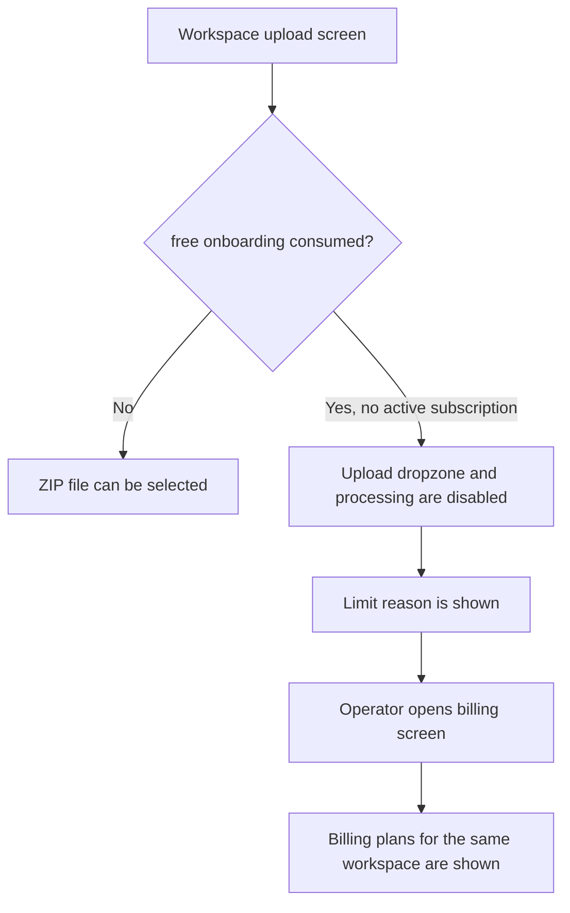

# Frontend E2E Spec: 무료 요금제 사용량 소진 시 업로드 차단

## Goal

무료 온보딩/무료 요금제 업로드 권리를 모두 사용한 운영자가 상담 로그 ZIP 업로드를 시도할 때 업로드가 시작되지 않고, 제한 이유와 결제 화면으로 이동할 수 있는 다음 행동을 명확히 확인하도록 보장한다.

## User Flow Chart



## Design Diff

### As-is vs To-be

| Area | As-is | To-be | Change |
| --- | --- | --- | --- |
| Upload entry state | `LogUploadForm` disables upload when `freeOnboardingStatus=CONSUMED` and there is no active subscription | The blocked state also provides a billing/upgrade navigation action from the upload screen | Adds the explicit next action required by Issue #705 |
| E2E coverage | Upload E2E covers successful upload and Domain Pack generation request | Mocked Playwright covers exhausted free workspace upload block before any upload API call | Adds a regression scenario for the quota-blocked path |
| Workspace isolation | Billing mocks already keep workspace 1 and 2 data separate | The exhausted-free-workspace scenario asserts workspace 1 billing navigation and avoids upload requests | Keeps the scenario scoped to the current workspace |

## Component Tree

```text
WorkspaceUploadPage
└─ LogUploadForm
   ├─ onboarding/quota status banner
   ├─ FileUploader
   ├─ idle file preview + processing CTA
   └─ blocked billing CTA
```

## API Integration

### Endpoints

| Method | Path | Description |
| --- | --- | --- |
| GET | `/api/v1/workspaces/{workspaceId}` | Supplies workspace metadata including `freeOnboardingStatus` when available |
| GET | `/api/v1/workspaces/{workspaceId}/subscription` | Supplies active subscription state; 404/null means no active subscription |
| POST | `/api/v1/workspaces/{workspaceId}/datasets/uploads:init` | Must not be called in the blocked scenario |
| GET | `/api/v1/workspaces/{workspaceId}/billing/overview` | Billing page overview for the same workspace after CTA navigation |

No backend contract or generated API change is required for this issue.

## Data Flow

```text
WorkspaceUploadPage
├─ useGetWorkspace(workspaceId) -> freeOnboardingStatus
├─ useSubscription(workspaceId) -> hasActiveSubscription
└─ LogUploadForm props
   ├─ disables FileUploader and processing CTA when consumed without subscription
   ├─ shows the limit reason
   └─ navigates to /workspaces/{workspaceId}/billing for the next action
```

## 수정 대상 파일

| File | Change type | Description |
| --- | --- | --- |
| `frontend/src/features/log-upload/ui/LogUploadForm.tsx` | modify | Add billing navigation action to the blocked consumed-free state |
| `frontend/src/features/log-upload/ui/log-upload-form.module.css` | modify | Style the blocked-state action without changing the upload layout |
| `frontend/src/features/log-upload/ui/LogUploadForm.test.tsx` | modify | Cover billing CTA rendering/navigation and existing upload block behavior |
| `frontend/e2e/support/app-mocks.ts` | modify | Add narrow mock options for exhausted workspace 1 subscription/onboarding state |
| `frontend/e2e/upload-domain-pack-generation.spec.ts` | modify | Add mocked E2E scenario for blocked free-plan upload |

## State Management

- Server state remains in existing generated hooks and entity wrappers.
- `LogUploadForm` keeps local upload/generation state unchanged.
- The free-plan upload block is derived from `freeOnboardingStatus === "CONSUMED"` and no active subscription.
- Workspace-specific billing navigation uses the current `workspaceId`; it does not infer a different workspace or global billing state.

## Tests

### Test Strategy

| Type | Tool | Scenario |
| --- | --- | --- |
| Component | Vitest + React Testing Library | Consumed free onboarding with no active subscription shows billing CTA, disables upload, and navigates to current workspace billing |
| E2E | Playwright mocked API | Workspace 1 exhausted free state blocks ZIP upload, avoids upload API calls, and opens workspace 1 billing plans |

### Acceptance Criteria

- [ ] When workspace 1 has `freeOnboardingStatus=CONSUMED` and no active subscription, the upload page shows the consumed/free-limit explanation.
- [ ] The file input and `처리 시작` action are disabled before any upload can start.
- [ ] Selecting/clicking in the blocked state does not produce an upload completion state or pipeline start state.
- [ ] The page shows a billing/upgrade action and routes to `/workspaces/1/billing`.
- [ ] The blocked scenario does not call upload-init, upload-complete, or pipeline-generation API routes.
- [ ] Billing and usage state remain scoped to the same workspace in the mocked scenario.

## Non-goals

- Change backend quota policy, quota counters, or response schemas.
- Add a new payment/upgrade product flow beyond the existing workspace billing screen.
- Assert an unverified paid-plan copy, exact free-plan period, or external payment-provider behavior.
- Regenerate OpenAPI clients.

## Validation Plan

- `pnpm --dir frontend test -- src/features/log-upload/ui/LogUploadForm.test.tsx --run`
- `pnpm --dir frontend e2e -- upload-domain-pack-generation.spec.ts`
- `pnpm --dir frontend exec eslint e2e/upload-domain-pack-generation.spec.ts e2e/support/app-mocks.ts src/features/log-upload/ui/LogUploadForm.tsx`

## Open Questions

- The issue asks to confirm the exact free-plan quota policy and message. This implementation uses the product code's current `무료 온보딩 사용 완료` state and existing billing route as the confirmed behavior.
