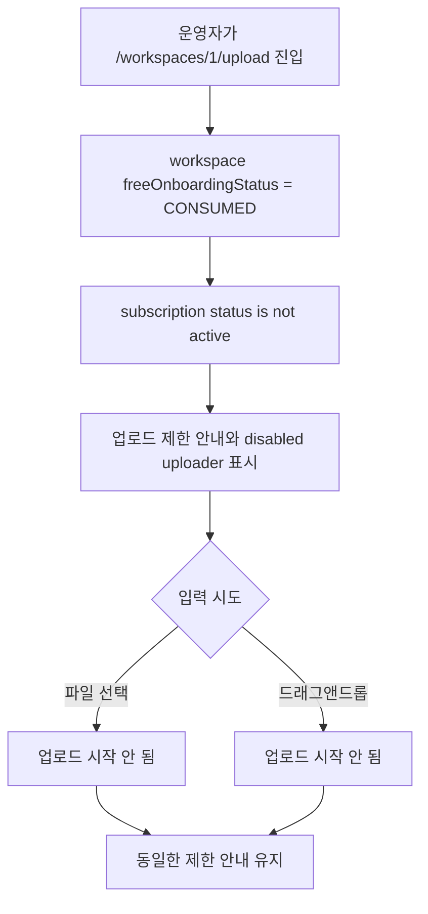

# Frontend E2E Spec: 무료 요금제 업로드 제한 입력 경로 일관성

## Goal

무료 온보딩을 이미 사용했고 활성 구독이 없는 워크스페이스에서는 상담 로그 업로드가 파일 선택과 드래그앤드롭 어느 입력 경로에서도 시작되지 않음을 E2E로 검증한다.

## Issue Context

- 대상 이슈: GitHub Issue #706 `[P2] E2E Critical 후보: 무료 요금제 업로드 제한이 클릭과 드래그앤드롭에 동일하게 적용된다`
- 사용자 기대: 무료 요금제 제한 상태의 운영자가 입력 방식 차이로 업로드 제한을 우회할 수 없어야 한다.
- 기술 확인 결과: `frontend/src/shared/ui/file-upload/FileUploader.tsx`는 파일 input 변경과 drag/drop을 모두 지원하며, `disabled` 상태에서는 두 경로 모두 `onFileSelect`를 호출하지 않는다.

## User Flow Chart



## Design Diff

| 영역             | As-is                                              | To-be                                                                                     | 변경 내용                                                    |
| ---------------- | -------------------------------------------------- | ----------------------------------------------------------------------------------------- | ------------------------------------------------------------ |
| Mock E2E fixture | 기본 workspace는 업로드 가능/활성 구독 상태만 제공 | free onboarding consumed + no subscription 상태를 테스트별로 구성 가능                    | 제한 상태 fixture가 유료/사용량 회복 상태와 섞이지 않게 한다 |
| Upload E2E       | 파일 미선택, 정상 업로드, 생성/리뷰 이동을 검증    | 제한 상태에서 파일 선택과 drag/drop 모두 업로드 요청을 만들지 않는 critical 시나리오 추가 | 두 입력 경로의 제한 우회 회귀를 막는다                       |

## Component Tree

```text
WorkspaceUploadPage
└─ LogUploadForm
   └─ FileUploader
      ├─ input[type="file"]
      └─ drop target
```

## API Integration

이 이슈는 새 API를 만들지 않는다. Mock E2E에서 아래 기존 호출의 응답 상태만 조정한다.

| Method | Path                                                | 목적                                            |
| ------ | --------------------------------------------------- | ----------------------------------------------- |
| GET    | `/api/v1/workspaces/1`                              | `freeOnboardingStatus: "CONSUMED"` fixture 제공 |
| GET    | `/api/v1/workspaces/1/subscription`                 | subscription 없음 fixture 제공                  |
| POST   | `/api/v1/workspaces/1/datasets/uploads:init`        | 제한 상태에서는 호출되지 않아야 함              |
| PUT    | presigned upload URL                                | 제한 상태에서는 호출되지 않아야 함              |
| POST   | `/api/v1/workspaces/1/datasets/uploads/77:complete` | 제한 상태에서는 호출되지 않아야 함              |

## 수정 대상 파일

| 파일                                      | 변경 유형 | 설명                                                         |
| ----------------------------------------- | --------- | ------------------------------------------------------------ |
| `frontend/e2e/support/app-mocks.ts`       | modify    | workspace/subscription 제한 상태를 테스트 옵션으로 구성한다  |
| `frontend/e2e/upload-entitlement.spec.ts` | new       | 파일 선택과 드래그앤드롭 제한 경로를 critical E2E로 검증한다 |

## State Management

- 서버 상태 mock만 조정한다.
- 실제 프론트엔드 상태 흐름은 현재 `WorkspaceUploadPage`가 workspace와 subscription query 결과를 `LogUploadForm`에 전달하는 구조를 유지한다.
- 제한 판단은 현재 `LogUploadForm`의 `freeOnboardingStatus === "CONSUMED" && !hasActiveSubscription` 조건을 따른다.

## Tests

### Test Strategy

| 구분            | 방법                  | 도구                                                             | 비고                              |
| --------------- | --------------------- | ---------------------------------------------------------------- | --------------------------------- |
| E2E             | Mock API + Playwright | `pnpm --dir frontend e2e -- upload-entitlement.spec.ts`          | issue의 Given/When/Then 직접 검증 |
| Critical subset | Playwright grep       | `pnpm --dir frontend e2e:critical -- upload-entitlement.spec.ts` | `@critical` 태그 포함             |

### Test Scenario

| #   | Given                                                                | When                                                | Then                                                                                    |
| --- | -------------------------------------------------------------------- | --------------------------------------------------- | --------------------------------------------------------------------------------------- |
| 1   | 무료 온보딩이 사용 완료되고 활성 구독이 없는 workspace의 업로드 화면 | ZIP 파일을 file input 경로로 선택 시도              | 제한 안내가 유지되고 upload init, presigned PUT, complete 요청이 발생하지 않는다        |
| 2   | 같은 제한 상태                                                       | 같은 ZIP 파일을 uploader drop target에 드래그앤드롭 | 동일한 제한 안내가 유지되고 upload init, presigned PUT, complete 요청이 발생하지 않는다 |

## Non-goals

- 새 업로드 제한 정책, 결제 정책, API, DB schema를 만들지 않는다.
- UI 문구나 결제 전환 UX를 변경하지 않는다.
- drag/drop을 지원하지 않는 별도 컴포넌트를 새로 만들지 않는다.

## Validation Expectations

- `pnpm --dir frontend e2e -- upload-entitlement.spec.ts`
- 필요 시 `pnpm --dir frontend e2e:critical -- upload-entitlement.spec.ts`
