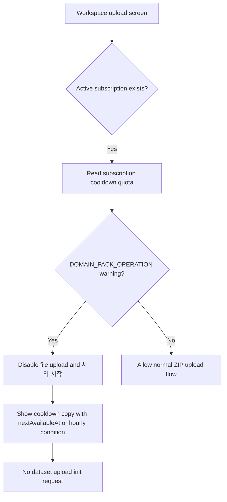

# Frontend E2E Spec: 유료 요금제 쿨다운 중 업로드 차단

## Goal

유료 요금제 워크스페이스에서 도메인팩 생성·검토 시간당 한도가 소진된 동안 운영자가 새 상담 로그 ZIP 업로드를 시작하지 못하고, 재개 가능 조건을 이해할 수 있음을 보장한다.

## Issue Summary

GitHub Issue #707은 유료 요금제에도 쿨다운 정책이 적용되는 동안 새 ZIP 업로드가 시작되지 않아야 하며, 사용자가 무료 요금제 사용량 제한과 혼동하지 않는 안내를 받아야 한다는 Critical E2E 후보이다.

현재 코드 기준 backend는 `WorkspaceQuotaService.assertPipelineRunAllowed`에서 도메인팩 생성·검토를 `DOMAIN_PACK_OPERATION` 롤링 1시간 한도로 차단한다. 하지만 멤버 권한으로 조회 가능한 subscription 응답과 billing overview는 결제 기간 단위 `PIPELINE_RUN` 사용량만 노출하고, upload page는 무료 온보딩 소진 여부만 선제 차단한다. 따라서 이번 작업은 시간당 도메인팩 작업 한도 상태를 멤버가 접근 가능한 구독 상태 응답에 노출하고, billing overview에도 같은 quota usage를 반영하며, 업로드 화면에서 해당 쿨다운 신호가 있으면 ZIP 선택·처리 시작을 막는 사용자 흐름을 고정한다.

## User Flow Chart



## Design Diff

| 영역 | As-is | To-be | 변경 내용 |
| --- | --- | --- | --- |
| Backend subscription/overview | 결제 기간 단위 `PIPELINE_RUN` 중심으로 노출 | `DOMAIN_PACK_OPERATION` 롤링 1시간 사용량과 `nextAvailableAt`도 반환 | 업로드 화면이 유료 쿨다운을 선제 판단할 수 있는 계약 추가 |
| Upload UI | 무료 온보딩 소진만 선제 차단 | 유료 구독 활성 상태에서도 도메인팩 작업 쿨다운이면 업로드 선택과 처리 시작을 비활성화 | 무료 사용량 제한과 다른 쿨다운 안내 제공 |
| Mocked E2E | 정상 업로드 및 생성 요청 경로 중심 | 유료 워크스페이스 쿨다운 fixture에서 업로드 요청이 시작되지 않음을 검증 | dataset/pipeline job 생성 회귀 방지 |

## Component Tree

```text
frontend/src/pages/upload/ui/WorkspaceUploadPage.tsx
└─ LogUploadForm
   ├─ FileUploader
   ├─ paid cooldown notice
   └─ disabled upload action

frontend/e2e/paid-upload-cooldown.spec.ts
└─ Paid plan upload cooldown
   └─ upload blocked before dataset init

backend/src/main/java/com/init/payment/application/SubscriptionService.java
└─ getSubscription
   └─ DOMAIN_PACK_OPERATION hourly usage

backend/src/main/java/com/init/payment/application/BillingOverviewService.java
└─ quotaUsages
   └─ same DOMAIN_PACK_OPERATION hourly usage
```

## API Integration

### Backend

`GET /api/v1/workspaces/{workspaceId}/subscription` 응답에 아래 quota usage를 포함하고, `GET /api/v1/workspaces/{workspaceId}/billing/overview`의 `quotaUsages` 배열에도 같은 resource를 추가한다.

| Field | Value |
| --- | --- |
| `resource` | `DOMAIN_PACK_OPERATION` |
| `used` | 현재 시각 기준 직전 1시간 도메인팩 생성·검토 작업 수 |
| `limit` | plan의 `pipelineRunHourlyLimit` |
| `warning` | `limit >= 0 && used >= limit` |
| `nextAvailableAt` | warning 상태이고 윈도우 내 가장 오래된 작업 시각을 알 수 있으면 그 시각 + 1시간 |

`nextAvailableAt`을 계산할 수 없으면 frontend는 “최근 도메인팩 생성·검토 후 최대 1시간 뒤” 조건 문구를 표시한다. Enterprise처럼 `limit < 0`인 플랜은 쿨다운 차단 대상이 아니다.

### Frontend

`WorkspaceUploadPage`는 기존 `useSubscription(parsedWorkspaceId)` 응답의 `quotaUsages`에서 쿨다운 상태를 읽고, `LogUploadForm`에 쿨다운 차단 상태를 props로 전달한다. 쿨다운 차단 상태에서는 다음 동작이 막힌다.

| Action | Expected |
| --- | --- |
| ZIP 파일 선택 | 선택 이벤트가 들어와도 toast로 쿨다운 안내 후 state를 변경하지 않는다 |
| `처리 시작` 클릭 | 버튼 disabled, upload init API 호출 없음 |
| 무료 온보딩 소진 메시지 | 표시하지 않음. 유료 요금제 쿨다운 안내를 우선 표시 |

## 수정 대상 파일

| 파일 | 변경 유형 | 설명 |
| --- | --- | --- |
| `.agent/specs/707.md` | new | Issue #707 요구사항과 검증 기준 기록 |
| `backend/src/main/java/com/init/payment/application/QuotaUsageResult.java` | modify | optional `nextAvailableAt` 포함 |
| `backend/src/main/java/com/init/payment/application/SubscriptionResult.java` | modify | subscription 응답에 quota usages 포함 |
| `backend/src/main/java/com/init/payment/application/SubscriptionService.java` | modify | 멤버 권한 subscription 조회에 시간당 도메인팩 작업 사용량 포함 |
| `backend/src/main/java/com/init/payment/application/BillingOverviewService.java` | modify | 시간당 도메인팩 작업 사용량을 overview에 포함 |
| `backend/src/main/java/com/init/payment/application/WorkspaceQuotaUsagePort.java` | modify | 윈도우 내 가장 오래된 도메인팩 작업 시각 조회 계약 추가 |
| `backend/src/main/java/com/init/payment/infrastructure/JdbcWorkspaceQuotaUsageRepository.java` | modify | oldest operation timestamp SQL 구현 |
| `backend/src/main/java/com/init/payment/presentation/dto/SubscriptionResponse.java` | modify | `quotaUsages` 응답 필드 추가 |
| `backend/src/main/java/com/init/payment/presentation/dto/QuotaUsageResponse.java` | modify | `nextAvailableAt` 응답 필드 추가 |
| `backend/src/test/java/com/init/payment/application/SubscriptionServiceTest.java` | modify | subscription 쿨다운 quota 계산 검증 |
| `backend/src/test/java/com/init/payment/application/BillingOverviewServiceTest.java` | modify | hourly operation usage와 `nextAvailableAt` 검증 |
| `frontend/src/pages/upload/ui/WorkspaceUploadPage.tsx` | modify | subscription 쿨다운 상태를 upload form으로 전달 |
| `frontend/src/features/log-upload/ui/LogUploadForm.tsx` | modify | paid cooldown 차단 UI와 guard 추가 |
| `frontend/src/features/log-upload/ui/LogUploadForm.test.tsx` | modify | 쿨다운 차단 단위 테스트 추가 |
| `frontend/e2e/support/app-mocks.ts` | modify | paid cooldown fixture 옵션 추가 |
| `frontend/e2e/paid-upload-cooldown.spec.ts` | new | 유료 쿨다운 중 upload init 미호출 E2E 추가 |

## State Management

- Server state: `useSubscription`이 반환한 `quotaUsages`에서 `DOMAIN_PACK_OPERATION`을 찾는다.
- Client state: `LogUploadForm`은 기존 local upload state를 유지하되, paid cooldown block 상태에서는 파일 선택, 처리 시작, reset 이후 재선택을 모두 같은 guard로 막는다.
- Loading/error: subscription 조회가 로딩 중이면 기존 권한 확인 상태에 맞춰 일시적으로 uploader를 disabled한다. subscription 조회 실패는 서버 업로드 검증에 맡기기 위해 선제 차단하지 않는다.

## Acceptance Criteria

- [ ] subscription 응답과 billing overview가 활성 구독의 `DOMAIN_PACK_OPERATION` 시간당 사용량과 한도, warning 상태, 가능한 경우 `nextAvailableAt`을 반환한다.
- [ ] 유료 구독이 활성이고 `DOMAIN_PACK_OPERATION.warning === true`이면 upload form의 파일 입력과 `처리 시작` 버튼이 비활성화된다.
- [ ] 쿨다운 안내는 무료 온보딩 소진 문구와 구분되며, `nextAvailableAt` 또는 “최근 도메인팩 생성·검토 후 최대 1시간 뒤” 조건을 포함한다.
- [ ] 쿨다운 중 파일 선택 이벤트가 들어와도 dataset upload init 요청이 시작되지 않는다.
- [ ] mocked E2E는 `POST /workspaces/1/datasets/uploads:init`, `POST /workspaces/1/datasets/uploads/77:complete`, `POST /workspaces/1/datasets/77/pipeline-jobs/domain-pack-generation`이 호출되지 않음을 검증한다.

## Non-goals

- 새로운 결제 정책이나 plan 가격을 정의하지 않는다.
- dataset 업로드 자체의 서버 quota 정책을 변경하지 않는다.
- OpenAPI endpoint path를 변경하지 않는다.
- live E2E나 실제 결제 provider 의존 테스트를 추가하지 않는다.
- Airflow DAG, ML pipeline artifact, review task 생성 로직을 변경하지 않는다.

## Validation

| 검증 | 목적 |
| --- | --- |
| `cd backend && ./gradlew test --tests com.init.payment.application.SubscriptionServiceTest --tests com.init.payment.application.BillingOverviewServiceTest` | backend subscription/overview hourly quota 계약 검증 |
| `pnpm --dir frontend test -- src/features/log-upload/ui/LogUploadForm.test.tsx src/pages/upload/ui/WorkspaceUploadPage.test.tsx --run` | upload form/page 쿨다운 상태 검증 |
| `pnpm --dir frontend e2e -- paid-upload-cooldown.spec.ts` | mocked E2E에서 유료 쿨다운 중 upload init 미호출 검증 |
| `pnpm --dir frontend exec eslint e2e/paid-upload-cooldown.spec.ts e2e/support/app-mocks.ts src/features/log-upload/ui/LogUploadForm.tsx src/features/log-upload/ui/LogUploadForm.test.tsx src/pages/upload/ui/WorkspaceUploadPage.tsx src/pages/upload/ui/WorkspaceUploadPage.test.tsx` | 변경 frontend 파일 lint 확인 |

## Open Questions

- 없음.
