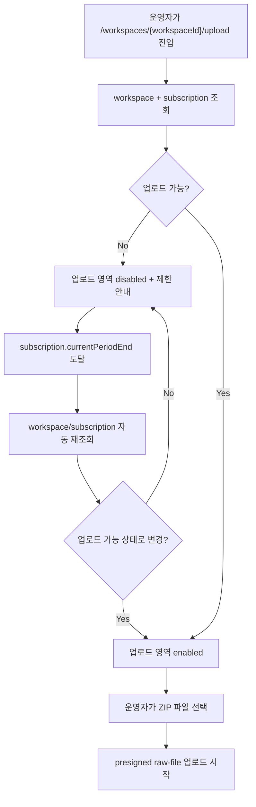

# Frontend Spec: 업로드 쿨다운 만료 후 새로고침 없는 재시작

## Goal

쿨다운 또는 entitlement 경계가 지난 업로드 화면이 브라우저 새로고침 없이 최신 업로드 가능 상태를 다시 조회하고 ZIP 업로드를 시작할 수 있게 한다.

## User Flow Chart



## Design Diff

| 영역                 | As-is                                                                     | To-be                                                      | 변경 내용                                                                |
| -------------------- | ------------------------------------------------------------------------- | ---------------------------------------------------------- | ------------------------------------------------------------------------ |
| Entitlement 갱신     | upload page mount/focus/reconnect 중심으로 조회                           | subscription period boundary에 맞춰 자동 재조회            | 쿨다운이 끝났는데 탭을 그대로 둔 운영자도 새로고침 없이 상태 전환을 본다 |
| Upload disabled 상태 | `freeOnboardingStatus=CONSUMED`이고 active subscription이 없으면 disabled | 자동 재조회 결과 active subscription이면 disabled 해제     | 이전 제한 안내가 남아 업로드를 계속 막지 않는다                          |
| E2E 회귀             | 업로드 성공 경로 중심                                                     | blocked → boundary refresh → ZIP upload 성공 시나리오 추가 | 이슈 Given/When/Then을 mocked E2E로 고정한다                             |

## Component Tree

```text
WorkspaceUploadPage
├─ useGetWorkspace(workspaceId)
├─ useSubscription(workspaceId)
├─ entitlement boundary refetch timer
└─ LogUploadForm
   └─ FileUploader
```

## API Integration

| Method | Path                                                                     | Description                                         |
| ------ | ------------------------------------------------------------------------ | --------------------------------------------------- |
| GET    | `/api/v1/workspaces/{workspaceId}`                                       | `freeOnboardingStatus`를 포함한 workspace 상태 조회 |
| GET    | `/api/v1/workspaces/{workspaceId}/subscription`                          | subscription status와 `currentPeriodEnd` 조회       |
| POST   | `/api/v1/workspaces/{workspaceId}/datasets/uploads:init`                 | ZIP raw-file presigned 업로드 세션 생성             |
| PUT    | presigned upload URL                                                     | ZIP 파일 전송                                       |
| POST   | `/api/v1/workspaces/{workspaceId}/datasets/uploads/{datasetId}:complete` | 업로드 완료 처리                                    |

확인 사항:

- `frontend/src/pages/upload/ui/WorkspaceUploadPage.tsx`는 `useGetWorkspace`, `useSubscription`, `LogUploadForm`을 조합한다.
- `frontend/src/entities/billing/api/useSubscription.ts`는 `SubscriptionResponse.currentPeriodEnd`를 그대로 반환한다.
- 전용 `cooldownUntil` API 필드는 현재 확인되지 않았다. 이번 범위는 기존 subscription period boundary를 쿨다운/entitlement 재조회 시점으로 사용한다.

## Data Flow

```text
WorkspaceUploadPage
  -> workspace query: freeOnboardingStatus
  -> subscription query: status, currentPeriodEnd
  -> boundary timer: currentPeriodEnd + short buffer
  -> workspaceQuery.refetch() + subscriptionQuery.refetch()
  -> LogUploadForm props update
  -> FileUploader disabled state update
```

## 수정 대상 파일

| 파일                                                        | 변경 유형 | 설명                                                        |
| ----------------------------------------------------------- | --------- | ----------------------------------------------------------- |
| `frontend/src/pages/upload/ui/WorkspaceUploadPage.tsx`      | modify    | subscription boundary timer로 workspace/subscription 재조회 |
| `frontend/src/pages/upload/ui/WorkspaceUploadPage.test.tsx` | modify    | period boundary 도달 시 refetch 호출 검증                   |
| `frontend/e2e/upload-domain-pack-generation.spec.ts`        | modify    | blocked 상태에서 boundary 후 ZIP 업로드 가능 E2E 추가       |
| `.agent/specs/708.md`                                       | new       | 이슈 스펙                                                   |

## State Management

- 서버 상태는 기존 TanStack Query hooks를 유지한다.
- 새 client state는 추가하지 않는다.
- `currentPeriodEnd`가 유효하고 미래 시각이면 `setTimeout`으로 1회 재조회한다.
- scheduled refetch 중에는 기존 query fetching 상태를 entitlement 확인 중 상태에 포함한다.
- 브라우저 timer overflow를 피하기 위해 매우 먼 미래 시각은 안전한 최대 timeout 범위로 clamp한다.
- `currentPeriodEnd`가 없거나 invalid/past이면 별도 timer를 만들지 않는다.

## Tests

### Test Strategy

| 구분            | 방법                                                           | 도구                           |
| --------------- | -------------------------------------------------------------- | ------------------------------ |
| 컴포넌트 테스트 | fake timer로 boundary refetch 호출 검증                        | Vitest + React Testing Library |
| E2E 테스트      | mocked workspace/subscription 상태를 blocked에서 active로 전환 | Playwright                     |

### Test Scenarios

| #   | 시나리오           | 사전 조건                                                               | 조작                                     | 기대 결과                                                      |
| --- | ------------------ | ----------------------------------------------------------------------- | ---------------------------------------- | -------------------------------------------------------------- |
| 1   | Boundary refetch   | consumed onboarding + inactive subscription + future `currentPeriodEnd` | timer boundary 도달                      | workspace/subscription `refetch()` 호출                        |
| 2   | Refreshless upload | blocked upload screen                                                   | clock fast-forward 후 ZIP 선택/처리 시작 | 새로고침 없이 upload area enabled, init/PUT/complete 요청 발생 |

## Acceptance Criteria

- 쿨다운 경계 이후 upload page는 workspace와 subscription 상태를 자동 재조회한다.
- 재조회 결과 active subscription이면 `LogUploadForm`이 enabled 상태로 갱신된다.
- 이전 제한 안내나 disabled file input이 새 ZIP 업로드를 계속 막지 않는다.
- E2E는 clock 제어 또는 상태 재조회 fixture로 쿨다운 만료를 안정적으로 재현한다.
- 변경은 frontend FSD 방향을 위반하지 않는다.

## Non-goals

- 별도 `cooldownUntil` API 필드 추가.
- backend quota/window 계산 정책 변경.
- presigned raw-file upload endpoint의 quota guard 추가.
- billing 화면의 quota 사용량 UI 변경.

## Open Questions

- 제품 정책상 "쿨다운"의 최종 권위 필드가 `currentPeriodEnd`가 아니라 별도 API 필드로 추가될 경우, 이번 timer 기준은 해당 필드로 교체해야 한다.
