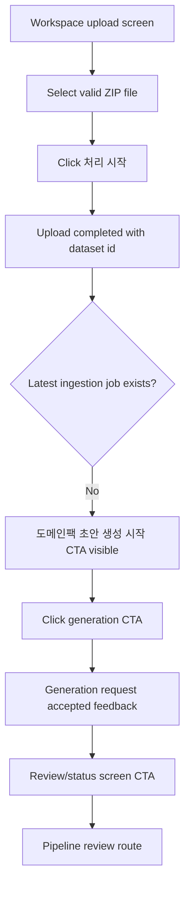

# Frontend E2E Spec: 업로드 완료 후 Domain Pack 초안 생성 요청

## Goal

운영자가 유효한 상담 로그 ZIP 업로드를 완료한 뒤 Domain Pack 초안 생성을 명시적으로 요청하고, 접수 피드백과 다음 진행 화면을 확인할 수 있음을 E2E로 보장한다.

## Issue Summary

GitHub Issue #709는 상담 로그 업로드 이후 운영자가 Domain Pack 초안 생성 또는 분석 시작 CTA를 눌렀을 때 요청 접수 여부와 진행 상태 진입이 사용자 시나리오 관점에서 검증되어야 한다는 Critical E2E 요구사항이다.

현재 코드 기준 `frontend/src/features/log-upload/ui/LogUploadForm.tsx`는 업로드 성공 후 `datasetId`를 표시하고, 자동 ingestion job이 없을 때 `도메인팩 초안 생성 시작` CTA로 generated `useTriggerDomainPackGeneration` mutation을 호출한다. 단위 테스트는 중복 클릭 방지와 성공 CTA를 다루지만, mocked Playwright E2E는 주로 업로드 후 이미 생성된 자동 pipeline job으로 검토 화면에 들어가는 경로를 검증한다. 따라서 이번 작업은 명시적 초안 생성 요청 경로를 독립 E2E로 고정한다.

## User Flow Chart



## Design Diff

| 영역       | As-is                                                              | To-be                                                                                    | 변경 내용                                                            |
| ---------- | ------------------------------------------------------------------ | ---------------------------------------------------------------------------------------- | -------------------------------------------------------------------- |
| Upload E2E | 업로드 성공 후 자동 생성된 pipeline job 상태와 검토 이동을 검증    | 자동 job이 없는 상태에서 운영자가 직접 Domain Pack 초안 생성을 요청하는 경로를 추가 검증 | Issue #709의 명시적 요청 시나리오를 Playwright로 보강                |
| API mock   | `GET /datasets/{datasetId}/pipeline-jobs/latest`가 항상 job을 반환 | 특정 E2E에서 latest job이 없음을 mock하고 생성 trigger 응답을 확인                       | CTA 노출 조건과 generation endpoint 호출을 사용자 흐름 기준으로 고정 |
| 중복 요청  | 단위 테스트에서 빠른 중복 클릭 guard 검증                          | E2E에서도 같은 CTA를 빠르게 두 번 눌러 generation 요청이 1회만 전송됨을 확인             | 실제 브라우저 상호작용 회귀 방지                                     |

## Component Tree

```text
frontend/e2e/upload-domain-pack-generation.spec.ts
└─ Upload completed Domain Pack draft generation
   └─ Explicit generation request E2E

frontend/e2e/support/app-mocks.ts
└─ installAppApiMocks
   └─ upload/review fixtures

frontend/src/pages/upload/ui/WorkspaceUploadPage.tsx
└─ LogUploadForm
   ├─ FileUploader
   ├─ PipelineJobStatusPanel
   └─ Manual generation fallback
```

## API Integration

테스트는 기존 Playwright route mock과 `seen` API 호출 추적 배열을 사용한다.

| Method | Path                                                                      | 목적                                |
| ------ | ------------------------------------------------------------------------- | ----------------------------------- |
| `POST` | `/api/v1/workspaces/1/datasets/uploads:init`                              | ZIP 업로드 준비                     |
| `PUT`  | `/e2e-upload/raw-log.zip`                                                 | presigned upload 대상 mock          |
| `POST` | `/api/v1/workspaces/1/datasets/uploads/77:complete`                       | 업로드 완료 및 `datasetId` 확보     |
| `GET`  | `/api/v1/workspaces/1/datasets/77/pipeline-jobs/latest?jobType=INGESTION` | 자동 ingestion job 없음 상태를 구성 |
| `POST` | `/api/v1/workspaces/1/datasets/77/pipeline-jobs/domain-pack-generation`   | Domain Pack 초안 생성 요청 접수     |
| `GET`  | `/api/v1/workspaces/1/pipeline-jobs/900/review-checkpoint`                | 요청 후 검토/진행 상태 화면 진입    |

## 수정 대상 파일

| 파일                                                 | 변경 유형 | 설명                                                                                  |
| ---------------------------------------------------- | --------- | ------------------------------------------------------------------------------------- |
| `.agent/specs/709.md`                                | new       | Issue #709 요구사항과 검증 기준 기록                                                  |
| `frontend/e2e/support/app-mocks.ts`                  | modify    | explicit generation E2E에서 자동 latest job 없음 상태를 구성할 수 있는 mock 옵션 추가 |
| `frontend/e2e/upload-domain-pack-generation.spec.ts` | new       | 업로드 완료 후 Domain Pack 초안 생성 요청, 중복 클릭 방지, 검토 화면 이동 E2E 추가    |

## State Management

- 제품 코드는 기존 `LogUploadForm` local state와 TanStack Query 흐름을 유지한다.
- E2E는 테스트별 route mock 옵션과 `seen` 배열로 API 호출을 검증한다.
- 업로드 완료 전에는 generation CTA가 노출되지 않아야 한다.
- generation mutation pending 상태에서는 같은 CTA가 비활성화되거나 in-flight guard로 중복 요청이 차단되어야 한다.

## Acceptance Criteria

- 유효한 ZIP 업로드 완료 후 화면에 `업로드 완료`와 업로드한 파일명, `dataset 77`이 보인다.
- 자동 ingestion job이 없는 fixture에서는 `도메인팩 초안 생성 시작` CTA가 보인다.
- CTA를 클릭하면 `POST /workspaces/1/datasets/77/pipeline-jobs/domain-pack-generation` 요청이 정확히 1회만 발생한다.
- 요청 접수 후 `생성 요청 완료`와 생성된 `job 900` 또는 상태 정보가 보인다.
- 사용자는 `검토 화면으로 이동` CTA로 `/workspaces/1/pipeline-jobs/900/review`에 진입할 수 있다.
- 업로드 완료 전 또는 dataset id가 없는 상태에서는 초안 생성 요청을 시작하지 않는다.

## Non-goals

- backend API contract, OpenAPI generated file, database schema는 변경하지 않는다.
- 실제 Airflow 실행, ML artifact 생성, review task 생성 로직은 이 E2E에서 검증하지 않는다.
- upload form의 시각 디자인 또는 CTA 문구를 새로 설계하지 않는다.
- live E2E나 운영 백엔드 데이터 의존 테스트를 추가하지 않는다.

## Validation

| 검증                                                                                                 | 목적                                                       |
| ---------------------------------------------------------------------------------------------------- | ---------------------------------------------------------- |
| `pnpm --dir frontend e2e -- upload-domain-pack-generation.spec.ts`                                   | Issue #709 mocked E2E 검증                                 |
| `pnpm --dir frontend test -- src/features/log-upload/ui/LogUploadForm.test.tsx --run`                | 기존 upload form generation/duplicate guard 단위 검증 유지 |
| `pnpm --dir frontend exec eslint e2e/upload-domain-pack-generation.spec.ts e2e/support/app-mocks.ts` | 변경된 E2E TypeScript 파일 lint 확인                       |

## Open Questions

- 없음.
