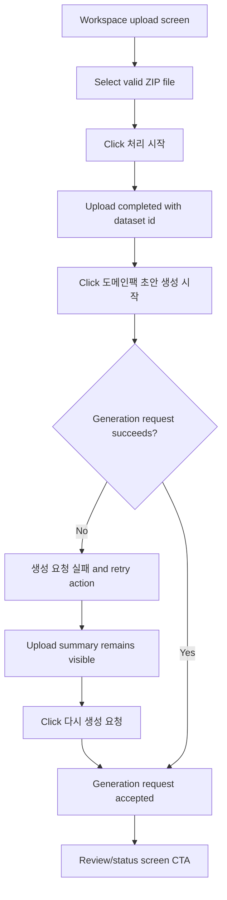

# Frontend E2E Spec: 초안 생성 요청 실패 복구

## Goal

운영자가 상담 로그 업로드 후 Domain Pack 초안 생성 요청 실패를 성공이나 진행 중 상태로 오해하지 않고, 업로드한 데이터셋을 유지한 채 다시 시도할 수 있음을 E2E로 보장한다.

## Issue Summary

GitHub Issue #710은 Domain Pack 초안 생성 요청이 서버 또는 파이프라인 요청 단계에서 실패했을 때 운영자가 오류를 확인하고 같은 업로드 결과로 재시도할 수 있어야 한다는 Critical E2E 요구사항이다.

현재 코드 기준 `frontend/src/features/log-upload/ui/LogUploadForm.tsx`는 업로드 성공 후 `datasetId`를 보존하고, 자동 ingestion job이 없으면 `도메인팩 초안 생성 시작` CTA로 generated `useTriggerDomainPackGeneration` mutation을 호출한다. 생성 요청 실패 시 `생성 요청 실패` 패널과 `다시 생성 요청` CTA를 렌더링하는 단위 테스트는 있으나, 실제 브라우저 사용자 흐름에서 실패 후 업로드 상태 보존과 재시도 성공까지 검증하는 mocked Playwright E2E가 필요하다.

## User Flow Chart



## Design Diff

| 영역 | As-is | To-be | 변경 내용 |
| --- | --- | --- | --- |
| Failure E2E | 업로드 후 초안 생성 성공 경로는 E2E로 검증됨 | 첫 generation 요청 실패 후 사용자-visible 오류, 데이터셋 보존, 재시도 성공을 검증 | Issue #710의 복구 가능 상태를 Playwright 시나리오로 고정 |
| API mock | generation trigger fixture가 항상 성공 응답을 반환 | 테스트별로 generation trigger가 지정 횟수만큼 실패한 뒤 성공할 수 있음 | 서버/파이프라인 요청 실패를 안정적으로 재현 |
| User recovery | 단위 테스트에서 실패 패널과 retry 버튼만 확인 | E2E에서 같은 업로드 결과의 `dataset 77`이 유지되고 재시도 후 review CTA가 표시됨 | 성공/진행 중 상태로 오인되는 회귀 방지 |

## Component Tree

```text
frontend/e2e/upload-domain-pack-generation.spec.ts
└─ Upload completed Domain Pack draft generation
   ├─ Successful explicit generation request E2E
   └─ Failure then retry E2E

frontend/e2e/support/app-mocks.ts
└─ installAppApiMocks
   └─ upload/review fixtures

frontend/src/pages/upload/ui/WorkspaceUploadPage.tsx
└─ LogUploadForm
   ├─ FileUploader
   ├─ PipelineJobStatusPanel
   └─ Manual generation fallback / failure recovery panel
```

## API Integration

테스트는 기존 Playwright route mock과 `seen` API 호출 추적 배열을 사용한다.

| Method | Path | 목적 |
| --- | --- | --- |
| `POST` | `/api/v1/workspaces/1/datasets/uploads:init` | ZIP 업로드 준비 |
| `PUT` | `/e2e-upload/raw-log.zip` | presigned upload 대상 mock |
| `POST` | `/api/v1/workspaces/1/datasets/uploads/77:complete` | 업로드 완료 및 `datasetId` 확보 |
| `GET` | `/api/v1/workspaces/1/datasets/77/pipeline-jobs/latest?jobType=INGESTION` | 자동 ingestion job 없음 상태 구성 |
| `POST` | `/api/v1/workspaces/1/datasets/77/pipeline-jobs/domain-pack-generation` | Domain Pack 초안 생성 요청 실패/성공 |
| `GET` | `/api/v1/workspaces/1/pipeline-jobs/900/review-checkpoint` | 재시도 성공 후 검토/진행 상태 화면 진입 |

## 수정 대상 파일

| 파일 | 변경 유형 | 설명 |
| --- | --- | --- |
| `.agent/specs/710.md` | new | Issue #710 요구사항과 검증 기준 기록 |
| `frontend/e2e/support/app-mocks.ts` | modify | generation trigger 실패 횟수 fixture 옵션 추가 |
| `frontend/e2e/upload-domain-pack-generation.spec.ts` | modify | 실패 표시, 데이터셋 상태 보존, 재시도 성공 E2E 추가 |

## State Management

- 제품 코드는 기존 `LogUploadForm` local state와 TanStack Query 흐름을 유지한다.
- E2E fixture는 테스트별 mock 상태로 generation trigger 실패 횟수를 관리한다.
- generation 요청 실패 후 `uploadedDataset`와 업로드 요약은 유지되어야 한다.
- 재시도 중에는 기존 in-flight guard가 중복 요청을 막아야 한다.

## Acceptance Criteria

- 유효한 ZIP 업로드 완료 후 화면에 `업로드 완료`, 파일명, `dataset 77`이 보인다.
- 첫 generation trigger 실패 시 `생성 요청 실패`와 사용자-safe 오류 메시지가 보인다.
- 실패 상태에서 `생성 요청 완료` 또는 진행 중 상태가 남지 않는다.
- 실패 후에도 업로드한 파일명과 `dataset 77`이 사라지지 않는다.
- 운영자는 `다시 생성 요청`으로 같은 dataset에 generation trigger를 다시 보낼 수 있다.
- 재시도 성공 시 `생성 요청 완료`와 `job 900 · WAITING_DOMAIN_CONFIRMATION`이 보이고, 검토 화면으로 이동할 수 있다.

## Non-goals

- backend API contract, OpenAPI generated file, database schema는 변경하지 않는다.
- 4xx와 5xx 실패 정책을 분리해 고정하지 않는다. 이번 E2E는 사용자-visible 복구 가능 상태를 우선 검증한다.
- 실제 Airflow 실행, ML artifact 생성, review task 생성 로직은 이 E2E에서 검증하지 않는다.
- upload form의 시각 디자인 또는 CTA 문구를 새로 설계하지 않는다.

## Validation

| 검증 | 목적 |
| --- | --- |
| `pnpm --dir frontend e2e -- upload-domain-pack-generation.spec.ts` | Issue #710 mocked E2E 검증 |
| `pnpm --dir frontend test -- src/features/log-upload/ui/LogUploadForm.test.tsx --run` | 기존 upload form failure/retry 단위 검증 유지 |
| `pnpm --dir frontend exec eslint e2e/upload-domain-pack-generation.spec.ts e2e/support/app-mocks.ts` | 변경된 E2E TypeScript 파일 lint 확인 |

## Open Questions

- 없음. 4xx/5xx별 화면 정책은 현재 이슈에서 확정하지 않고, 실패 시 사용자가 보는 복구 가능 상태를 검증한다.
