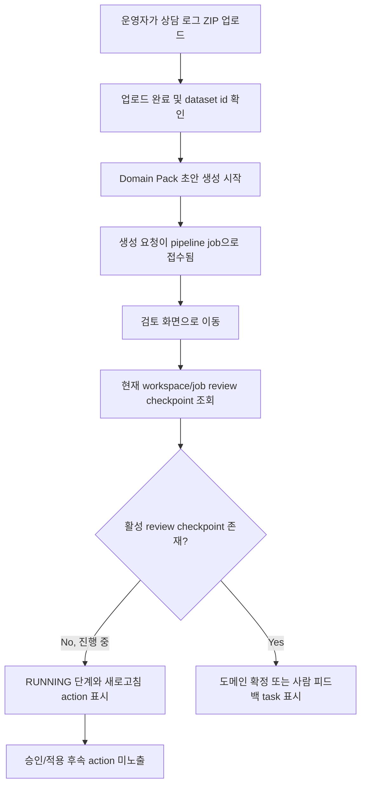

# Frontend E2E Spec: 초안 생성 후 파이프라인 진행 상태 확인

## Goal

운영자가 Domain Pack 초안 생성을 시작한 뒤 pipeline review 화면에서 현재 job의 진행 단계, 상태, 후속 행동 가능 여부를 확인할 수 있음을 Critical E2E로 보장한다.

## Issue Summary

GitHub Issue #711은 상담 로그 업로드 후 Domain Pack 초안 생성이 접수된 상태에서 운영자가 검토 또는 pipeline job 화면에 진입했을 때, 현재 pipeline job이 어느 단계까지 진행됐는지 화면 기준으로 판단할 수 있어야 한다는 요구사항이다. 진행 중, 완료, 실패 상태는 서로 구분되어야 하며, 현재 workspace에 연결된 pipeline job만 조회되어야 하고, 완료 전에는 승인/적용 같은 후속 행동이 잘못 활성화되지 않아야 한다.

현재 코드 기준 `frontend/e2e/upload-domain-pack-generation.spec.ts`는 업로드 완료 후 명시적 초안 생성 요청과 review 화면 진입을 검증한다. `frontend/e2e/workspace-core.spec.ts`는 review 화면에서 RUNNING 상태가 완료/실패로 전이될 때의 상태 새로고침을 검증한다. 이번 작업은 업로드에서 시작된 신규 pipeline job이 아직 활성 review checkpoint에 도달하지 않은 진행 중 상태일 때도 review 화면의 진행 단계와 후속 행동 guard가 명확하게 보이는지를 Critical E2E로 고정한다.

## User Flow Chart



## Design Diff

| 영역 | As-is | To-be | 변경 내용 |
| ---- | ----- | ----- | -------- |
| Upload-to-review E2E | 초안 생성 요청 후 바로 도메인 확정 checkpoint가 있는 job 진입을 검증 | 초안 생성 요청 후 아직 checkpoint가 없는 RUNNING job에서도 review 화면의 진행 상태와 action guard를 검증 | Issue #711 진행 중 상태를 사용자 흐름 기준으로 추가 고정 |
| Pipeline review 진행 중 상태 | 활성 checkpoint가 없으면 상태 새로고침과 도메인팩 관리 이동을 함께 제공 | 완료 전에는 도메인팩 관리 이동 대신 상태 새로고침만 제공하고 승인/적용은 완료 후 진행됨을 표시 | 완료 전 후속 행동 오인을 줄임 |
| API mock | 생성 trigger가 고정된 `WAITING_DOMAIN_CONFIRMATION` job을 반환 | 테스트 옵션으로 생성 직후 `RUNNING` job fixture를 반환할 수 있음 | 실제 polling 전 단계의 진행 상태를 안정적으로 재현 |
| Critical grouping | 관련 E2E가 일반 mocked E2E에 포함됨 | 신규 진행 상태 시나리오를 `@critical`로 식별 | 핵심 운영 회귀를 좁게 실행 가능 |

## Component Tree

```text
frontend/e2e/upload-domain-pack-generation.spec.ts
└─ Upload completed Domain Pack draft generation
   └─ Running generation progress Critical scenario

frontend/e2e/support/app-mocks.ts
└─ installAppApiMocks
   └─ upload/review fixtures

frontend/src/pages/pipeline-review/ui/PipelineReviewPage.tsx
└─ PipelineReviewPage
   ├─ status context panel
   └─ PipelineReviewCheckpointCard

frontend/src/features/pipeline-review/ui/PipelineReviewCheckpointCard.tsx
└─ StateActionCard
   ├─ progress copy
   └─ refresh action
```

## API Integration

테스트는 기존 Playwright route mock과 `seen` API 호출 추적 배열을 사용한다. 새 backend endpoint, OpenAPI generated file, DTO 변경은 없다.

| Method | Path | 목적 |
| ------ | ---- | ---- |
| `POST` | `/api/v1/workspaces/1/datasets/uploads:init` | ZIP 업로드 준비 |
| `PUT` | `/e2e-upload/raw-log.zip` | presigned upload 대상 mock |
| `POST` | `/api/v1/workspaces/1/datasets/uploads/77:complete` | 업로드 완료 및 `datasetId` 확보 |
| `GET` | `/api/v1/workspaces/1/datasets/77/pipeline-jobs/latest?jobType=INGESTION` | 자동 ingestion job 없음 상태 구성 |
| `POST` | `/api/v1/workspaces/1/datasets/77/pipeline-jobs/domain-pack-generation` | Domain Pack 초안 생성 요청 접수 |
| `GET` | `/api/v1/workspaces/1/pipeline-jobs/905/review-checkpoint` | 생성 직후 RUNNING 상태인 pipeline job 조회 |

## 수정 대상 파일

| 파일 | 변경 유형 | 설명 |
| ---- | --------- | ---- |
| `.agent/specs/711.md` | new | Issue #711 요구사항과 검증 기준 기록 |
| `frontend/e2e/support/app-mocks.ts` | modify | 초안 생성 trigger가 RUNNING job을 반환하는 fixture 옵션 추가 |
| `frontend/e2e/upload-domain-pack-generation.spec.ts` | modify | 업로드 후 초안 생성 진행 상태와 후속 action guard Critical E2E 추가 |
| `frontend/src/pages/pipeline-review/ui/PipelineReviewPage.tsx` | modify | 진행/완료/실패/review checkpoint별 초안 승인 가능 여부 문구 분리 |
| `frontend/src/pages/pipeline-review/ui/PipelineReviewPage.test.tsx` | modify | pipeline status별 context panel 문구 검증 보강 |
| `frontend/src/features/pipeline-review/ui/PipelineReviewCheckpointCard.tsx` | modify | 완료 전 no-checkpoint 상태에서 도메인팩 관리 CTA 미노출 |
| `frontend/src/features/pipeline-review/ui/PipelineReviewCheckpointCard.test.tsx` | modify | RUNNING 상태의 action guard 검증 업데이트 |

## State Management

- Server state는 기존 TanStack Query `["pipeline-review-checkpoint", workspaceId, pipelineJobId]` 흐름을 유지한다.
- `PipelineReviewPage`와 `PipelineReviewCheckpointCard`는 현재 route의 `workspaceId`와 `pipelineJobId`만 사용한다.
- 진행 중이면서 활성 review checkpoint가 없는 상태에서는 `상태 새로고침`으로 같은 workspace/job을 재조회할 수 있어야 한다.
- `SUCCEEDED` 상태에서만 도메인팩 관리 화면으로 이어지는 후속 CTA를 제공한다.
- `FAILED` 상태는 업로드 재시도와 현재 job 새로고침을 제공하고 성공 CTA를 표시하지 않는다.
- `DOMAIN_CONFIRMATION` 또는 `HUMAN_FEEDBACK` 상태는 해당 checkpoint task action만 제공하고 최종 승인/적용은 완료 후 Domain Pack 화면에서 진행됨을 안내한다.

## Acceptance Criteria

- 유효한 ZIP 업로드 완료 후 운영자가 `도메인팩 초안 생성 시작`을 누르면 생성 요청 접수와 `job 905 · RUNNING` 상태가 보인다.
- `검토 화면으로 이동` CTA는 `/workspaces/1/pipeline-jobs/905/review`로 이동한다.
- review 화면의 맥락 영역은 현재 단계가 `RUNNING`이고 반영 방식이 `활성 체크포인트 없음`임을 표시한다.
- review 화면은 활성 checkpoint가 없을 때 `활성 리뷰 체크포인트가 없습니다.`와 `상태 새로고침` action을 표시한다.
- 완료 전 RUNNING 상태에서는 `도메인팩 관리로 이동`, 승인, 적용, 배포 같은 후속 행동이 표시되지 않는다.
- E2E mock은 `GET /workspaces/1/pipeline-jobs/905/review-checkpoint`처럼 현재 workspace와 pipeline job route에 맞는 endpoint만 검증한다.
- 신규 시나리오는 Playwright `@critical` grep으로 식별 가능하다.

## Non-goals

- backend API contract, OpenAPI generated file, database schema는 변경하지 않는다.
- 실제 Airflow 실행, ML artifact 생성, review task 생성 로직은 이 E2E에서 검증하지 않는다.
- 완료/실패 전이 검증은 기존 `frontend/e2e/workspace-core.spec.ts` 시나리오를 유지하며 중복 확장하지 않는다.
- Domain Pack 승인 화면의 적용/배포 workflow 자체를 변경하지 않는다.
- live E2E나 운영 backend 데이터 의존 테스트를 추가하지 않는다.

## Validation

| 검증 | 목적 |
| ---- | ---- |
| `pnpm --dir frontend exec playwright test e2e/upload-domain-pack-generation.spec.ts --grep @critical` | Issue #711 Critical E2E만 좁게 검증 |
| `pnpm --dir frontend e2e -- upload-domain-pack-generation.spec.ts` | upload-to-review mocked E2E 전체 회귀 검증 |
| `pnpm --dir frontend test -- PipelineReviewPage PipelineReviewCheckpointCard --run` | pipeline review context/action guard 단위 검증 |
| `pnpm --dir frontend exec eslint e2e/upload-domain-pack-generation.spec.ts e2e/support/app-mocks.ts src/pages/pipeline-review/ui/PipelineReviewPage.tsx src/features/pipeline-review/ui/PipelineReviewCheckpointCard.tsx` | 변경된 frontend 파일 lint 확인 |

## Open Questions

- 없음.
