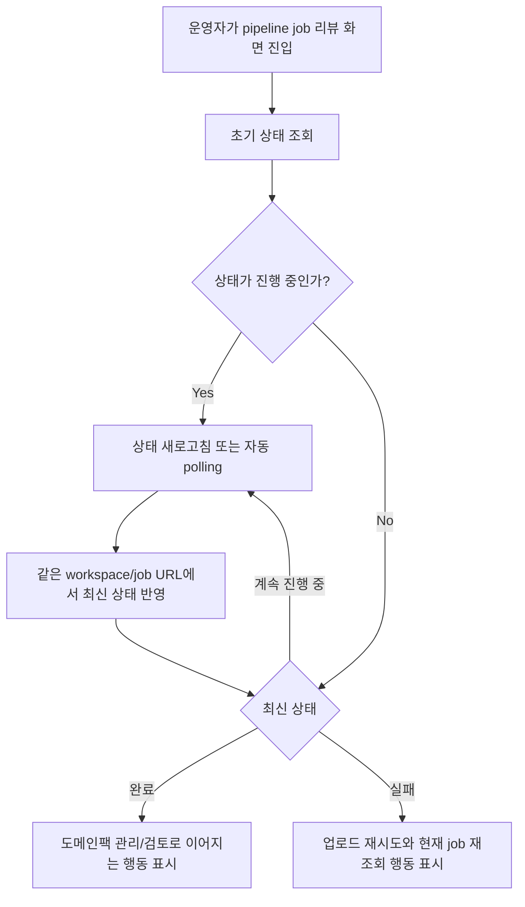

# Frontend Spec: Pipeline Status Refresh

## Goal

운영자가 파이프라인 리뷰/진행 화면에서 같은 workspace와 pipeline job 맥락을 유지한 채 최신 상태를 재조회하고, 완료 또는 실패 상태에 맞는 다음 행동을 확인할 수 있게 한다.

## User Flow Chart



## Design Diff

| 영역                      | As-is                                                                    | To-be                                                                                     | 변경 내용                                                |
| ------------------------- | ------------------------------------------------------------------------ | ----------------------------------------------------------------------------------------- | -------------------------------------------------------- |
| 파이프라인 리뷰 상태 조회 | 화면 진입 시 체크포인트를 조회하고 일부 상태에서 수동 재조회 버튼을 제공 | 진행 중인 체크포인트 없는 상태에서는 같은 query key로 주기 재조회하고, 수동 재조회도 유지 | 오래된 RUNNING/QUEUED 상태가 고정되어 보이지 않도록 보강 |
| 완료 상태                 | 상태 카드가 도메인팩 관리 CTA를 표시                                     | 최신 SUCCEEDED 상태가 반영되면 같은 화면에서 완료 CTA 노출                                | workspace와 pipeline job route 유지                      |
| 실패 상태                 | 상태 카드가 업로드 재시도 CTA와 현재 job 재조회 버튼을 표시              | 최신 FAILED 상태가 반영되면 성공 CTA 대신 실패 대응 CTA 노출                              | 실패 상태에서 성공 행동이 잘못 활성화되지 않도록 검증    |
| E2E fixture               | 업로드 후 리뷰 진입과 체크포인트 액션은 검증됨                           | 진행 중 상태가 완료/실패로 바뀌는 fixture 기반 E2E를 추가                                 | 상태 전이 재현성을 확보                                  |

## Component Tree

```text
PipelineReviewPage
├─ status context panel
└─ PipelineReviewCheckpointCard
   ├─ StateActionCard
   │  ├─ status copy
   │  └─ refresh / next-action controls
   ├─ Domain confirmation review
   └─ Human feedback review
```

## API Integration

| Method | Path                                                                               | Description                                          |
| ------ | ---------------------------------------------------------------------------------- | ---------------------------------------------------- |
| GET    | `/api/v1/workspaces/{workspaceId}/pipeline-jobs/{pipelineJobId}/review-checkpoint` | pipeline job의 현재 체크포인트, 상태, 리뷰 작업 조회 |

- 기존 generated endpoint `getCheckpoint`를 계속 사용한다.
- 새 API, DTO, schema, OpenAPI generated code 변경은 없다.
- React Query query key는 기존 `["pipeline-review-checkpoint", workspaceId, pipelineJobId]`를 유지한다.

## 수정 대상 파일

| 파일                                                                   | 변경 유형 | 설명                                                                            |
| ---------------------------------------------------------------------- | --------- | ------------------------------------------------------------------------------- |
| `frontend/src/features/pipeline-review/api/pipelineReviewApi.ts`       | modify    | 진행 중인 체크포인트 없는 상태에서 자동 재조회 여부를 판단하는 query 옵션 추가  |
| `frontend/src/features/pipeline-review/api/pipelineReviewApi.test.tsx` | modify    | polling 판단과 generated API 위임 동작 검증                                     |
| `frontend/src/pages/pipeline-review/ui/PipelineReviewPage.tsx`         | modify    | 페이지 수준 체크포인트 query에 자동 재조회를 적용                               |
| `frontend/e2e/support/app-mocks.ts`                                    | modify    | 진행 중에서 완료/실패로 전이되는 pipeline review fixture 추가                   |
| `frontend/e2e/workspace-core.spec.ts`                                  | modify    | 운영자가 재조회 후 최신 완료/실패 상태와 다음 행동을 확인하는 E2E 시나리오 추가 |

## State Management

- Server state는 TanStack Query로 유지한다.
- `PipelineReviewPage`와 `PipelineReviewCheckpointCard`는 동일한 checkpoint query key를 공유하므로 페이지 수준 재조회 결과가 카드에도 반영되어야 한다.
- 진행 중이면서 활성 리뷰 작업이 없는 상태는 자동 polling 대상이다.
- `SUCCEEDED`, `FAILED`, `CANCELLED` 같은 최종 상태와 `DOMAIN_CONFIRMATION`, `HUMAN_FEEDBACK`처럼 운영자 입력을 기다리는 활성 리뷰 상태는 자동 polling을 멈춘다.
- 수동 재조회 버튼은 기존처럼 `query.refetch()`를 호출해 staleTime과 무관하게 최신 상태를 요청해야 한다.

## Tests

### Test Strategy

| 구분           | 방법                                      | 도구                           | 비고                                 |
| -------------- | ----------------------------------------- | ------------------------------ | ------------------------------------ |
| 훅 단위 테스트 | polling 판단과 query 옵션 검증            | Vitest + React Testing Library | 기존 `pipelineReviewApi` 테스트 확장 |
| E2E 테스트     | mock fixture 상태 전이 후 UI/CTA/URL 검증 | Playwright                     | 완료/실패 전이를 안정적으로 재현     |

### Test Scenarios

| #   | Given                                                                     | When                         | Then                                                                                |
| --- | ------------------------------------------------------------------------- | ---------------------------- | ----------------------------------------------------------------------------------- |
| 1   | 운영자가 `/workspaces/1/pipeline-jobs/902/review`에서 RUNNING 상태를 본다 | 상태를 재조회한다            | 같은 URL에서 SUCCEEDED 상태와 도메인팩 관리 CTA가 표시된다                          |
| 2   | 운영자가 `/workspaces/1/pipeline-jobs/903/review`에서 RUNNING 상태를 본다 | 상태를 재조회한다            | 같은 URL에서 FAILED 상태와 업로드 재시도 CTA가 표시되고, 성공 CTA는 노출되지 않는다 |
| 3   | checkpoint query가 진행 중 상태를 받는다                                  | 자동 재조회 옵션이 켜져 있다 | polling interval이 활성화된다                                                       |
| 4   | checkpoint query가 완료/실패/취소 또는 활성 리뷰 상태를 받는다            | 자동 재조회 옵션이 켜져 있다 | polling interval이 비활성화된다                                                     |

## Non-goals

- 새 백엔드 endpoint, schema, 권한 정책을 만들지 않는다.
- Airflow 실제 상태 전이를 E2E에서 호출하지 않는다.
- 리뷰 작업 제출 플로우 자체를 변경하지 않는다.
- 도메인팩 승인 화면의 후속 workflow를 이 이슈에서 확장하지 않는다.

## Validation Expectations

- `pnpm --dir frontend test -- pipelineReviewApi PipelineReviewPage PipelineReviewCheckpointCard`
- `pnpm --dir frontend e2e -- workspace-core.spec.ts`
- 필요 시 `pnpm --dir frontend build`

## Open Questions

- 없음. 이 이슈의 기술 확인 메모는 구현 전 조사 결과로 기존 수동 refresh와 query 기반 화면 구조가 확인되었고, 안정적인 mock fixture로 전이 상태를 고정한다.
