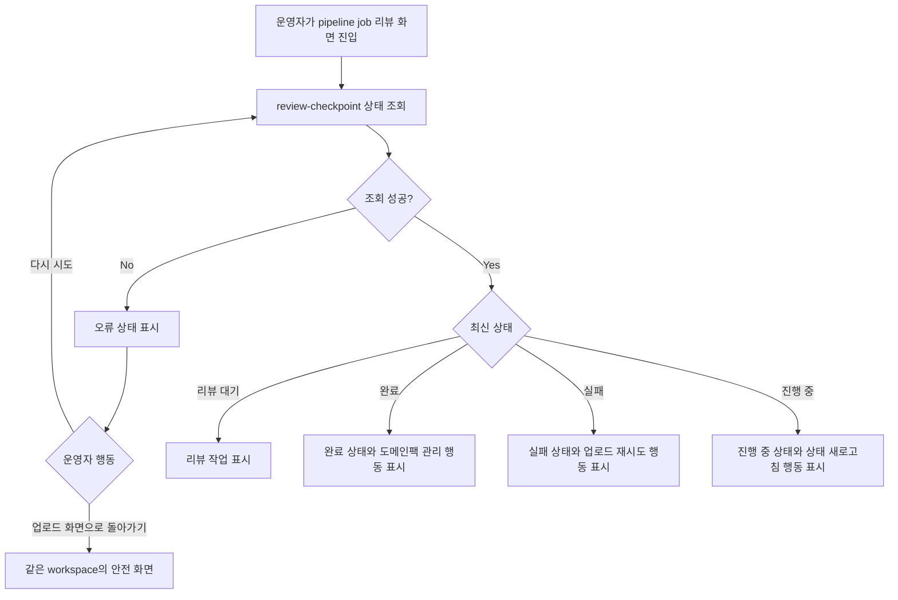

# Frontend Spec: Pipeline Status Lookup Error Recovery

## Goal

운영자가 pipeline job 리뷰 화면에서 상태 조회 실패를 완료/성공으로 오해하지 않고, 현재 상태를 확인할 수 없다는 오류와 재시도 또는 안전 화면 이동 행동을 볼 수 있게 한다.

## User Flow Chart



## Design Diff

| 영역 | As-is | To-be | 변경 내용 |
| ---- | ----- | ----- | --------- |
| 조회 실패 카드 | 체크포인트 카드가 오류와 다시 시도를 표시한다 | 오류 카드가 현재 상태를 확인할 수 없음을 명확히 알리고, 재시도와 업로드 화면 이동을 함께 제공한다 | 운영자가 성공/완료로 오해하지 않고 회복 행동을 선택할 수 있게 한다 |
| 페이지 상태 맥락 | 페이지 상단 맥락은 query data가 없으면 확인 중으로 보일 수 있다 | query error일 때 상단 맥락도 상태 조회 실패와 확인 불가 상태를 표시한다 | 카드 밖에서도 실패 상태가 진행/완료처럼 보이지 않게 한다 |
| 재시도 후 성공 | 컴포넌트 단위 재시도는 검증되어 있다 | E2E fixture에서 최초 조회 실패 후 재시도 성공 시 최신 job 상태가 반영되는 흐름을 검증한다 | 실제 operator route에서 회복 동작을 고정한다 |
| workspace/job 격리 | 같은 route query key를 사용한다 | 실패 중에는 다른 workspace/job 결과를 표시하지 않고, 재시도도 같은 workspace/job endpoint만 다시 호출한다 | 상태 섞임을 방지한다 |

## Component Tree

```text
PipelineReviewPage
├─ status context panel
│  ├─ 현재 단계
│  ├─ 반영 방식
│  └─ 초안 승인
└─ PipelineReviewCheckpointCard
   ├─ loading state
   ├─ error recovery StateActionCard
   │  ├─ 다시 시도
   │  └─ 업로드 화면으로 돌아가기
   ├─ no-active-checkpoint StateActionCard
   ├─ Domain confirmation review
   └─ Human feedback review
```

## API Integration

| Method | Path | Description |
| ------ | ---- | ----------- |
| GET | `/api/v1/workspaces/{workspaceId}/pipeline-jobs/{pipelineJobId}/review-checkpoint` | pipeline job의 현재 체크포인트, 상태, 리뷰 작업 조회 |

- 기존 generated endpoint `getCheckpoint`를 계속 사용한다.
- 새 API, DTO, schema, OpenAPI generated code 변경은 없다.
- React Query query key는 기존 `["pipeline-review-checkpoint", workspaceId, pipelineJobId]`를 유지한다.
- 전역 query 설정은 retry를 자동 수행하지 않으므로, 오류 후 재조회는 운영자의 명시적 `refetch()` 행동으로 수행된다.

## 수정 대상 파일

| 파일 | 변경 유형 | 설명 |
| ---- | --------- | ---- |
| `frontend/src/pages/pipeline-review/ui/PipelineReviewPage.tsx` | modify | checkpoint query 실패 시 페이지 맥락에 상태 조회 실패/확인 불가 copy 표시 |
| `frontend/src/pages/pipeline-review/ui/PipelineReviewPage.test.tsx` | modify | 페이지 상단 맥락의 query error 매핑 검증 |
| `frontend/src/features/pipeline-review/ui/PipelineReviewCheckpointCard.tsx` | modify | 오류 카드에 안전 화면 이동 link와 alert 역할 추가 |
| `frontend/src/features/pipeline-review/ui/PipelineReviewCheckpointCard.test.tsx` | modify | 오류 상태의 재시도와 안전 화면 이동 행동 검증 |
| `frontend/e2e/support/app-mocks.ts` | modify | 최초 review-checkpoint 조회 실패 후 재시도 성공하는 fixture 추가 |
| `frontend/e2e/workspace-core.spec.ts` | modify | 운영자가 오류를 보고 같은 job 재시도 후 최신 성공 상태를 확인하는 E2E 시나리오 추가 |

## State Management

- Server state는 TanStack Query로 유지한다.
- `PipelineReviewPage`와 `PipelineReviewCheckpointCard`는 동일한 checkpoint query key를 공유한다.
- 실패 상태에서는 이전 성공 데이터가 없는 경우 완료/성공 CTA를 표시하지 않는다.
- 수동 재시도는 기존 `query.refetch()`를 사용해 같은 workspaceId와 pipelineJobId endpoint를 다시 호출한다.
- 안전 화면 이동은 같은 workspace의 `/workspaces/{workspaceId}/upload` 경로로 이동한다.

## Tests

### Test Strategy

| 구분 | 방법 | 도구 | 비고 |
| ---- | ---- | ---- | ---- |
| 컴포넌트 테스트 | query error 상태의 문구/행동 검증 | Vitest + React Testing Library | 기존 페이지/카드 테스트 확장 |
| E2E 테스트 | 최초 조회 실패 후 재시도 성공 검증 | Playwright | mock fixture로 실패와 성공을 deterministic하게 재현 |

### Test Scenarios

| # | Given | When | Then |
| --- | ----- | ---- | ---- |
| 1 | 운영자가 pipeline job 리뷰 화면에 있고 상태 조회가 실패한다 | 화면을 본다 | 상단 맥락과 카드가 현재 상태를 확인할 수 없음을 표시하고 완료/성공 CTA를 노출하지 않는다 |
| 2 | 상태 조회 실패 카드가 표시되어 있다 | 운영자가 다시 시도한다 | 같은 workspace/job review-checkpoint endpoint가 다시 호출된다 |
| 3 | 재시도 응답이 성공 상태를 반환한다 | 재시도 후 화면을 본다 | 같은 URL에서 최신 완료 상태와 도메인팩 관리 CTA가 표시된다 |
| 4 | 상태 조회 실패 카드가 표시되어 있다 | 운영자가 안전 화면 이동을 선택한다 | 같은 workspace의 업로드 화면으로 이동할 수 있다 |

## Non-goals

- 백엔드 endpoint, schema, 권한 정책을 변경하지 않는다.
- Airflow 실제 장애를 E2E에서 호출하지 않는다.
- pipeline job 자체를 새로 retry하는 backend action은 이 이슈 범위에 포함하지 않는다.
- 다른 workspace나 다른 job의 상태를 fallback으로 보여주지 않는다.

## Validation Expectations

- `pnpm --dir frontend test -- PipelineReviewPage PipelineReviewCheckpointCard`
- `pnpm --dir frontend e2e -- workspace-core.spec.ts`
- 필요 시 `pnpm --dir frontend build`

## Open Questions

- 없음. issue의 기술 확인 메모에 따라 실제 코드 조사를 통해 최초 조회 실패와 polling 실패 모두 같은 checkpoint query error surface에서 회복하도록 확인했다.
