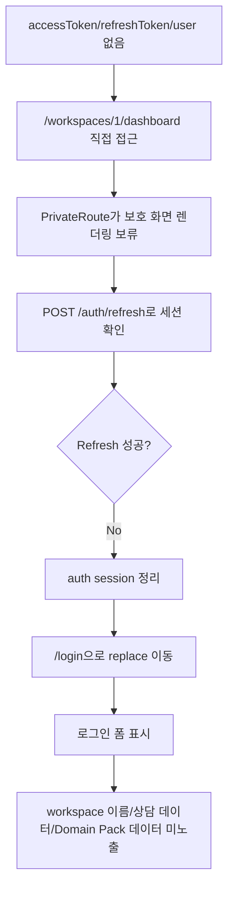

# Frontend E2E Spec: 비인증 private workspace URL 로그인 가드

## Goal

로그인하지 않은 사용자가 private workspace URL을 직접 열어도 workspace 화면이나 운영 데이터가 표시되지 않고 로그인 화면으로 이동함을 Critical E2E로 보장한다.

## Issue Summary

GitHub Issue #714는 access token과 refresh token이 없는 비인증 사용자가 `/workspaces/:workspaceId/dashboard` 같은 workspace 내부 URL을 직접 열었을 때 private 데이터가 순간적으로도 노출되지 않아야 한다는 P1 Critical E2E 후보를 다룬다.

현재 `frontend/src/shared/ui/PrivateRoute.tsx`는 access token이 없으면 보호 route children을 렌더링하지 않고 `refreshAuthSession()`을 먼저 시도한다. `frontend/src/shared/api/index.ts`의 refresh 요청은 cookie 기반 세션 가능성을 확인하기 위해 localStorage refresh token 존재 여부와 무관하게 `POST /auth/refresh`를 호출하며, 실패하면 auth session을 정리한다. 따라서 이 작업은 기존 `frontend/e2e/navigation.spec.ts`의 anonymous private URL guard 테스트를 Critical 그룹으로 식별 가능하게 만들고, login 화면 진입과 private 데이터 미노출을 사용자 관점에서 강화한다.

## User Flow Chart



## Design Diff

| 영역 | As-is | To-be | 변경 내용 |
| --- | --- | --- | --- |
| Critical 편입 | anonymous private URL guard 테스트가 일반 navigation E2E에 포함되어 있다. | 같은 시나리오가 `@critical` marker로 선택 실행된다. | Critical 회귀 후보를 `--grep @critical`로 좁게 실행할 수 있게 한다. |
| 로그인 화면 확인 | `/login` URL과 `시스템 로그인` 버튼을 확인한다. | `/login`, 이메일 입력, `시스템 로그인` 버튼을 함께 확인한다. | 사용자가 로그인해야 한다는 화면을 본다는 기대 결과를 더 명확히 검증한다. |
| 데이터 미노출 | API 호출 목록이 refresh 요청 1건뿐임을 확인한다. | refresh 요청 1건만 허용하고 workspace marker, dashboard 문구, mock sensitive workspace/pack 이름이 보이지 않음을 확인한다. | private 데이터가 화면에 렌더링되지 않는 사용자 결과를 직접 검증한다. |
| Refresh 정책 | anonymous 상태에서도 refresh endpoint 호출 여부가 테스트에 암묵적으로만 남아 있다. | cookie 기반 refresh 확인 시도 후 실패하면 login으로 이동하는 현재 정책을 spec과 mock에 명시한다. | refresh token 없음과 refresh 실패 조건을 현재 구현 기준으로 분리해 설명한다. |

## Component Tree

```text
frontend/src/app/App.tsx
└─ PrivateRoute
   ├─ isAuthenticated()
   ├─ refreshAuthSession()
   ├─ unauthorized: Navigate("/login")
   └─ authorized: WorkspaceDashboardPage

frontend/e2e/navigation.spec.ts
└─ Application navigation boundaries
   └─ Given no authenticated session
      └─ anonymous private workspace URL @critical
```

## API Integration

테스트는 Playwright route mock만 사용한다.

| Method | Path | 목적 |
| --- | --- | --- |
| `POST` | `/api/v1/auth/refresh` | 비인증 상태의 세션 확인 시도를 401로 mock한다. |
| `GET` | `/api/v1/workspaces` | guard 누수 시 노출될 수 있는 sensitive workspace fixture를 준비한다. 정상 기대에서는 호출되지 않는다. |
| `GET` | `/api/v1/workspaces/1` | guard 누수 시 workspace 상세 데이터가 노출되지 않는지 확인하기 위한 fixture다. 정상 기대에서는 호출되지 않는다. |
| `GET` | `/api/v1/workspaces/1/dashboard/knowledge-pack-health` | guard 누수 시 Domain Pack 이름이 노출되지 않는지 확인하기 위한 fixture다. 정상 기대에서는 호출되지 않는다. |

신규 API, backend contract, generated client는 변경하지 않는다.

## 수정 대상 파일

| 파일 | 변경 유형 | 설명 |
| --- | --- | --- |
| `.agent/specs/714.md` | new | Issue #714 요구사항과 검증 기준 기록 |
| `frontend/e2e/navigation.spec.ts` | modify | anonymous private workspace URL guard 테스트를 Critical 그룹으로 편입하고 private 데이터 미노출 단언 강화 |

## State Management

- 테스트 Given은 `accessToken`, `refreshToken`, `user`가 localStorage에 없는 상태다.
- `PrivateRoute`는 인증 확인 중 protected children을 렌더링하지 않아야 한다.
- refresh 실패 후 `clearAuthSession()` 정책에 따라 세 auth storage key는 계속 비어 있어야 한다.
- TanStack Query cache, workspace state, 로그인 form state는 변경하지 않는다.
- stale refresh token이 저장된 실패 시나리오는 이미 `frontend/e2e/navigation.spec.ts`와 `.agent/specs/715.md`의 별도 Critical 시나리오가 다룬다.

## Tests

| 구분 | 방법 | 도구 |
| --- | --- | --- |
| E2E 회귀 | 비인증 상태에서 private workspace dashboard URL 직접 접근 후 login 이동과 private 데이터 미노출 검증 | Playwright mocked E2E |
| 정적 검증 | 변경된 E2E TypeScript 파일 lint와 diff whitespace 확인 | ESLint, `git diff --check` |

## Acceptance Criteria

- `.agent/specs/714.md` 파일명이 이슈 번호만 포함한다.
- anonymous private workspace URL E2E가 `@critical` marker로 식별된다.
- access token, refresh token, user가 없는 상태에서 `/workspaces/1/dashboard`를 직접 열면 `/login`으로 이동한다.
- 로그인 화면에서 이메일 입력과 `시스템 로그인` 버튼이 보인다.
- workspace marker, dashboard heading/metric, sensitive workspace 이름, sensitive Domain Pack 이름은 표시되지 않는다.
- private workspace/dashboard API는 호출되지 않고, 세션 확인용 `POST /auth/refresh`만 호출된다.
- auth storage key `accessToken`, `refreshToken`, `user`는 계속 `null`이다.

## Non-goals

- `PrivateRoute`, `refreshAuthSession`, token 저장/정리 정책을 변경하지 않는다.
- refresh token이 저장된 만료 세션 시나리오는 이 이슈에서 중복 구현하지 않는다.
- 로그인 화면 문구나 레이아웃을 변경하지 않는다.
- 별도 Critical-only Playwright config, CI job, package script를 추가하지 않는다.
- live E2E나 운영 backend 의존 테스트를 추가하지 않는다.

## Validation

| 검증 | 목적 |
| --- | --- |
| `pnpm --dir frontend exec playwright test e2e/navigation.spec.ts --grep "anonymous visitor"` | Issue #714 시나리오만 좁게 검증 |
| `pnpm --dir frontend exec playwright test e2e/navigation.spec.ts --grep @critical` | navigation Critical subset에 anonymous guard가 포함됨을 검증 |
| `pnpm --dir frontend exec eslint e2e/navigation.spec.ts` | 변경된 E2E TypeScript lint 확인 |
| `git diff --check` | diff whitespace 확인 |

## Open Questions

- 없음. refresh token이 없는 anonymous 진입에서도 cookie 기반 refresh 확인을 한 번 시도하는 현재 구현 정책을 유지하고, 실패 후 login 이동과 데이터 미노출을 검증한다.
