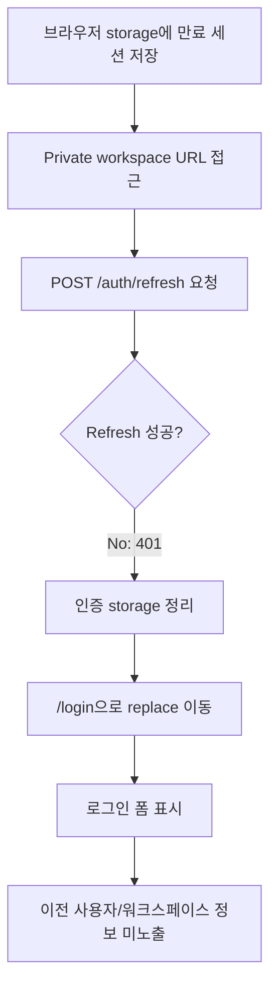

# Frontend E2E Spec: 만료 refresh token 인증 정보 정리

## Goal

만료된 refresh token이 거절되면 브라우저에 남아 있던 이전 인증 정보와 사용자/워크스페이스 표시가 모두 사라지고 로그인 화면으로 돌아감을 E2E로 보장한다.

## Issue Summary

GitHub Issue #715는 오래된 세션 정보가 브라우저에 남아 있어도 refresh 요청이 실패한 뒤 사용자가 이전 권한으로 private 화면에 진입하거나 이전 계정의 사용자/워크스페이스 정보를 볼 수 없어야 한다는 P1 Critical E2E 후보를 다룬다.

현재 브랜치에는 critical 전용 Playwright project가 없다. 따라서 기존 navigation boundary mocked E2E에 있는 stale refresh token 시나리오를 강화하고 `@critical` grep marker를 붙여 Critical 회귀 조건을 선택 실행할 수 있게 한다.

## User Flow Chart



## Design Diff

| 영역              | As-is                                                                                       | To-be                                                                                                                    | 변경 내용                                                                     |
| ----------------- | ------------------------------------------------------------------------------------------- | ------------------------------------------------------------------------------------------------------------------------ | ----------------------------------------------------------------------------- |
| Stale refresh E2E | `refreshToken`, `user` 저장 후 refresh 401과 storage null 여부를 확인한다.                  | `accessToken`, `refreshToken`, `user`가 모두 저장된 상태에서 refresh 401 후 세 값이 모두 삭제됨을 확인한다.              | access token 정리 회귀까지 직접 검증한다.                                     |
| 사용자 표시       | 로그인 URL 이동만 확인한다.                                                                 | 로그인 폼이 보이고 이전 사용자명/워크스페이스명이 화면에 보이지 않음을 확인한다.                                         | refresh 실패가 빈 workspace나 이전 계정 화면처럼 보이지 않도록 검증한다.      |
| Critical 편입     | stale refresh token 시나리오가 선택 실행용 marker 없이 일반 navigation E2E에 포함되어 있다. | 기존 `frontend/e2e/navigation.spec.ts`의 navigation boundary 시나리오를 `@critical`로 표시하고 요구사항에 맞게 보강한다. | 저장소의 현재 E2E 구조를 유지하면서 Critical 후보를 좁게 실행할 수 있게 한다. |

## Component Tree

```text
frontend/e2e/navigation.spec.ts
└─ Application navigation boundaries
   └─ Given no authenticated session
      └─ stale refresh token rejected scenario

frontend/e2e/support/generated-api-auth.ts
└─ makeJwt(role, expiresAt)

frontend/src/shared/ui/PrivateRoute.tsx
└─ refreshAuthSession()
   ├─ success: protected route render
   └─ failure: clearAuthSession() + /login
```

## API Integration

테스트는 Playwright route mock을 사용한다.

| Method | Path                   | 목적                                           |
| ------ | ---------------------- | ---------------------------------------------- |
| `POST` | `/api/v1/auth/refresh` | 만료 refresh token 거절 응답을 401로 mock한다. |

## 수정 대상 파일

| 파일                                         | 변경 유형 | 설명                                                                                                 |
| -------------------------------------------- | --------- | ---------------------------------------------------------------------------------------------------- |
| `.agent/specs/715.md`                        | new       | Issue #715 요구사항과 검증 기준 기록                                                                 |
| `frontend/e2e/navigation.spec.ts`            | modify    | stale refresh token 거절 시 storage 정리와 이전 정보 미노출을 E2E로 강화하고 `@critical` marker 부여 |
| `frontend/e2e/support/generated-api-auth.ts` | modify    | 만료 access token fixture를 만들 수 있도록 JWT exp를 선택적으로 주입                                 |

## State Management

- 인증 storage key는 현재 구현 기준 `accessToken`, `refreshToken`, `user`를 사용한다.
- refresh 실패 시 기존 `clearAuthSession()` 정책에 따라 세 key가 모두 삭제되어야 한다.
- refresh 실패 전에는 protected route children이 렌더링되지 않아야 하며, 실패 후 로그인 화면으로 이동해야 한다.
- TanStack Query cache, backend API contract, generated API 파일은 변경하지 않는다.

## Acceptance Criteria

- 브라우저 storage에 만료된 `accessToken`, 만료된 `refreshToken`, 오래된 `user`가 저장된 상태로 private workspace URL에 접근한다.
- 앱은 `POST /api/v1/auth/refresh`를 호출하고 401 응답을 받는다.
- 사용자는 `/login`으로 이동하며 `시스템 로그인` 버튼과 이메일 입력을 볼 수 있다.
- `accessToken`, `refreshToken`, `user` localStorage 값은 모두 `null`이 된다.
- 이전 사용자 이름과 이전 workspace 이름은 화면에 표시되지 않는다.
- refresh 실패를 빈 workspace나 이전 권한이 있는 workspace 화면으로 오해할 수 있는 API 요청은 발생하지 않는다.

## Non-goals

- refresh endpoint contract, cookie 정책, backend token 검증 로직을 변경하지 않는다.
- 로그인 화면 문구나 레이아웃을 변경하지 않는다.
- 별도 critical Playwright project, CI job, package script를 새로 만들지 않는다.
- live E2E나 운영 백엔드 의존 테스트를 추가하지 않는다.

## Validation

| 검증                                                                                       | 목적                                               |
| ------------------------------------------------------------------------------------------ | -------------------------------------------------- |
| `pnpm --dir frontend exec playwright test e2e/navigation.spec.ts --grep @critical`         | stale refresh token Critical subset 선택 실행 검증 |
| `pnpm --dir frontend e2e -- navigation.spec.ts`                                            | stale refresh token 거절 mocked E2E 검증           |
| `pnpm --dir frontend exec eslint e2e/navigation.spec.ts e2e/support/generated-api-auth.ts` | 변경된 E2E TypeScript 파일 lint 확인               |

## Open Questions

- 없음.
