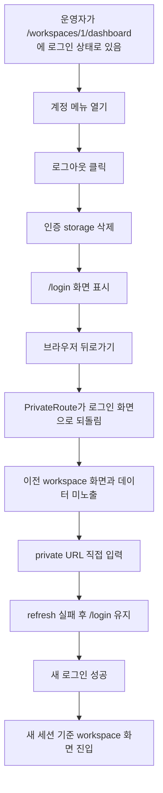

# Frontend E2E Spec: 계정 메뉴 로그아웃 후 private 재진입 차단

## Goal

운영자가 계정 메뉴에서 로그아웃한 뒤 같은 브라우저에서 뒤로가기 또는 private URL 직접 입력을 해도 이전 인증 세션과 workspace 화면으로 재진입할 수 없음을 Critical E2E로 보장한다.

## Issue Summary

GitHub Issue #716은 로그인된 운영자가 workspace dashboard 같은 private 화면에서 로그아웃한 뒤 `accessToken`, `refreshToken`, `user`가 삭제되고, 브라우저 뒤로가기나 private URL 재입력으로 이전 workspace 화면 또는 데이터가 다시 보이지 않아야 한다는 P1 Critical E2E 후보를 다룬다.

기존 `frontend/e2e/workspace-core.spec.ts`의 account menu logout 테스트는 로그인 화면 이동과 storage 삭제를 확인하지만 `@critical` 대상이 아니며, 로그아웃 직후 private URL 재진입 차단과 이전 workspace 데이터 비노출까지 한 흐름에서 고정하지 않는다. 또한 현재 `frontend/e2e/support/generated-api-auth.ts`의 인증 helper는 문서 로드마다 토큰을 다시 심기 때문에 로그아웃 후 `page.goto(privateUrl)` 검증이 실제 제품 동작이 아니라 테스트 helper 재인증 동작에 의해 왜곡될 수 있다.

## User Flow Chart



## Design Diff

| 영역 | As-is | To-be | 변경 내용 |
| --- | --- | --- | --- |
| Account menu logout E2E | 로그아웃 후 `/login` 이동과 storage null 여부만 확인한다. | 로그아웃 후 뒤로가기, private URL 직접 입력, 새 로그인까지 같은 사용자 흐름에서 확인한다. | Issue #716의 사용자 기대 결과를 account menu 시나리오에 직접 매핑한다. |
| Critical 편입 | 기존 logout 테스트가 일반 workspace-core E2E에 포함되어 있다. | logout 시나리오에 `@critical` marker를 붙여 Critical subset에서 선택 실행한다. | `pnpm --dir frontend e2e:critical` 대상에 포함한다. |
| E2E auth fixture | `installAuth`가 매 문서 로드마다 localStorage 인증 값을 다시 저장한다. | helper가 테스트 시작 시 한 번만 인증 값을 심어 로그아웃 후 full navigation이 재인증되지 않게 한다. | 로그아웃 후 private URL 재입력 검증이 제품의 storage clearing 정책을 보게 한다. |

## Component Tree

```text
frontend/e2e/workspace-core.spec.ts
└─ Workspace core operator screens
   └─ Given an authenticated workspace operator
      └─ When they use the account menu
         └─ logout Critical scenario

frontend/e2e/support/generated-api-auth.ts
└─ installAuth(page)
   └─ one-time localStorage seed for mocked authenticated setup

frontend/src/shared/ui/ostone/chrome/AccountMenu.tsx
└─ account-menu-logout
   └─ clearAuthSession() + navigate("/login")

frontend/src/shared/ui/PrivateRoute.tsx
└─ unauthenticated private access
   └─ refreshAuthSession() failure -> clearAuthSession() + /login
```

## API Integration

테스트는 Playwright route mock을 사용하며 신규 API는 만들지 않는다.

| Method | Path | 목적 |
| --- | --- | --- |
| `POST` | `/api/v1/auth/refresh` | 로그아웃 후 private URL 재진입 시 서버 refresh가 실패하는 상태를 401로 mock한다. |
| `POST` | `/api/v1/auth/login` | 새 로그인 성공 응답을 mock해 새 세션 기준 workspace 진입을 확인한다. |
| `GET` | `/api/v1/workspaces` | 로그인 후 destination 판정과 workspace shell 조회에 기존 app mock을 사용한다. |
| `GET` | `/api/v1/workspaces/1` | 새 세션의 workspace shell 렌더링에 기존 app mock을 사용한다. |

## 수정 대상 파일

| 파일 | 변경 유형 | 설명 |
| --- | --- | --- |
| `.agent/specs/716.md` | new | Issue #716 요구사항과 검증 기준 기록 |
| `frontend/e2e/workspace-core.spec.ts` | modify | account menu logout 테스트를 Critical로 편입하고 뒤로가기/private URL/새 로그인 검증을 보강 |
| `frontend/e2e/support/generated-api-auth.ts` | modify | mocked auth seed가 로그아웃 후 full navigation에서 토큰을 다시 심지 않도록 one-time guard 추가 |

## State Management

- 인증 storage key는 현재 구현 기준 `accessToken`, `refreshToken`, `user`를 사용한다.
- 로그아웃은 기존 `clearAuthSession()` 정책에 따라 세 key를 모두 삭제해야 한다.
- 로그아웃 직후 뒤로가기나 private URL 직접 입력으로 private route가 평가되면 refresh 실패 후 로그인 화면만 보여야 한다.
- 이전 workspace 화면의 대표 텍스트인 `QA Workspace`, `총 상담`, `최신 도메인 후보 확정` 등은 로그인 화면 또는 차단된 상태에서 보이지 않아야 한다.
- 새 로그인 성공 후에는 새로 저장된 `accessToken`과 `user` 기준으로 workspace 화면에 진입해야 하며 legacy `refreshToken` key는 남지 않아야 한다.

## Tests

| 구분 | 방법 | 도구 |
| --- | --- | --- |
| E2E Critical | account menu logout 후 화면, storage, 뒤로가기, private URL, 재로그인 검증 | Playwright mocked E2E |
| 정적 검증 | 변경된 E2E TypeScript와 auth helper lint/type 위험 확인 | `pnpm --dir frontend exec eslint ...` 또는 `pnpm --dir frontend test -- --run` 범위 검토 |

## Acceptance Criteria

- 운영자는 `/workspaces/1/dashboard`에서 account menu를 열고 로그아웃을 실행할 수 있다.
- 로그아웃 직후 `/login` 화면이 보이며 `accessToken`, `refreshToken`, `user` localStorage 값은 모두 `null`이다.
- 브라우저 뒤로가기 후에도 로그인 화면으로 돌아오며 이전 workspace marker, dashboard KPI, domain pack 데이터가 보이지 않는다.
- 로그아웃 후 `/workspaces/1/dashboard`를 직접 입력해도 로그인 화면으로 돌아오며 workspace API가 인증 없이 렌더링되지 않는다.
- 새로 로그인하면 새 `user` 정보와 token이 저장되고 새 세션 기준 workspace 화면으로 진입한다.
- `installAuth` helper가 로그아웃 후 full document navigation에서 인증 값을 다시 심어 테스트를 위양성으로 만들지 않는다.

## Non-goals

- backend logout, refresh token cookie, JWT 검증 정책은 변경하지 않는다.
- account menu UI 디자인이나 로그인 화면 문구를 변경하지 않는다.
- 별도 Critical Playwright project나 CI workflow를 새로 만들지 않는다.
- cross-account stale cache 정책은 기존 `frontend/e2e/navigation.spec.ts` 회귀 테스트 범위에 맡기고 이 이슈에서는 계정 메뉴 로그아웃 직후 흐름만 다룬다.

## Validation

| 검증 | 목적 |
| --- | --- |
| `pnpm --dir frontend exec playwright test e2e/workspace-core.spec.ts --grep @critical` | account menu logout Critical 시나리오 선택 실행 |
| `pnpm --dir frontend e2e -- workspace-core.spec.ts` | workspace-core mocked E2E 회귀 확인 |
| `pnpm --dir frontend exec eslint e2e/workspace-core.spec.ts e2e/support/generated-api-auth.ts` | 변경된 E2E 파일 lint 확인 |
| `git diff --check` | 패치 공백/형식 확인 |

## Open Questions

- 없음. Issue의 디스클레이머에 따라 계정 메뉴 위치, storage key, private route 정책은 현재 코드 기준으로 확인했다.
