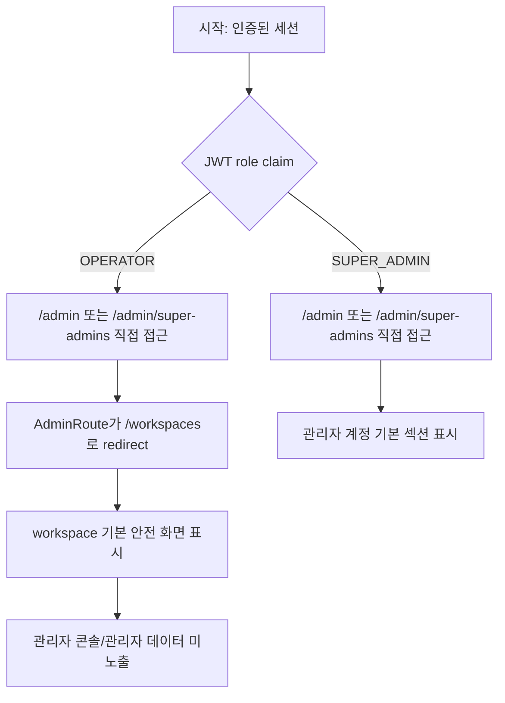

# Frontend E2E Spec: admin URL 접근 권한 Critical 회귀

## Goal

일반 운영자가 admin URL을 직접 입력해도 관리자 데이터가 노출되지 않고, SUPER_ADMIN만 관리자 콘솔 기본 섹션을 볼 수 있음을 Critical E2E로 보장한다.

## Issue Summary

GitHub Issue #717은 일반 운영자와 SUPER_ADMIN 세션 fixture를 기준으로 `/admin` 및 `/admin/super-admins` 직접 접근 정책을 검증해야 한다고 요구한다. 현재 제품 라우팅은 `frontend/src/app/App.tsx`에서 `/admin` 하위 경로를 `AdminRoute`로 감싸고, `frontend/src/shared/ui/PrivateRoute.tsx`의 `RequireSuperAdmin`이 `frontend/src/shared/lib/auth.ts`의 JWT `role` claim 기반 `isSuperAdmin()` 결과로 접근을 판별한다.

기존 `frontend/e2e/navigation.spec.ts`에는 비 SUPER_ADMIN이 `/admin/customers`에 접근하면 workspace home으로 돌아가는 검증이 있고, SUPER_ADMIN이 `/admin`에서 `/admin/super-admins`로 진입하는 검증도 있다. 이 작업은 이슈가 지정한 `/admin`, `/admin/super-admins` 경로와 Critical 실행 그룹을 명확히 고정하고, 운영자 차단 시 admin 화면/데이터가 남지 않는지 화면 기준으로 확인한다.

## User Flow Chart



## Design Diff

| 영역 | As-is | To-be | 변경 내용 |
| --- | --- | --- | --- |
| Operator admin guard E2E | `/admin/customers` 단일 경로를 workspace home redirect로 검증 | `/admin`, `/admin/super-admins` 직접 접근을 Critical 시나리오로 검증 | 이슈 Given/When/Then 경로를 직접 고정 |
| SUPER_ADMIN default E2E | `/admin` 진입 시 관리자 계정 섹션 표시 검증 | 동일 검증을 Critical 시나리오로 편입하고 `/admin/super-admins` 기본 섹션 표시를 명시 | SUPER_ADMIN 기본 진입 화면을 Critical subset에서 확인 |
| Role fixture | Playwright auth fixture가 localStorage user와 JWT payload에 role을 저장 | JWT payload role이 `isSuperAdmin()` 판별 기준임을 테스트 전제로 유지 | 앱 권한 판별 기준과 fixture를 맞춤 |
| 제품 UI/API | 변경 없음 | 변경 없음 | 라우트 guard 동작을 E2E로 고정하는 범위 |

## Component Tree

```text
App
└─ /admin route
   └─ AdminRoute
      └─ PrivateRoute
         └─ RequireSuperAdmin
            ├─ OPERATOR -> Navigate("/workspaces")
            └─ SUPER_ADMIN -> AdminLayout
               └─ AdminSuperAdminsPage

Playwright mocked E2E
└─ frontend/e2e/navigation.spec.ts
   ├─ Given an authenticated operator
   └─ Given a SUPER_ADMIN session
```

## API Integration

신규 API는 만들지 않는다. 테스트는 기존 Playwright route mock만 사용한다.

| Method | Path | Description |
| --- | --- | --- |
| GET | `/api/v1/workspaces` | OPERATOR가 admin 접근 차단 후 안전한 workspace home을 결정하기 위한 목록 조회 |
| GET | `/api/v1/workspaces/{workspaceId}` | workspace shell 표시를 위한 상세 조회 |

OPERATOR admin 접근 차단 시 admin API 호출은 기대하지 않는다.

## 수정 대상 파일

| 파일 | 변경 유형 | 설명 |
| --- | --- | --- |
| `.agent/specs/717.md` | new | Issue #717 요구사항과 검증 기준 기록 |
| `frontend/e2e/navigation.spec.ts` | modify | `/admin`, `/admin/super-admins` role guard Critical E2E 강화 |

## State Management

- 인증 상태는 `frontend/e2e/support/generated-api-auth.ts`의 `installAuth()`와 `makeJwt()`를 사용한다.
- 앱의 SUPER_ADMIN 판별은 localStorage `user.role`이 아니라 access token payload의 `role` claim을 기준으로 한다.
- OPERATOR 접근 차단 후 라우팅은 기존 `RequireSuperAdmin`의 `/workspaces` redirect 정책을 유지한다.
- E2E mock state는 테스트 실행 단위로 초기화되며 product state나 cache key는 변경하지 않는다.

## Tests

### Test Strategy

| 구분 | 방법 | 도구 | 비고 |
| --- | --- | --- | --- |
| E2E 회귀 | OPERATOR와 SUPER_ADMIN mocked auth session으로 admin URL 직접 접근 | Playwright mocked E2E | 이슈 Given/When/Then 직접 검증 |
| Critical subset | `@critical` tag로 admin 권한 경계를 좁게 실행 | Playwright grep | 기존 `frontend/package.json`의 `e2e:critical` 사용 |

### Test Scenarios

| # | Given | When | Then |
| --- | --- | --- | --- |
| 1 | OPERATOR 세션과 workspace fixture가 준비되어 있다. | `/admin`을 직접 연다. | `/workspaces/{id}/dashboard` 안전 화면으로 이동하고 admin heading/data가 보이지 않는다. |
| 2 | OPERATOR 세션과 workspace fixture가 준비되어 있다. | `/admin/super-admins`를 직접 연다. | workspace 안전 화면으로 이동하고 관리자 계정 화면이 보이지 않는다. |
| 3 | SUPER_ADMIN 세션이 준비되어 있다. | `/admin`을 직접 연다. | `/admin/super-admins`로 이동하고 관리자 계정 기본 섹션을 볼 수 있다. |
| 4 | SUPER_ADMIN 세션이 준비되어 있다. | `/admin/super-admins`를 직접 연다. | 관리자 계정 기본 섹션을 볼 수 있다. |
| 5 | SUPER_ADMIN admin 화면을 본 뒤 OPERATOR role로 전환된다. | `/admin/super-admins`를 다시 연다. | 이전 admin 화면이 남지 않고 workspace 안전 화면으로 돌아간다. |

## Acceptance Criteria

- `.agent/specs/717.md` 파일명이 이슈 번호만 포함한다.
- `frontend/e2e/navigation.spec.ts`의 admin 권한 경계 시나리오가 `@critical` tag로 식별된다.
- OPERATOR가 `/admin` 또는 `/admin/super-admins`를 열면 workspace 기본 안전 화면으로 이동한다.
- OPERATOR 화면에는 고객사, 결제, Airflow, 관리자 계정 등 admin console 항목과 admin fixture 데이터가 표시되지 않는다.
- SUPER_ADMIN이 `/admin` 또는 `/admin/super-admins`를 열면 관리자 계정 기본 섹션을 볼 수 있다.
- SUPER_ADMIN 화면 이후 OPERATOR role로 바뀌어 admin URL을 열면 이전 admin 화면이 남지 않는다.
- 권한 차단은 404 화면이 아니라 기존 workspace redirect 정책으로 구분된다.

## Non-goals

- Backend admin 권한 정책, JWT 발급 방식, OpenAPI generated files를 변경하지 않는다.
- Admin UI 문구, 레이아웃, 스타일을 변경하지 않는다.
- live E2E 또는 실제 SUPER_ADMIN 운영 계정을 사용하는 검증은 추가하지 않는다.
- `/admin/customers`, `/admin/billing`, `/admin/airflow` 개별 기능 검증을 새로 작성하지 않는다.

## Validation

| 검증 | 목적 |
| --- | --- |
| `pnpm --dir frontend exec playwright test e2e/navigation.spec.ts --grep @critical` | admin 권한 경계 Critical E2E를 좁게 검증 |
| `pnpm --dir frontend e2e -- navigation.spec.ts` | navigation mocked E2E 전체 회귀 확인 |
| `pnpm --dir frontend exec eslint e2e/navigation.spec.ts` | 변경된 E2E TypeScript lint 확인 |

## Open Questions

- 없음. 현재 확인된 제품 정책은 비 SUPER_ADMIN admin 접근 시 `/workspaces`로 redirect하는 것이다.
