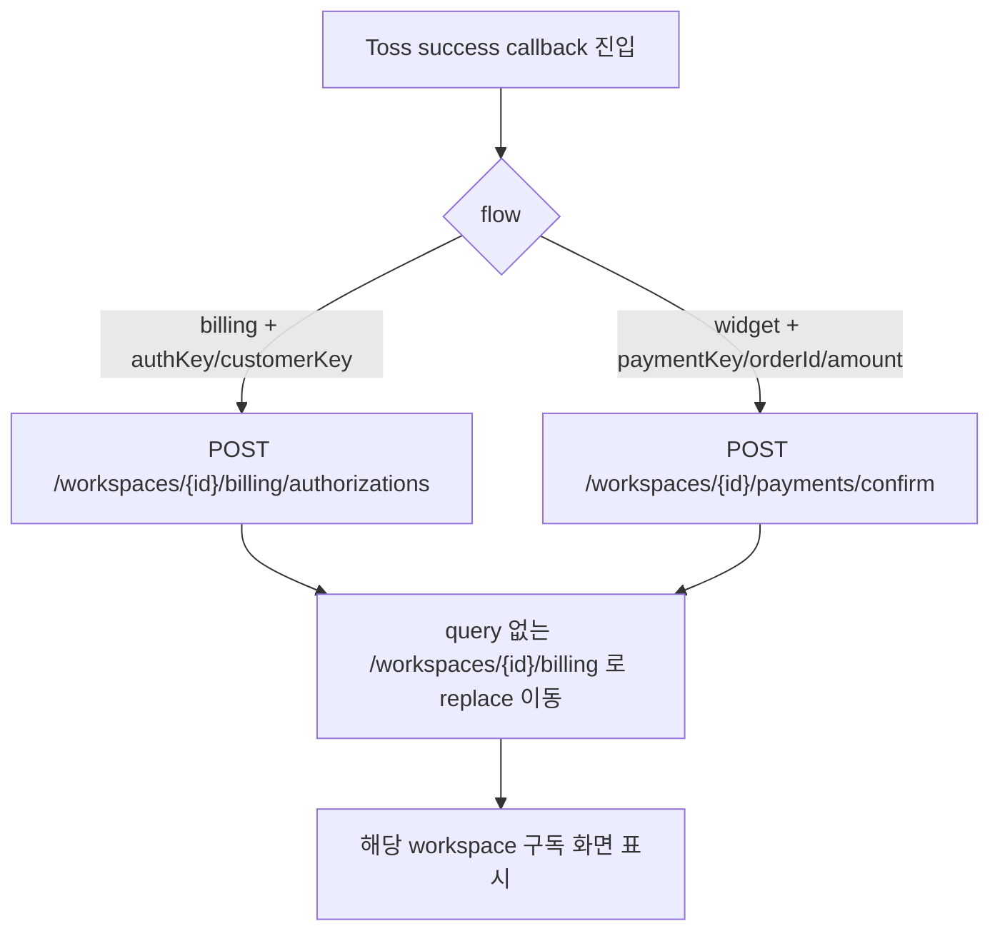

# 결제 성공 callback 민감 query 제거 E2E 보강

## Goal

운영자가 외부 결제창에서 성공 callback URL로 돌아온 뒤 결제 결과가 처리되고, URL에 Toss 인증/결제 query가 남지 않은 상태로 해당 workspace 구독 화면을 보게 한다.

## User Flow Chart

## Problem

`frontend/src/pages/billing/ui/BillingSuccessPage.tsx`는 mount 직후 현재 history entry에서 query string을 제거한 뒤 billing authorization 또는 widget payment confirm을 실행한다. 기존 `frontend/e2e/billing.spec.ts`는 success redirect가 구독 화면으로 돌아오는 흐름을 검증하지만, billing authorization 성공 path와 widget payment 성공 path 모두에서 `authKey`, `customerKey`, `paymentKey`, `orderId`, `amount` 같은 민감 callback query가 최종 URL에 남지 않는지는 충분히 단언하지 않는다.

## Scope

- `frontend/e2e/billing.spec.ts`의 mocked Playwright billing success 시나리오를 보강한다.
- billing authorization success callback은 서버 confirm 호출 후 `/workspaces/1/billing`로 돌아가고 현재 URL과 브라우저 back history에 `authKey`, `customerKey` query가 남지 않아야 한다.
- widget payment success callback은 서버 confirm 호출 후 `/workspaces/1/billing`로 돌아가고 현재 URL과 브라우저 back history에 `paymentKey`, `orderId`, `amount` query가 남지 않아야 한다.
- 기존 mocked API 호출 추적 배열 `seen`으로 workspace별 confirm endpoint 호출을 확인한다.
- 동일한 success callback이 다른 workspace 구독 상태로 반영되지 않는 기대는 기존 billing 관리 E2E의 workspace 전환 단언과 새 success callback의 workspace-scoped URL/API 단언으로 함께 검증한다.

## Non-goals

- `BillingSuccessPage`의 문구, 레이아웃, loading/error UI를 변경하지 않는다.
- Toss SDK request flow, backend billing/payment API contract, generated API client를 변경하지 않는다.
- 결제 실패 callback의 query 제거 정책은 이번 범위에서 변경하지 않는다.
- 실제 Toss 네트워크 호출 또는 운영 결제 credential을 사용하는 live E2E를 추가하지 않는다.

## Affected Paths

| 파일                                                                                  | 변경 유형 | 설명                                                         |
| ------------------------------------------------------------------------------------- | --------- | ------------------------------------------------------------ |
| `frontend/e2e/billing.spec.ts`                                                        | modify    | billing/widget success callback 후 민감 query 제거 단언 보강 |
| `frontend/src/pages/billing/ui/BillingSuccessPage.tsx`                                | inspect   | success landing의 query 제거 및 redirect 기준 확인           |
| `frontend/src/features/register-billing-method/api/useConfirmBillingAuthorization.ts` | inspect   | billing authorization confirm mutation contract 확인         |
| `frontend/src/features/pay-once/api/useConfirmPayment.ts`                             | inspect   | widget payment confirm mutation contract 확인                |
| `frontend/e2e/support/app-mocks.ts`                                                   | inspect   | workspace별 mocked billing state와 API 호출 추적 확인        |

## API Integration

| Method | Path                                                      | 기대                                                       |
| ------ | --------------------------------------------------------- | ---------------------------------------------------------- |
| POST   | `/api/v1/workspaces/{workspaceId}/billing/authorizations` | billing success callback의 `authKey/customerKey` 처리      |
| POST   | `/api/v1/workspaces/{workspaceId}/payments/confirm`       | widget success callback의 `paymentKey/orderId/amount` 처리 |

API, generated client, database schema 변경은 없다.

## Requirements

1. billing success callback E2E는 `POST /workspaces/1/billing/authorizations` 호출을 확인해야 한다.
2. billing success callback E2E는 최종 URL과 back history가 `/workspaces/1/billing`이며 `authKey`, `customerKey` query를 포함하지 않음을 확인해야 한다.
3. widget success callback E2E는 `POST /workspaces/1/payments/confirm` 호출을 확인해야 한다.
4. widget success callback E2E는 최종 URL과 back history가 `/workspaces/1/billing`이며 `paymentKey`, `orderId`, `amount` query를 포함하지 않음을 확인해야 한다.
5. 성공 callback 처리 후 사용자는 구독 화면 heading을 볼 수 있어야 한다.
6. 테스트는 기존 mocked E2E route, 인증 설치, API mock fixture를 재사용해야 한다.

## Tests

### Test Strategy

| 구분      | 방법                                                          | 도구       | 비고                                                      |
| --------- | ------------------------------------------------------------- | ---------- | --------------------------------------------------------- |
| E2E 회귀  | mocked billing success callback URL 진입 후 URL/API/화면 단언 | Playwright | `frontend/e2e/billing.spec.ts`                            |
| 정적 확인 | FSD/API/generated client 변경 없음 확인                       | 코드 리뷰  | product code 변경이 필요한 경우에만 추가 단위 테스트 검토 |

### Test Scenarios

| #   | 시나리오                      | 사전 조건                  | 조작                                                                                                         | 기대 결과                                                                                                   |
| --- | ----------------------------- | -------------------------- | ------------------------------------------------------------------------------------------------------------ | ----------------------------------------------------------------------------------------------------------- |
| 1   | billing authorization success | mock auth/session/API 설치 | 안전한 구독 화면에서 `/billing/success?workspaceId=1&flow=billing&authKey=...&customerKey=...` 진입          | authorization API 1회 호출, 현재 URL/back history 모두 query 없는 `/workspaces/1/billing`, 구독 화면 표시   |
| 2   | widget payment success        | mock auth/session/API 설치 | 안전한 구독 화면에서 `/billing/success?workspaceId=1&flow=widget&paymentKey=...&orderId=...&amount=...` 진입 | payment confirm API 1회 호출, 현재 URL/back history 모두 query 없는 `/workspaces/1/billing`, 구독 화면 표시 |

## Acceptance Criteria

- `frontend/e2e/billing.spec.ts`는 billing authorization success 후 `authKey`, `customerKey`가 현재 URL과 browser back history에 남지 않음을 검증한다.
- `frontend/e2e/billing.spec.ts`는 widget payment success 후 `paymentKey`, `orderId`, `amount`가 현재 URL과 browser back history에 남지 않음을 검증한다.
- 두 success path 모두 서버 confirm endpoint 호출과 구독 화면 복귀를 검증한다.
- 변경이 product code에 필요하지 않다면 E2E 단언 보강만으로 범위를 유지한다.

## Validation

- `cd frontend && pnpm e2e -- billing.spec.ts`

## Open Questions

- 없음.
