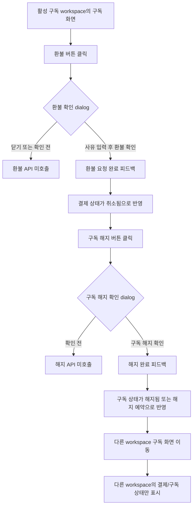

# Frontend E2E Spec: 구독 환불/해지 확인 절차와 완료 상태

## Goal

운영자가 워크스페이스 구독 화면에서 환불 또는 구독 해지를 실행할 때 확인 dialog를 거치고, 완료 후 해당 워크스페이스의 결제/구독 상태가 화면에 일관되게 반영됨을 E2E로 보장한다.

## Issue Summary

GitHub Issue #719는 활성 구독이 있는 workspace의 구독 화면에서 환불과 구독 해지가 실수로 즉시 실행되지 않아야 하며, 환불 사유 입력, 완료 피드백, 상태 반영, 다른 workspace 결제 상태와의 격리를 Critical E2E로 검증하라는 요구다.

## User Flow Chart



## Design Diff

| 영역 | As-is | To-be | 변경 내용 |
| --- | --- | --- | --- |
| Billing E2E | 환불/해지 endpoint 호출을 주로 확인 | 확인 dialog, 사유 입력 유지/제출, 완료 피드백, 화면 상태 반영을 우선 확인 | 사용자 기대 결과 중심의 Critical E2E로 강화 |
| Billing overview cache | 환불/해지 mutation 후 standalone payments/subscription query만 갱신 | BillingPage가 사용하는 overview query도 mutation 결과로 갱신 | 완료 후 결제/구독 상태가 즉시 일관되게 표시 |
| Workspace isolation | 기본 workspace billing만 확인 | 다른 workspace billing fixture를 추가해 상태 섞임을 검증 | workspace별 billing context 회귀 방지 |

## Component Tree

```text
frontend/e2e/billing.spec.ts
└─ Billing screens E2E
   └─ 환불/구독 해지 Critical scenario

frontend/e2e/support/app-mocks.ts
└─ installAppApiMocks
   ├─ workspace 1 billing overview/refund/cancel mock
   └─ workspace 2 billing overview mock

frontend/src/pages/billing/ui/BillingPage.tsx
└─ BillingPage
   ├─ SubscriptionStatusCard
   ├─ PaymentHistoryList
   │  └─ RefundButton
   └─ CancelSubscriptionButton

frontend/src/features/cancel-subscription/api
├─ useRefundPayment
└─ useCancelSubscription
```

## API Integration

테스트는 Playwright route mock을 사용하며 신규 API는 만들지 않는다.

| Method | Path | 목적 |
| --- | --- | --- |
| `GET` | `/api/v1/workspaces` | workspace switcher와 shell context 조회 |
| `GET` | `/api/v1/workspaces/{workspaceId}` | 현재 workspace marker 조회 |
| `GET` | `/api/v1/workspaces/{workspaceId}/billing/overview` | 구독, 결제수단, 결제내역, quota 조회 |
| `POST` | `/api/v1/workspaces/{workspaceId}/payments/{paymentKey}/cancel` | 환불 사유를 포함한 결제 환불 |
| `DELETE` | `/api/v1/workspaces/{workspaceId}/subscription` | 구독 해지 |

## 수정 대상 파일

| 파일 | 변경 유형 | 설명 |
| --- | --- | --- |
| `.agent/specs/719.md` | new | Issue #719 요구사항과 검증 기준 기록 |
| `frontend/e2e/billing.spec.ts` | modify | 환불/해지 Critical E2E를 사용자 기대 결과 중심으로 강화 |
| `frontend/e2e/support/app-mocks.ts` | modify | workspace별 billing overview fixture와 mutation body 검증 보강 |
| `frontend/src/features/cancel-subscription/api/useRefundPayment.ts` | modify | 환불 성공 시 billing overview 결제 상태 갱신 |
| `frontend/src/features/cancel-subscription/api/useCancelSubscription.ts` | modify | 구독 해지 성공 시 billing overview 구독 상태 갱신 |
| `frontend/src/features/cancel-subscription/api/useRefundPayment.test.tsx` | modify | 환불 mutation 후 overview cache 갱신 검증 |
| `frontend/src/features/cancel-subscription/api/useCancelSubscription.test.tsx` | modify | 구독 해지 mutation 후 overview cache 갱신 검증 |
| `frontend/src/features/cancel-subscription/ui/RefundButton.tsx` | modify | 환불 성공 payload를 상위 화면에 전달 |
| `frontend/src/features/cancel-subscription/ui/CancelSubscriptionButton.tsx` | modify | 구독 해지 성공 payload를 상위 화면에 전달 |
| `frontend/src/features/cancel-subscription/ui/RefundButton.test.tsx` | modify | 환불 성공 callback 전달 검증 |
| `frontend/src/features/cancel-subscription/ui/CancelSubscriptionButton.test.tsx` | modify | 구독 해지 성공 callback 전달 검증 |
| `frontend/src/pages/billing/ui/BillingPage.tsx` | modify | 이미 해지 또는 해지 예약된 구독의 중복 해지 CTA 노출 방지 |
| `frontend/src/pages/billing/ui/BillingPage.test.tsx` | modify | 해지 예약/해지 완료 상태에서 해지 CTA 숨김 검증 |

## State Management

- 서버 상태는 기존 TanStack Query query key를 유지한다.
- BillingPage는 `billingQueryKeys.overview(workspaceId)`로 결합된 billing read model을 표시한다.
- 환불 성공 시 mutation 결과의 `PaymentResponse`를 overview의 `payments` 배열에 반영한다.
- 구독 해지 성공 시 mutation 결과의 `SubscriptionResponse`를 overview의 `subscription`에 반영한다.
- BillingPage는 mutation 성공 callback을 받아 즉시 표시 상태를 갱신하며, 성공 응답 body가 비어도 현재 화면의 결제/구독 정보를 기반으로 완료 상태를 표시한다.
- workspace별 query key는 workspace id를 포함하므로 다른 workspace overview cache를 변경하지 않는다.

## Tests

### Test Strategy

| 구분 | 방법 | 도구 | 비고 |
| --- | --- | --- | --- |
| Hook regression | mutation 성공 후 billing overview cache 갱신 확인 | Vitest, TanStack Query | BillingPage 상태 반영 회귀 방지 |
| Button/Page regression | 성공 callback 전달, 빈 응답 fallback, 해지/예약 상태에서 중복 해지 CTA 숨김 확인 | Vitest, React Testing Library | 반복 실행 UX 방지 |
| E2E Critical | 환불/해지 dialog, 완료 feedback, 상태 반영, workspace isolation 검증 | Playwright | Issue #719 핵심 사용자 시나리오 |

### Test Scenarios

| # | Given | When | Then |
| --- | --- | --- | --- |
| 1 | 활성 구독과 DONE 결제가 있는 workspace 1 구독 화면 | 환불 버튼을 클릭하지만 확인 전 | 환불 dialog가 표시되고 환불 API는 호출되지 않는다 |
| 2 | 환불 dialog가 열린 상태 | 환불 사유를 입력하고 닫았다가 다시 열어 환불을 확인 | 입력한 사유가 유지되고 해당 사유로 환불 요청이 제출된다 |
| 3 | 환불 요청이 성공 | 화면을 확인 | 완료 toast, 결제 상태 `취소됨`, 환불 CTA 제거가 표시된다 |
| 4 | 활성 구독 workspace 1 | 구독 해지 버튼을 클릭하지만 확인 전 | 구독 해지 dialog가 표시되고 해지 API는 호출되지 않는다 |
| 5 | 구독 해지 요청이 성공 | 화면을 확인 | 완료 toast, 구독 상태 `해지됨` 또는 해지 예약 정보, 중복 해지 CTA 제거가 표시된다 |
| 6 | workspace 1에서 환불/해지를 완료한 뒤 | workspace 2 구독 화면으로 이동 | workspace 2의 결제수단/결제금액/구독 상태만 표시되고 workspace 1의 취소 상태가 섞이지 않는다 |

## Acceptance Criteria

- 환불과 구독 해지는 확인 dialog의 최종 확인 전까지 API를 호출하지 않는다.
- 환불 사유가 입력되고, dialog 재오픈 후에도 유지되며, 제출 body에 명확히 포함된다.
- 환불 성공 후 사용자는 완료 feedback과 결제 상태 `취소됨`을 볼 수 있고 같은 결제의 환불 CTA는 사라진다.
- 구독 해지 성공 후 사용자는 완료 feedback과 해지된 구독 상태 또는 해지 예약 정보를 볼 수 있고 중복 해지 CTA는 사라진다.
- 다른 workspace 구독 화면은 해당 workspace의 billing overview만 표시한다.
- endpoint 호출 검증은 보조로 유지하되, E2E의 우선 단언은 화면상 확인 절차와 완료 상태다.

## Non-goals

- backend billing API contract, OpenAPI generated file, database schema는 변경하지 않는다.
- Toss 결제 위젯, billing authorization redirect, one-off payment confirm/fail landing 정책은 변경하지 않는다.
- 실제 운영 백엔드를 호출하는 live E2E는 추가하지 않는다.
- 환불 금액 정책이나 부분 환불 UI는 이번 범위에 포함하지 않는다.

## Validation

| 검증 | 목적 |
| --- | --- |
| `pnpm --dir frontend test -- src/features/cancel-subscription/api/useRefundPayment.test.tsx src/features/cancel-subscription/api/useCancelSubscription.test.tsx src/features/cancel-subscription/ui/RefundButton.test.tsx src/features/cancel-subscription/ui/CancelSubscriptionButton.test.tsx src/pages/billing/ui/BillingPage.test.tsx --run` | 변경 hook/button/page 단위 회귀 검증 |
| `pnpm --dir frontend e2e -- billing.spec.ts` | Billing Critical E2E 검증 |
| `git diff --check` | 공백/패치 형식 확인 |

## Open Questions

- 없음. Issue의 미확인 세부 정책은 코드 기준으로 조사했고, 확인된 현재 정책만 테스트에 고정한다.
