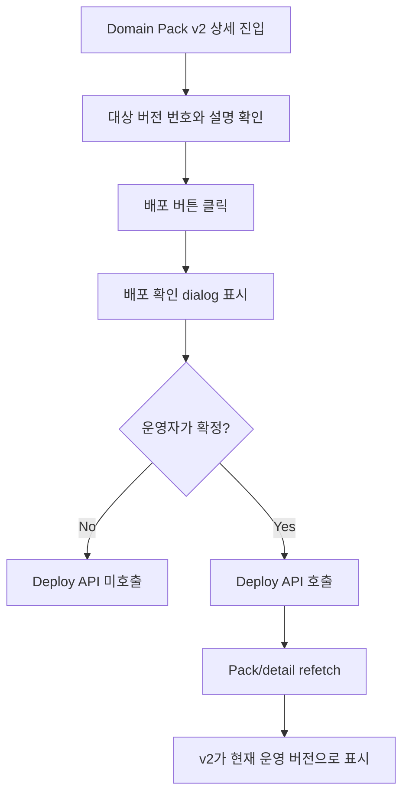

# Frontend E2E Spec: Domain Pack Version 운영 배포 확인

## Goal

운영자가 검토된 Domain Pack 버전을 배포할 때 대상 버전과 운영 전환을 확인하고, 완료 후 해당 버전이 현재 운영 버전으로 표시됨을 mocked E2E로 보장한다.

## Issue Summary

GitHub Issue #720은 Domain Pack Version 배포가 Critical E2E 시나리오로 검증되어야 한다고 요구한다. 기존 `frontend/e2e/domain-pack-core.spec.ts`에는 v2 배포 확인 dialog와 deploy API 호출 검증이 있으나, 배포 성공 후 mock fixture가 현재 운영 버전을 v2로 갱신하지 않아 UI가 운영 버전 전환을 신뢰할 수 있는지 확인하지 못한다.

현재 `frontend/playwright.config.ts`는 mocked E2E 전체를 실행한다. 따라서 이 작업은 기존 `domain-pack-core` suite 안의 배포 시나리오를 Playwright `@critical` tag로 식별 가능하게 하고, 사용자에게 중요한 운영 전환 결과를 화면 기준으로 검증한다.

## User Flow Chart



## Design Diff

| 영역 | As-is | To-be | 변경 내용 |
| --- | --- | --- | --- |
| E2E scenario | v2 배포 dialog와 deploy endpoint 호출만 확인 | Critical 배포 흐름에서 dialog의 대상 버전/운영 전환 정보와 완료 후 운영 버전 전환까지 확인 | 사용자 기대 결과 중심으로 검증 강화 |
| Mock fixture | deploy 응답 후 pack 상세 refetch가 계속 `currentVersionId=1` 반환 | deploy 성공 후 workspace 1의 Domain Pack summary/detail이 `currentVersionId=2`, `currentVersionNo=2`를 반환 | 실제 배포 후 운영 버전 변경 계약을 mock에 반영 |
| Workspace isolation | workspace 2 mock은 workspace 1 deploy state와 명시적으로 분리되지 않음 | workspace 1 deploy state만 변경하고 workspace 2 fixture는 기존 운영 버전 상태 유지 | 다른 workspace에 배포가 적용된 것처럼 보이지 않게 함 |

## Component Tree

```text
frontend/e2e/domain-pack-core.spec.ts
└─ Domain pack core read flows
   └─ deploy operating candidate version @critical

frontend/e2e/support/app-mocks.ts
└─ installAppApiMocks
   └─ fulfillDomainPackRead
      ├─ GET pack list/detail
      ├─ GET version detail
      └─ POST version deploy
```

## API Integration

테스트는 `frontend/e2e/support/app-mocks.ts`의 Playwright route mock만 사용한다.

| Method | Path | 목적 |
| --- | --- | --- |
| `GET` | `/api/v1/workspaces/1/domain-packs/1` | 현재 운영 버전과 버전 목록 조회 |
| `GET` | `/api/v1/workspaces/1/domain-packs/1/versions/2` | 배포 대상 v2 상세 조회 |
| `POST` | `/api/v1/workspaces/1/domain-packs/1/versions/2/deploy` | 운영 버전 배포 확정 |

## 수정 대상 파일

| 파일 | 변경 유형 | 설명 |
| --- | --- | --- |
| `.agent/specs/720.md` | new | Issue #720 요구사항과 검증 기준 기록 |
| `frontend/e2e/domain-pack-core.spec.ts` | update | Domain Pack Version 배포 Critical E2E assertions 강화 |
| `frontend/e2e/support/app-mocks.ts` | update | deploy 후 current operating version을 v2로 반환하는 stateful mock 추가 |

## State Management

- 프로덕션 클라이언트 상태 관리는 변경하지 않는다.
- E2E mock state는 `installAppApiMocks` 호출 단위로 초기화되어 테스트 간 공유되지 않는다.
- deploy 확정 전에는 mock current version이 v1이다.
- deploy 확정 후에는 workspace 1의 pack list/detail refetch만 v2를 현재 운영 버전으로 반환한다.
- workspace 2 fixture는 workspace 1 deploy state를 공유하지 않는다.

## Tests

### Test Strategy

| 구분 | 방법 | 도구 | 비고 |
| --- | --- | --- | --- |
| E2E 테스트 | Domain Pack summary 화면 조작 + API route mocking | Playwright | 핵심 사용자 시나리오 |
| 정적 검증 | 변경 파일 TypeScript/ESLint 확인 | ESLint | frontend staged 파일 위험 확인 |

### Test Environment & 사전 조건

| 항목 | 값 |
| --- | --- |
| 환경 | `frontend/playwright.config.ts` preview mock 환경 |
| API Mock | Playwright `page.route` |
| 사전 조건 | workspace 1의 Domain Pack 1에 현재 운영 v1과 운영 가능 후보 v2가 존재 |

### Test Scenarios

| # | 시나리오 | 사전 조건 | 조작 | 기대 결과 |
| --- | --- | --- | --- | --- |
| 1 | 운영 가능 후보 버전 배포 | v2 상세 화면 표시 | 배포 버튼 클릭 후 dialog에서 배포 확정 | 성공 피드백이 보이고 v2가 현재 운영 버전으로 표시된다 |
| 2 | 확정 전 실행 방지 | v2 상세 화면 표시 | 배포 버튼 클릭 후 dialog만 표시 | deploy API는 확정 버튼 전까지 호출되지 않는다 |
| 3 | workspace/version isolation | workspace 1 pack v2 배포 | 배포 완료 후 화면 확인 | v1이 계속 배포중으로 보이지 않고, selected v2만 배포중/운영 중으로 표시된다 |

## Acceptance Criteria

- `.agent/specs/720.md` 파일명이 이슈 번호만 포함한다.
- `frontend/e2e/domain-pack-core.spec.ts`의 version deploy 시나리오가 `@critical` tag로 식별된다.
- 배포 확인 dialog는 대상 `v2`, 운영 전환(`현재 v1 → v2`), 변경 요약을 화면 기준으로 확인한다.
- 확인 dialog에서 `배포하기`를 누르기 전에는 deploy endpoint가 호출되지 않는다.
- deploy 성공 후 성공 피드백이 표시된다.
- deploy 성공 후 버전 안전성 정보와 상세 패널은 v2를 현재 운영 버전으로 표시한다.
- deploy 성공 후 v1 row가 `배포중`으로 표시되지 않는다.
- deploy API 호출 여부는 보조 검증으로 유지한다.
- E2E mock은 테스트 간 상태를 공유하지 않는다.

## Non-goals

- Backend deploy API contract, OpenAPI generated files, database schema는 변경하지 않는다.
- Domain Pack 배포 UI 문구나 디자인을 변경하지 않는다.
- live E2E 또는 실제 운영 백엔드 의존 테스트를 추가하지 않는다.
- 별도 Critical-only CI job이나 package script를 추가하지 않는다.

## Validation

| 검증 | 목적 |
| --- | --- |
| `pnpm --dir frontend exec playwright test e2e/domain-pack-core.spec.ts --grep @critical` | Domain Pack 배포 Critical E2E만 좁게 검증 |
| `pnpm --dir frontend e2e -- domain-pack-core.spec.ts` | Domain Pack mocked E2E 중 배포 Critical 흐름 검증 |
| `pnpm --dir frontend exec eslint e2e/domain-pack-core.spec.ts e2e/support/app-mocks.ts` | 변경된 E2E TypeScript 파일 lint 확인 |

## Open Questions

- 없음.
