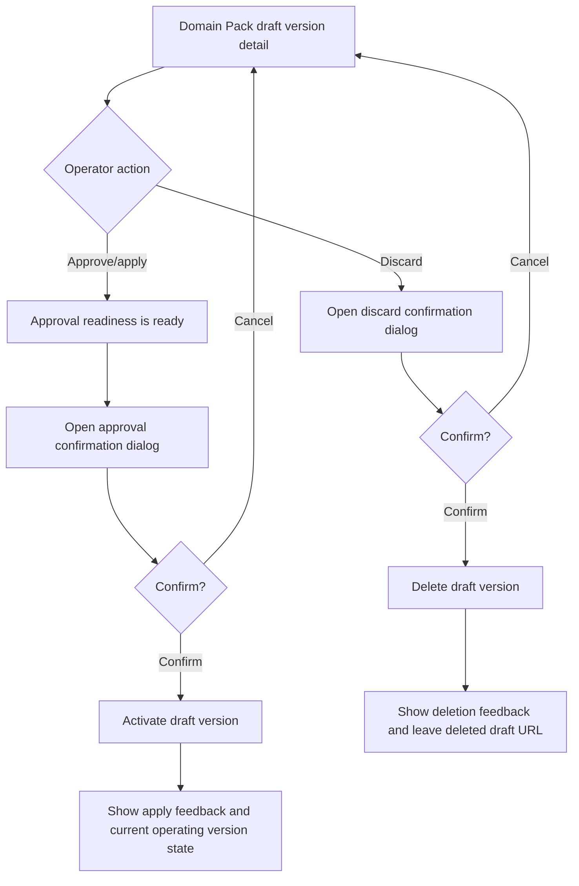

# Frontend E2E Spec: Domain Pack draft 적용/삭제 확인 Critical 편입

## Goal

운영자가 검토 중인 Domain Pack draft를 운영 반영하거나 삭제할 때 확인 절차를 거치고, 완료 후 현재 유효한 Domain Pack 상태로 이동함을 Critical E2E로 보장한다.

## Issue Summary

GitHub Issue #721은 검토 중인 Domain Pack draft 버전 상세에서 적용 또는 삭제를 선택할 때 즉시 실행되지 않고 확인 dialog를 거쳐야 한다는 사용자 시나리오를 다룬다. 기존 `frontend/e2e/domain-pack-core.spec.ts`에는 draft 삭제 확인 E2E와 approval readiness 차단 E2E가 있고, `frontend/e2e/support/app-mocks.ts`에는 draft activate mock endpoint가 존재한다. 이번 작업은 실제 summary page 흐름 기준으로 approval-ready draft 적용 성공 경로를 추가하고, 기존 삭제 경로를 Critical 그룹으로 명시한다.

## User Flow Chart



## Design Diff

| 영역                  | As-is                                                         | To-be                                                          | 변경 내용                                                                    |
| --------------------- | ------------------------------------------------------------- | -------------------------------------------------------------- | ---------------------------------------------------------------------------- |
| Critical E2E grouping | draft 삭제 테스트가 일반 그룹에 있음                          | draft 적용 성공과 삭제 성공이 `@critical` grep 대상            | Critical 실행에서 draft lifecycle destructive action을 보장                  |
| Draft 적용 E2E        | readiness blocker만 검증하고 activate success route는 미사용  | approval-ready fixture에서 승인 확인 dialog와 성공 상태 검증   | 적용 전 확인 절차와 운영 버전 전환을 E2E로 고정                              |
| Draft 삭제 E2E        | 삭제 dialog와 redirect를 검증                                 | 같은 검증을 Critical 그룹으로 편입하고 즉시 삭제 미발생을 단언 | 삭제 전 확인 dialog 완료가 필요함을 명시                                     |
| 적용 메모 정책        | component/page unit test에서 기존 `변경사항 정리` 전달을 검증 | E2E는 현재 summary page의 approval readiness 승인 흐름을 따름  | issue의 조사 메모에 따라 실제 page 정책과 다른 memo UX를 E2E에 강제하지 않음 |

## Component Tree

```text
frontend/e2e/domain-pack-core.spec.ts
├─ Domain pack core read flows
│  └─ Given generated domain packs in a workspace
│     └─ When they discard a draft version @critical
└─ Domain pack draft lifecycle critical flows
   └─ Given an approval-ready draft version
      └─ When they approve the draft version @critical

frontend/e2e/support/app-mocks.ts
└─ installAppApiMocks
   └─ domainPackDraftApproval option
```

## API Integration

테스트는 기존 Playwright API mock과 `seen` 호출 추적 배열을 사용한다.

| Method   | Path                                                      | 목적                                 |
| -------- | --------------------------------------------------------- | ------------------------------------ |
| `GET`    | `/api/v1/workspaces/1/domain-packs/1`                     | Domain Pack 상세와 version list 조회 |
| `GET`    | `/api/v1/workspaces/1/domain-packs/1/versions/3`          | draft 버전 상세 조회                 |
| `GET`    | `/api/v1/workspaces/1/domain-packs/1/versions/3/intents`  | approval readiness 판단              |
| `POST`   | `/api/v1/workspaces/1/domain-packs/1/versions/3/activate` | approval-ready draft 운영 반영       |
| `DELETE` | `/api/v1/workspaces/1/domain-packs/1/versions/3/draft`    | draft 삭제                           |

## 수정 대상 파일

| 파일                                    | 변경 유형 | 설명                                                                  |
| --------------------------------------- | --------- | --------------------------------------------------------------------- |
| `.agent/specs/721.md`                   | new       | Issue #721 요구사항과 검증 기준 기록                                  |
| `frontend/e2e/domain-pack-core.spec.ts` | modify    | draft 적용/삭제 확인 Critical E2E 추가 및 보강                        |
| `frontend/e2e/support/app-mocks.ts`     | modify    | approval-ready draft fixture와 activate 후 current version state 지원 |

## State Management

- 제품 코드, generated API client, route contract는 변경하지 않는다.
- E2E mock은 기본적으로 draft intent가 남아 approval readiness가 차단되는 기존 상태를 유지한다.
- 적용 성공 E2E에서만 `domainPackDraftApproval: "ready"` option으로 draft intent를 active 상태로 내려 approval-ready 경로를 만든다.
- activate 성공 후 mock state는 `currentVersionId = 3`, `currentVersionNo = 3`, version 3 lifecycle을 `PUBLISHED`로 갱신해 화면이 삭제/검토 중 draft 상태와 혼동되지 않게 한다.

## Acceptance Criteria

- draft 적용 성공 시나리오는 `@critical`로 선택 실행 가능하다.
- approval-ready draft에서 `승인` 클릭만으로 activate API가 호출되지 않고, approval confirmation dialog가 먼저 표시된다.
- confirmation 취소 후에도 activate API가 호출되지 않는다.
- confirmation 완료 후 성공 피드백이 표시되고, URL은 적용된 version 3 상태를 가리킨다.
- 적용 완료 화면은 version 3이 현재 운영 중인 상태임을 보여 draft와 운영 버전을 혼동하지 않는다.
- draft 삭제 시나리오는 `@critical`로 선택 실행 가능하다.
- 삭제 버튼 클릭만으로 discard API가 호출되지 않고, 삭제 confirmation dialog가 먼저 표시된다.
- 삭제 완료 후 성공 피드백이 표시되고, 더 이상 deleted draft URL에 남아 있지 않는다.

## Non-goals

- backend API contract, OpenAPI generated file, database schema는 변경하지 않는다.
- Domain Pack summary page의 approval readiness 정책이나 dialog 문구를 변경하지 않는다.
- `변경사항 정리` 메모 입력 UI를 E2E에서 새로 노출하거나 제품 정책과 다르게 강제하지 않는다.
- live E2E 또는 운영 backend 의존 테스트를 추가하지 않는다.
- 별도의 Playwright config나 CI job을 추가하지 않는다.

## Validation

| 검증                                                                                     | 목적                                                       |
| ---------------------------------------------------------------------------------------- | ---------------------------------------------------------- |
| `pnpm --dir frontend exec playwright test e2e/domain-pack-core.spec.ts --grep @critical` | Domain Pack 핵심 Critical E2E 중 draft lifecycle 회귀 확인 |
| `pnpm --dir frontend exec eslint e2e/domain-pack-core.spec.ts e2e/support/app-mocks.ts`  | 변경된 E2E TypeScript lint 확인                            |

## Open Questions

- 없음. 적용 메모 여부는 현재 summary page의 approval readiness 흐름에서는 입력하지 않는 것으로 조사되었고, memo 전달 자체는 기존 component/page unit test 범위에 남긴다.
