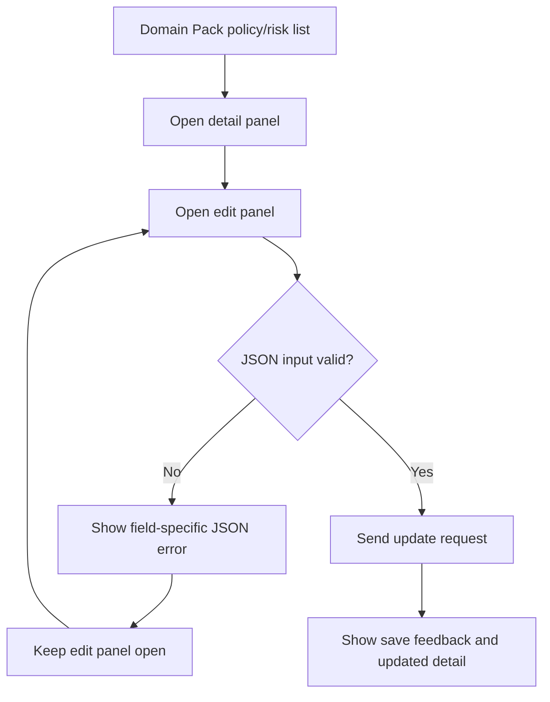

# Frontend E2E Spec: policy/risk JSON 저장 가드 Critical 편입

## Goal

운영자가 Domain Pack의 응대 기준(policy) 또는 주의 사항(risk)을 수정할 때 잘못된 JSON이 저장되지 않고, 같은 화면에서 오류를 확인한 뒤 유효한 JSON으로 저장할 수 있음을 Critical E2E로 보장한다.

## Issue Summary

GitHub Issue #722는 policy/risk 상세 편집 패널에서 조건, 액션, 근거, 메타 JSON 입력이 잘못되었을 때 저장 요청이 실행되지 않아야 한다는 사용자 시나리오를 다룬다. 기존 `frontend/e2e/domain-pack-core.spec.ts`에는 policy/risk invalid JSON 차단과 valid save 테스트가 있으므로, 이 작업은 해당 흐름을 Critical 그룹으로 명시하고 필드별 오류 메시지 검증을 보강한다.

## User Flow Chart



## Design Diff

| 영역                  | As-is                                                                                | To-be                                                            | 변경 내용                                                               |
| --------------------- | ------------------------------------------------------------------------------------ | ---------------------------------------------------------------- | ----------------------------------------------------------------------- |
| Critical E2E grouping | policy/risk edit tests exist in `domain-pack-core.spec.ts` without a Critical marker | policy/risk edit describe group is marked with `[@critical]`     | Playwright title grep로 Critical 시나리오를 선별할 수 있게 함           |
| Invalid JSON E2E      | policy 조건 JSON, risk 트리거 조건 JSON만 화면 오류를 확인                           | policy/risk의 조건/액션/근거/메타 JSON 필드별 오류 메시지를 확인 | 사용자가 어떤 JSON이 잘못되었는지 같은 편집 화면에서 확인 가능함을 고정 |
| PATCH guard           | invalid JSON에서 update PATCH 미발생만 보조 확인                                     | 필드별 invalid 저장 시 update PATCH 미발생을 유지                | 잘못된 운영 기준 저장 방지 회귀를 보강                                  |
| 상태 변경 분리        | policy/risk status switch가 각 endpoint로 요청되는지 확인                            | 반대 타입 status endpoint가 호출되지 않는지도 확인               | policy/risk 상태 변경이 서로 다른 항목에 적용되지 않음을 보조 검증      |

## Component Tree

```text
frontend/e2e/domain-pack-core.spec.ts
└─ Domain pack core read flows
   └─ Given generated domain packs in a workspace
      └─ [@critical] Policy/risk JSON edit safeguards
         ├─ When they edit a policy from the detail panel
         └─ When they edit a risk from the detail panel
```

## API Integration

테스트는 기존 Playwright mock과 API 호출 추적 배열을 사용한다.

| Method  | Path                                                                 | 목적                    |
| ------- | -------------------------------------------------------------------- | ----------------------- |
| `GET`   | `/api/v1/workspaces/1/domain-packs/1/versions/1/policies`            | policy 목록 조회        |
| `GET`   | `/api/v1/workspaces/1/domain-packs/1/versions/1/policies/101`        | policy 상세 조회        |
| `PATCH` | `/api/v1/workspaces/1/domain-packs/1/versions/1/policies/101`        | 유효한 policy 수정 저장 |
| `PATCH` | `/api/v1/workspaces/1/domain-packs/1/versions/1/policies/101/status` | policy 상태 변경        |
| `GET`   | `/api/v1/workspaces/1/domain-packs/1/versions/1/risks`               | risk 목록 조회          |
| `GET`   | `/api/v1/workspaces/1/domain-packs/1/versions/1/risks/201`           | risk 상세 조회          |
| `PATCH` | `/api/v1/workspaces/1/domain-packs/1/versions/1/risks/201`           | 유효한 risk 수정 저장   |
| `PATCH` | `/api/v1/workspaces/1/domain-packs/1/versions/1/risks/201/status`    | risk 상태 변경          |

## 수정 대상 파일

| 파일                                    | 변경 유형 | 설명                                                                                                      |
| --------------------------------------- | --------- | --------------------------------------------------------------------------------------------------------- |
| `.agent/specs/722.md`                   | new       | Issue #722 요구사항과 검증 기준 기록                                                                      |
| `frontend/e2e/domain-pack-core.spec.ts` | modify    | policy/risk JSON validation, valid save, status 분리 흐름을 Critical E2E로 명시하고 필드별 오류 검증 보강 |

## State Management

- 제품 상태 관리와 generated API client는 변경하지 않는다.
- E2E는 기존 `installAuth`, `installAppApiMocks`, `seen` 호출 추적을 그대로 사용한다.
- invalid JSON 검증은 편집 패널을 닫지 않고 각 필드 값을 유효한 JSON으로 되돌린 뒤 다음 필드를 검증한다.

## Acceptance Criteria

- policy/risk 편집 E2E는 Playwright title grep으로 식별 가능한 `[@critical]` 그룹 아래에 있다.
- policy 편집에서 조건 JSON, 액션 JSON, 근거 JSON, 메타 JSON이 잘못된 구조일 때 각각 사용자 오류 메시지가 보인다.
- risk 편집에서 트리거 조건 JSON, 처리 액션 JSON, 근거 JSON, 메타 JSON이 잘못된 구조일 때 각각 사용자 오류 메시지가 보인다.
- invalid JSON 저장 시 policy/risk update PATCH 요청은 발생하지 않는다.
- valid JSON 저장 시 저장 완료 피드백과 상세 패널의 변경된 이름을 확인한다.
- policy 상태 변경 테스트는 risk status endpoint를 호출하지 않음을 확인한다.
- risk 상태 변경 테스트는 policy status endpoint를 호출하지 않음을 확인한다.

## Non-goals

- backend API contract, OpenAPI generated file, database schema는 변경하지 않는다.
- policy/risk 편집 UI 문구나 validation schema를 변경하지 않는다.
- 별도의 Playwright Critical 전용 config나 CI job을 추가하지 않는다.
- live E2E 또는 운영 백엔드 의존 테스트를 추가하지 않는다.

## Validation

| 검증                                                                                 | 목적                                         |
| ------------------------------------------------------------------------------------ | -------------------------------------------- |
| `cd frontend && pnpm exec playwright test domain-pack-core.spec.ts --grep @critical` | Critical policy/risk JSON 편집 시나리오 실행 |
| `cd frontend && pnpm exec eslint e2e/domain-pack-core.spec.ts`                       | 변경된 E2E TypeScript lint 확인              |

## Open Questions

- 없음. 현재 저장 차단 기준은 기존 policy/risk edit schema의 사용자 메시지를 따른다.
