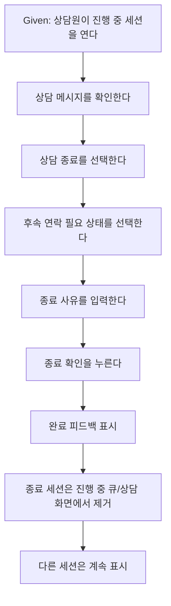

# 723: [P1] E2E Critical - 상담 종료 상태와 사유 저장 검증

> **Issue**: [#723](https://github.com/ajou-2026-1-capstone-5/ostone/issues/723)
> **Area**: Frontend E2E
> **Template**: `_TEMPLATE_FE.md` 기반
> **Branch**: `feature/723-consultation-end-critical-e2e`
> **Canonical Number**: `723`
> **작성일**: 2026-06-06

---

## Goal

상담원이 진행 중인 상담을 종료할 때 종료 처리 결과와 사유가 저장 요청에 포함되고, 화면에서 상담이 종료/후속 조치 상태로 반영되는 핵심 E2E 시나리오를 Critical 그룹으로 고정한다.

---

## Background

Issue #723은 코드 조사 기반 E2E Critical 후보이다. 현재 repository에는 상담 종료 확인 모달, 처리 결과 선택, 종료 사유 입력, generated `updateStatus` 호출을 검증하는 mocked Playwright 테스트가 `frontend/e2e/consultation.spec.ts`에 존재한다.

다만 기존 테스트는 제목과 주요 단언이 `status update endpoint` 호출에 치우쳐 있어, 이슈가 요구한 사용자 기대 결과인 완료 피드백, 종료된 상담이 진행 중 상담처럼 남지 않는 상태, 다른 상담 세션의 상태 보존을 Critical 시나리오로 충분히 드러내지 못한다.

---

## Scope

### In Scope

- 기존 `frontend/e2e/consultation.spec.ts`의 상담 종료 테스트를 Critical 그룹으로 식별 가능하게 만든다.
- 상담원이 상담 종료 모달에서 `후속 연락 필요`를 선택하고 종료 사유를 입력한 뒤 확정하는 흐름을 검증한다.
- 종료 완료 피드백이 화면에 표시되는지 검증한다.
- 종료된 상담이 상담 큐와 진행 중 상담 화면에서 제거되어 계속 진행 중처럼 보이지 않는지 검증한다.
- 종료되지 않은 다른 상담 세션이 잘못 제거되거나 상태가 바뀌지 않는지 검증한다.
- status update endpoint 검증은 보조 단언으로 유지하되, 화면상 결과를 우선 단언한다.

### Out of Scope

- 상담 종료 dialog UI 또는 상태 전환 정책 변경
- Backend `PATCH /api/v1/consultation/sessions/{sessionId}/status` 계약 변경
- 상담 기록 화면의 상세 표시 방식 변경
- live E2E 또는 운영 데이터에 영향을 주는 테스트 추가
- 새로운 Playwright project, CI job, test runner 도입

---

## Requirement Trace

| Issue 요구사항                                                        | 반영 기준                                                                       |
| --------------------------------------------------------------------- | ------------------------------------------------------------------------------- |
| 기존 `consultation.spec.ts`의 상담 종료 테스트를 Critical 그룹에 편입 | 테스트 제목 또는 describe 계층에서 `@critical`로 grep 가능하게 표시             |
| 상담 종료 dialog, 상태 옵션, 사유 입력 정책을 코드에서 재조사         | 기존 모달 라벨 `후속 연락 필요`, `종료 사유 또는 내부 메모`, `종료 확인`을 사용 |
| 완료 피드백 우선 단언                                                 | `상담이 종료되었습니다.` toast/feedback 가시성 검증                             |
| 세션 상태가 종료 또는 후속 조치 상태로 반영                           | 종료된 세션이 큐에서 제거되고 active conversation 액션이 사라지는지 검증        |
| 종료 사유 입력값이 저장 흐름에 반영                                   | mocked status endpoint request body에 `resolutionReason` 포함 검증 유지         |
| 다른 상담 세션의 상태 오염 방지                                       | 같은 큐의 다른 세션이 계속 표시되는지 검증                                      |

---

## Existing Context

아래 경로는 repository에서 존재 확인 완료했다.

| Path                                                                | 현재 역할                       | 변경 기준                                                       |
| ------------------------------------------------------------------- | ------------------------------- | --------------------------------------------------------------- |
| `frontend/e2e/consultation.spec.ts`                                 | mocked Playwright 상담 화면 E2E | 상담 종료 Critical 시나리오의 제목과 화면 단언 강화             |
| `frontend/e2e/support/generated-api-mocks.ts`                       | mocked E2E API route fixture    | status update request body 검증 기준 유지                       |
| `frontend/src/pages/consultation/ui/ConsultationPage.tsx`           | 상담 종료 모달과 submit 흐름    | 제품 코드 변경 없이 테스트가 실제 라벨/동작을 따른다            |
| `frontend/src/pages/consultation/ui/model/consultationPageState.ts` | 처리 결과 옵션과 상태 라벨      | `FOLLOW_UP_REQUIRED -> RESOLVED`, follow-up flag 정책 확인 기준 |
| `frontend/playwright.config.ts`                                     | mocked E2E 실행 config          | full E2E 흐름에 Critical 테스트가 포함되도록 유지               |

---

## User Flow Chart

---

## Design Diff

| 영역          | As-is                                             | To-be                                     | 변경 내용                                 |
| ------------- | ------------------------------------------------- | ----------------------------------------- | ----------------------------------------- |
| E2E 분류      | 상담 종료 테스트가 일반 상담 화면 테스트로만 보임 | `@critical`로 식별 가능                   | Critical 후보를 grep 가능한 그룹으로 편입 |
| 주요 단언     | generated message와 status endpoint 호출 중심     | 완료 피드백, 큐 제거, 다른 세션 보존 중심 | 사용자 기대 결과 우선                     |
| endpoint 검증 | request body fixture에서 검증                     | 보조 검증으로 유지                        | 저장 흐름 회귀 방지                       |

---

## Test Strategy

### Target Scenario

| Given                                                                  | When                                                                                         | Then                                                                                                      |
| ---------------------------------------------------------------------- | -------------------------------------------------------------------------------------------- | --------------------------------------------------------------------------------------------------------- |
| 상담원이 `/workspaces/1/consultation`에서 `김민지` 진행 중 상담을 연다 | `상담 종료` 클릭 후 `후속 연락 필요`를 선택하고 `배송사 확인 후 연락` 사유를 입력해 확정한다 | 완료 피드백이 보이고, `김민지` 세션은 진행 중 상담 큐에서 사라지며, `박준호` 등 다른 세션은 그대로 남는다 |

### Expected Verification

- `pnpm --dir frontend exec playwright test e2e/consultation.spec.ts --grep @critical`
- 필요 시 `pnpm --dir frontend e2e`로 mocked E2E 전체 회귀 확인

---

## Acceptance Criteria

- `frontend/e2e/consultation.spec.ts`의 상담 종료 시나리오가 `@critical`로 선택 실행 가능하다.
- 테스트는 상담 종료 전 메시지 확인, dialog 열림, 후속 연락 상태 선택, 사유 입력, 종료 확인을 포함한다.
- 테스트는 `상담이 종료되었습니다.` 피드백을 우선 단언한다.
- 테스트는 종료된 상담이 큐에 계속 표시되지 않고 active 상담 액션도 사라지는지 단언한다.
- 테스트는 다른 큐 세션이 계속 표시되어 잘못 변경되지 않았음을 단언한다.
- mocked status endpoint는 `status: "RESOLVED"`, `resolutionOutcome: "FOLLOW_UP_REQUIRED"`, `resolutionReason`, `followUpRequired: true` 요청을 계속 검증한다.

---

## Open Questions

- 없음. 현재 issue 본문과 기존 구현 조사 기준으로 테스트 범위를 확정한다.
