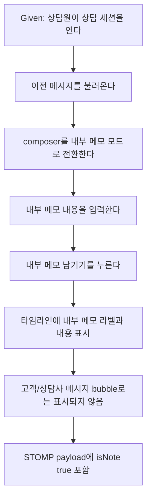

# 724: [P1] E2E Critical - 내부 메모가 고객 메시지로 전송되지 않음

> **Issue**: [#724](https://github.com/ajou-2026-1-capstone-5/ostone/issues/724)
> **Area**: Frontend E2E
> **Template**: `_TEMPLATE_FE.md` 기반
> **Branch**: `fix/724-internal-note-critical-e2e`
> **Canonical Number**: `724`
> **작성일**: 2026-06-07

---

## Goal

상담원이 상담 화면에서 내부 메모 모드로 작성한 내용이 고객에게 보내는 메시지로 오인되거나 전송되지 않고, 타임라인에 내부 note로 남는 핵심 E2E 시나리오를 Critical 그룹으로 고정한다.

---

## Background

Issue #724는 코드 조사 기반 E2E Critical 후보이다. 현재 repository에는 상담 화면에서 이전 메시지를 불러온 뒤 내부 메모 모드로 내용을 작성하고 STOMP frame의 `isNote: true` payload를 검증하는 mocked Playwright 테스트가 `frontend/e2e/consultation.spec.ts`에 존재한다.

다만 기존 테스트는 Critical 그룹으로 식별되지 않고, 화면 단언도 작성한 텍스트가 보이는지만 확인한다. 이슈가 요구한 사용자 기대 결과는 내부 메모가 고객 답변 영역으로 오인되지 않는 것이므로, 타임라인에서 `내부 메모`로 표시되는지와 고객/상담사 메시지 bubble로 렌더링되지 않는지를 함께 검증한다.

---

## Scope

### In Scope

- 기존 `frontend/e2e/consultation.spec.ts`의 내부 메모 작성 시나리오를 `@critical`로 식별 가능하게 만든다.
- 상담원이 상담 세션을 열고 이전 메시지를 불러온 뒤 composer를 내부 메모 모드로 전환하는 흐름을 검증한다.
- 내부 메모 작성 후 타임라인에 `내부 메모` 라벨과 메모 내용이 함께 표시되는지 검증한다.
- 메모 내용이 고객 또는 상담사 메시지 bubble 선택 버튼으로 렌더링되지 않는지 검증한다.
- STOMP frame이 `/app/chat.counselor.send`로 전송되고 payload에 `isNote: true`가 포함되는지 보조 검증으로 유지한다.

### Out of Scope

- 상담 화면 UI 문구, 디자인, 접근성 구조 변경
- Backend STOMP endpoint 또는 message DTO contract 변경
- 내부 메모 저장 정책, 권한 정책, 상담 기록 상세 화면 변경
- live E2E 또는 운영 데이터에 영향을 주는 테스트 추가
- 새로운 Playwright project, CI job, test runner 도입

---

## Requirement Trace

| Issue 요구사항                                                                    | 반영 기준                                                                                                                         |
| --------------------------------------------------------------------------------- | --------------------------------------------------------------------------------------------------------------------------------- |
| 내부 메모 작성 UI가 고객 답변 작성 UI와 구분됨                                    | note toggle 후 placeholder가 `내부 메모로 타임라인에 남길 내용을 입력하세요...`로 바뀌고 전송 버튼 이름이 `내부 메모 남기기`가 됨 |
| 내부 메모 내용이 고객에게 보내는 메시지 영역으로 오인되지 않음                    | 작성 내용이 고객/상담사 message bubble button으로 렌더링되지 않음을 검증                                                          |
| 저장 후 timeline에서 내부 메모임을 알 수 있음                                     | `chat-message-list` 안에서 `내부 메모` 라벨과 작성 내용을 함께 확인                                                               |
| realtime payload에 note 여부가 명확히 반영됨                                      | recorded STOMP frame에서 `/app/chat.counselor.send`, `sessionId: 601`, `isNote: true`, 작성 내용을 확인                           |
| 기존 `consultation.spec.ts` internal note/STOMP frame 검증을 Critical 그룹에 편입 | 테스트 제목에 `[@critical]`를 포함해 `--grep @critical` 실행 대상이 되게 함                                                       |

---

## Existing Context

아래 경로는 repository에서 존재 확인 완료했다.

| Path                                                       | 현재 역할                                    | 변경 기준                                                                           |
| ---------------------------------------------------------- | -------------------------------------------- | ----------------------------------------------------------------------------------- |
| `frontend/e2e/consultation.spec.ts`                        | mocked Playwright 상담 화면 E2E              | 내부 메모 시나리오의 Critical tag와 화면 단언 강화                                  |
| `frontend/e2e/support/generated-api-mocks.ts`              | 상담 queue/messages mocked API route fixture | session 601 message page와 이전 메시지 fixture를 그대로 사용                        |
| `frontend/e2e/support/mock-stomp.ts`                       | E2E WebSocket/STOMP frame recorder           | 전송 frame 기록을 payload 보조 검증에 사용                                          |
| `frontend/src/features/consultation/ui/ChatPanel.tsx`      | 상담 composer와 timeline renderer            | 제품 코드 변경 없이 현재 NOTE renderer와 접근 가능한 UI 텍스트를 따른다             |
| `frontend/src/features/consultation/lib/chatRoleLabels.ts` | sender role 표시 라벨 정의                   | `NOTE -> 내부 메모`, `CUSTOMER/USER -> 고객`, `COUNSELOR/AGENT -> 상담사` 기준 확인 |
| `frontend/playwright.config.ts`                            | mocked E2E 실행 config                       | Critical grep 실행과 전체 mocked E2E 실행 경로 유지                                 |

---

## User Flow Chart

---

## Design Diff

| 영역           | As-is                                               | To-be                                                         | 변경 내용                                   |
| -------------- | --------------------------------------------------- | ------------------------------------------------------------- | ------------------------------------------- |
| E2E 분류       | 내부 메모 테스트가 일반 상담 화면 테스트로만 실행됨 | `@critical`로 식별 가능                                       | Critical 후보를 grep 가능한 그룹으로 편입   |
| 주요 화면 단언 | 내부 메모 텍스트가 보이는지만 확인                  | `내부 메모` 라벨, bubble 오분류 방지, 텍스트 표시를 함께 확인 | 고객 메시지 유출 방지 관점의 화면 단언 강화 |
| payload 검증   | STOMP frame에 `isNote: true` 포함 여부 확인         | 같은 검증을 유지하고 `isNote: false` 오분류도 배제            | realtime note contract 회귀 방지            |

---

## Test Strategy

### Target Scenario

| Given                                                                                 | When                                                                       | Then                                                                                                                        |
| ------------------------------------------------------------------------------------- | -------------------------------------------------------------------------- | --------------------------------------------------------------------------------------------------------------------------- |
| 상담원이 `/workspaces/1/consultation`에서 `김민지` 상담을 열고 이전 메시지를 불러온다 | composer를 내부 메모 모드로 전환해 `배송사 확인 필요 내부 메모`를 저장한다 | 타임라인에는 `내부 메모`로 표시되고, 고객/상담사 메시지 bubble로 표시되지 않으며, STOMP payload는 `isNote: true`를 포함한다 |

### Expected Verification

- `pnpm --dir frontend exec playwright test e2e/consultation.spec.ts --grep @critical`
- 필요 시 `pnpm --dir frontend e2e -- consultation.spec.ts`로 상담 mocked E2E 전체 회귀 확인
- `git diff --check`

---

## Acceptance Criteria

- `.agent/specs/724.md` 파일명이 이슈 번호만 포함한다.
- `frontend/e2e/consultation.spec.ts`의 내부 메모 시나리오가 `@critical`로 선택 실행 가능하다.
- 테스트는 상담 세션 진입, 이전 메시지 로드, 내부 메모 모드 전환, 내부 메모 입력, 저장을 포함한다.
- 테스트는 작성한 내용이 `chat-message-list` 안에서 `내부 메모` 라벨과 함께 보이는지 단언한다.
- 테스트는 작성한 내용이 고객 또는 상담사 메시지 bubble 선택 버튼으로 표시되지 않는지 단언한다.
- 테스트는 recorded STOMP frame에 `/app/chat.counselor.send`, `sessionId: 601`, `isNote: true`, 작성 내용이 포함되는지 단언한다.
- 테스트는 해당 frame이 `isNote: false`로 전송되지 않았음을 단언한다.

---

## Open Questions

- 없음. 현재 issue 본문과 기존 구현 조사 기준으로 테스트 범위를 확정한다.
