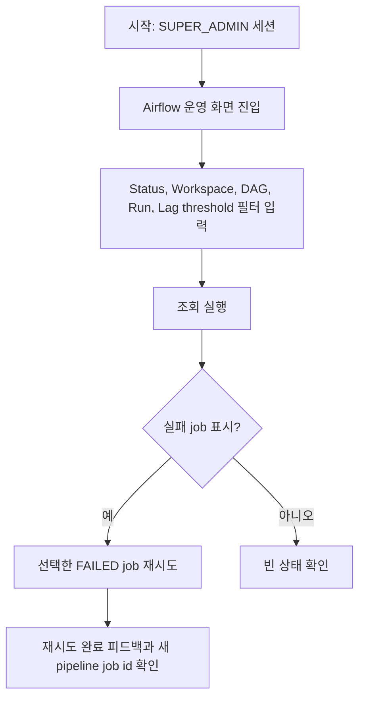

# Frontend FSD Spec: 슈퍼 관리자 Airflow 실패 job Critical E2E

## Goal

슈퍼 관리자가 Airflow 운영 화면에서 실패한 pipeline job을 필터링하고 선택한 job만 재시도하는 핵심 운영 흐름을 Critical E2E 그룹에서 실행할 수 있게 한다.

---

## User Flow Chart



---

## Design Diff

### As-is vs To-be

| 영역 | As-is | To-be | 변경 내용 |
|------|-------|-------|----------|
| Airflow admin E2E | `frontend/e2e/admin.spec.ts`에 필터/초기화/재시도 시나리오가 존재하지만 Critical subset으로 식별되지 않음 | Airflow 실패 job 필터/초기화/재시도 시나리오가 `@critical` 그룹에 포함됨 | 기존 시나리오 중 핵심 운영 흐름을 Critical E2E로 실행 가능하게 함 |
| Critical 실행 경로 | 전체 mocked E2E만 package script로 노출 | `frontend`와 root package script에서 Critical E2E subset 실행 경로 제공 | CI/로컬에서 핵심 회귀만 좁게 재현 가능 |
| 권한 guard | `frontend/e2e/navigation.spec.ts`가 비 SUPER_ADMIN admin URL 접근을 workspace home redirect로 검증 | 중복 테스트 추가 없이 기존 guard 검증을 유지 | 이 이슈는 Airflow 운영 action의 Critical 편입에 집중 |

---

## Component Tree

```text
App
└─ AdminRoute
   └─ AdminLayout
      └─ AdminPipelineJobsPage
         ├─ filter form
         ├─ PipelineJobTable
         └─ retry action

Playwright mocked E2E
└─ frontend/e2e/admin.spec.ts
   └─ Given a SUPER_ADMIN session
      └─ When they retry a failed pipeline job @critical
```

---

## API Integration

### Endpoints

| Method | Path | Description |
|--------|------|-------------|
| GET | `/api/v1/admin/pipeline-jobs` | admin Airflow pipeline job 목록 조회 |
| POST | `/api/v1/admin/pipeline-jobs/{pipelineJobId}/retry` | 선택한 실패 pipeline job 재시도 |

신규 API는 만들지 않는다. Mocked E2E는 기존 `frontend/e2e/support/app-mocks.ts`의 admin route fixture를 사용한다.

---

## 수정 대상 파일

| 파일 | 변경 유형 | 설명 |
|------|----------|------|
| `frontend/e2e/admin.spec.ts` | modify | 기존 Airflow 필터/초기화/재시도 describe block을 Critical tag로 편입 |
| `frontend/package.json` | modify | `e2e:critical` script 추가 |
| `package.json` | modify | root `e2e:frontend:critical` script 추가 |
| `.agent/specs/725.md` | new | 이슈 요구사항과 검증 기준 기록 |

---

## State Management

- product state 변경은 없다.
- E2E auth state는 `frontend/e2e/support/generated-api-auth.ts`의 SUPER_ADMIN localStorage fixture를 그대로 사용한다.
- admin API 응답 기록은 `frontend/e2e/support/app-mocks.ts`의 `seen` 배열 기반 검증을 유지한다.

---

## Tests

### Test Strategy

| 구분 | 방법 | 도구 | 비고 |
|------|------|------|------|
| E2E subset | `@critical` tag로 Airflow 운영 흐름만 실행 | Playwright mocked E2E | 핵심 운영 회귀 빠른 확인 |
| Full mocked E2E | 기존 `pnpm run e2e:frontend` | Playwright mocked E2E | 전체 프론트 E2E 회귀 확인 |

### Test Scenarios

#### Happy Path

| # | 시나리오 | 사전 조건 | 조작 | 기대 결과 |
|---|---------|---------|------|----------|
| 1 | 실패 job 필터 조회 | SUPER_ADMIN 세션, 실패 pipeline job fixture 존재 | Status, Workspace, DAG, Run, Lag threshold 입력 후 조회 | list query에 필터 값이 정규화되어 반영됨 |
| 2 | 필터 초기화 | 필터 입력값 존재 | 초기화 클릭 | 필터 UI가 기본값으로 돌아감 |
| 3 | 실패 job 재시도 | FAILED job fixture 존재 | 해당 job의 재시도 버튼 클릭 | 선택한 job retry endpoint가 호출되고 새 pipeline job id 피드백이 표시됨 |

#### Error & Edge Cases

| # | 시나리오 | 조작 | 기대 결과 |
|---|---------|------|----------|
| 1 | 비 SUPER_ADMIN admin URL 접근 | 일반 운영자가 admin URL 진입 | 기존 `frontend/e2e/navigation.spec.ts` guard 시나리오가 workspace home redirect를 검증 |
| 2 | 잘못된 job 재시도 방지 | FAILED가 아닌 job action | `AdminPipelineJobsPage`는 FAILED 상태에만 재시도 버튼을 렌더링 |

---

## Acceptance Criteria

- `frontend/e2e/admin.spec.ts`의 Airflow filter/reset/retry 흐름이 `@critical` tag로 식별된다.
- Critical E2E subset을 package script로 실행할 수 있다.
- 필터 입력값은 list query에 일관되게 반영된다.
- 재시도는 선택한 실패 job id에 대해서만 호출된다.
- 재시도 성공 후 새 pipeline job id 또는 처리 결과 피드백이 표시된다.
- 일반 운영자 admin 접근 제한은 기존 guard E2E와 중복되지 않는다.

---

## Non-goals

- Admin UI의 화면 구조, 문구, 스타일을 변경하지 않는다.
- Backend admin pipeline job API, 권한 정책, Airflow retry 동작을 변경하지 않는다.
- Live E2E 또는 실제 Airflow API 연동 테스트를 추가하지 않는다.
- 비 SUPER_ADMIN guard 전용 테스트를 이 이슈에서 새로 만들지 않는다.

---

## Validation

- `pnpm --dir frontend e2e:critical -- admin.spec.ts`
- 필요 시 `pnpm run e2e:frontend`로 전체 mocked E2E를 확인한다.

---

## Open Questions

- 별도 CI job이 Critical subset만 실행해야 하는지는 이슈에 명시되어 있지 않다. 이 PR에서는 실행 가능한 script와 tag 편입까지만 다룬다.
