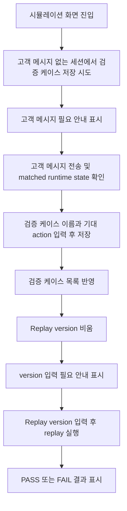

# Simulation Golden Case Replay E2E

## Goal

운영자가 상담 시뮬레이션에서 검증 케이스를 저장하고, 특정 Domain Pack version으로 replay한 PASS/FAIL 결과를 확인하는 핵심 브라우저 흐름을 E2E로 보장한다.

## User Flow Chart



## Design Diff

| 영역         | As-is                                                           | To-be                                                                    | 변경 내용                                             |
| ------------ | --------------------------------------------------------------- | ------------------------------------------------------------------------ | ----------------------------------------------------- |
| E2E coverage | simulation 기본 실행과 feedback 중심 검증                       | golden case 저장, replay version validation, replay result 표시까지 검증 | 기존 simulation E2E 흐름을 확장                       |
| Mock fixture | simulation session, feedback, improvement candidate 응답만 제공 | golden case create/list/replay 응답과 replay 이후 최신 결과 상태 제공    | `frontend/e2e/support/app-mocks.ts`에 mock state 추가 |
| Product UI   | `WorkspaceSimulationPage`에 검증 케이스 UI와 단위 테스트 존재   | UI 동작 변경 없음                                                        | E2E에서 기존 사용자 경험을 고정                       |

## Component Tree

```text
WorkspaceSimulationPage
├─ simulation session pane
├─ simulation chat pane
└─ runtime state side panel
   └─ 검증 케이스 panel
      ├─ 검증 케이스 이름 input
      ├─ 기대 action select
      ├─ Replay version input
      ├─ 등록 button
      └─ golden case list
         ├─ latest replay status
         └─ replay button
```

## API Integration

### Endpoints

| Method | Path                                                                              | Description                                 |
| ------ | --------------------------------------------------------------------------------- | ------------------------------------------- |
| GET    | `/api/v1/workspaces/{workspaceId}/simulation/sessions`                            | simulation session 목록 조회                |
| POST   | `/api/v1/workspaces/{workspaceId}/simulation/sessions`                            | 고객 메시지 없는 새 simulation session 생성 |
| GET    | `/api/v1/workspaces/{workspaceId}/simulation/sessions/{sessionId}`                | simulation session 상세 조회                |
| POST   | `/api/v1/workspaces/{workspaceId}/simulation/sessions/{sessionId}/messages`       | 고객 메시지 전송 및 runtime state 갱신      |
| GET    | `/api/v1/workspaces/{workspaceId}/simulation/golden-cases`                        | 저장된 검증 케이스 목록 조회                |
| POST   | `/api/v1/workspaces/{workspaceId}/simulation/sessions/{sessionId}/golden-cases`   | 현재 session을 검증 케이스로 저장           |
| POST   | `/api/v1/workspaces/{workspaceId}/simulation/golden-cases/{goldenCaseId}/replays` | 지정 version으로 검증 케이스 replay 실행    |

기존 `frontend/src/features/simulation/api/simulationApi.ts` wrapper와 `frontend/src/pages/workspace/ui/WorkspaceSimulationPage.tsx` UI 계약을 사용한다. 이번 범위에서는 production API wrapper나 화면 구조를 변경하지 않는다.

## 수정 대상 파일

| 파일                                  | 변경 유형 | 설명                                                     |
| ------------------------------------- | --------- | -------------------------------------------------------- |
| `.agent/specs/728.md`                 | new       | issue #728 요구사항, 범위, 검증 기준 정리                |
| `frontend/e2e/support/app-mocks.ts`   | update    | simulation golden case 저장, 목록, replay mock 상태 추가 |
| `frontend/e2e/workspace-core.spec.ts` | update    | 운영자 golden case 저장/replay E2E 시나리오 추가         |

## State Management

- E2E mock state는 `installAppApiMocks` 호출마다 초기화되어 테스트 간 golden case 저장 결과가 공유되지 않는다.
- 새 simulation session을 만들면 mock detail의 메시지는 비어 있어 고객 메시지 없는 저장 차단을 검증할 수 있어야 한다.
- 메시지 전송 후 mock detail은 고객/assistant turn과 matched workflow snapshot을 반환한다.
- replay 성공 후 golden case list mock은 `latestReplayResult.status`를 `PASS`로 갱신해 화면의 최신 결과 표시를 검증한다.

## Scope

- `frontend/e2e/workspace-core.spec.ts`의 authenticated workspace operator 흐름에서 simulation golden case 저장/replay를 검증한다.
- 고객 메시지가 없을 때 저장 차단 안내가 표시되고 create golden case API가 호출되지 않는지 확인한다.
- 저장 후 검증 케이스 목록에 새 케이스가 반영되는지 확인한다.
- replay version이 비어 있을 때 사용자 안내가 표시되고 replay API가 호출되지 않는지 확인한다.
- replay 실행 후 PASS 결과가 화면에 표시되는지 확인한다.

## Non-goals

- Backend golden case/replay API 구현 변경은 포함하지 않는다.
- `WorkspaceSimulationPage` production UI 구조, copy, 스타일 변경은 포함하지 않는다.
- generated API migration 또는 `simulationApi.ts` wrapper refactor는 포함하지 않는다.
- 실제 LLM/runtime replay 품질 판단 로직은 mock E2E 범위 밖이다.

## Test Scenarios

### Happy Path

| #   | 시나리오         | 사전 조건                                                       | 조작                            | 기대 결과                                          |
| --- | ---------------- | --------------------------------------------------------------- | ------------------------------- | -------------------------------------------------- |
| 1   | 검증 케이스 저장 | 고객 메시지를 보낸 simulation session과 matched workflow가 있음 | 이름과 기대 action 입력 후 등록 | create golden case API 호출, 성공 toast, 목록 반영 |
| 2   | replay 실행      | 저장된 검증 케이스와 replay version 입력값이 있음               | replay 버튼 클릭                | replay API 호출, 성공 toast, PASS 결과 표시        |

### Error & Edge Cases

| #   | 시나리오              | 조작                                   | 기대 결과                                 |
| --- | --------------------- | -------------------------------------- | ----------------------------------------- |
| 1   | 고객 메시지 없는 저장 | 새 session 생성 직후 등록 클릭         | 고객 메시지 필요 toast, create API 미호출 |
| 2   | replay version 누락   | Replay version 값을 비우고 replay 클릭 | version 입력 toast, replay API 미호출     |

## Acceptance Criteria

- 운영자는 `/workspaces/1/simulation`에서 고객 메시지 없는 session을 검증 케이스로 저장하려 할 때 차단 안내를 본다.
- 운영자는 고객 메시지와 matched workflow가 있는 session을 검증 케이스로 저장할 수 있다.
- 저장된 검증 케이스가 화면 목록에 표시된다.
- replay version 입력이 비어 있으면 replay 요청 전 사용자 안내가 표시된다.
- replay 실행 후 최신 결과가 PASS 또는 FAIL 상태 텍스트로 표시된다.
- E2E mock은 저장/replay 이후 목록 상태를 갱신해 실제 사용자 흐름과 같은 순서로 검증한다.

## Validation Expectations

- `pnpm --dir frontend e2e workspace-core.spec.ts --project=chromium`
- 필요 시 `pnpm --dir frontend test -- WorkspaceSimulationPage.test.tsx --run`으로 기존 단위 테스트 회귀를 확인한다.

## Open Questions

- issue #728은 E2E 보강 후보이므로 PASS/FAIL 판정 자체의 backend 알고리즘 변경은 이번 PR에서 다루지 않는다.
- Code-generated simulation endpoints가 존재하지만 현재 simulation feature wrapper는 별도 allowlist 기반 `customFetch` 패턴을 사용한다. 이번 PR은 E2E 보강에 한정하고 wrapper migration은 별도 범위로 남긴다.
