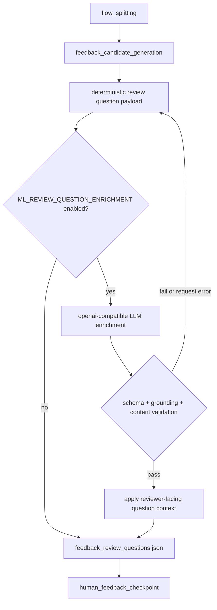

# LLM 기반 리뷰 질문 enrichment와 grounding 검증

## Goal

`feedback_candidate_generation`이 생성하는 human feedback 질문을 LLM으로 사람이 이해 가능한 업무 맥락으로 보강하되, schema와 grounding 검증을 통과한 결과만 review task payload에 사용한다.

## Problem

현재 `ml/src/pipeline/stages/feedback_candidate_generation/main.py`는 `actionObjectFrame`의 object/action과 term 기반 label 결과를 조합해 질문 요약을 만든다. 이 방식은 파이프라인 실행에는 안전하지만, `지역 이동할 원화로 견적`, `가요 리츠칼튼 있네 예약`, `지불하나 정보확인`처럼 리뷰어가 업무 단위를 판단하기 어려운 문구가 human feedback 화면에 노출될 수 있다. 리뷰어가 두 후보를 같은 intent로 묶을지 판단하려면 snippet, signals, entrypoint metadata에 근거한 자연스러운 질문 문맥이 필요하다.

## Scope

- `feedback_candidate_generation` 이후 또는 내부에서 선택적으로 LLM 기반 review question enrichment를 수행한다.
- LLM은 판단 결과를 확정하지 않고, 사람이 판단할 수 있는 제목, 요약, 공통점, 차이점, 선택지 설명을 정리하는 역할만 맡는다.
- LLM 응답은 JSON schema 검증, evidence id 기반 grounding 검증, 금지어/깨진 label 패턴 검증을 통과해야 한다.
- 검증 실패나 LLM 호출 실패 시 기존 deterministic payload를 그대로 사용하고 pipeline을 실패시키지 않는다.
- enrichment 결과와 실패/적용/abstain metric을 `feedback_review_questions.json` 및 stage manifest metrics에 남긴다.
- 근거가 부족하면 억지 질문을 적용하지 않고 abstain 상태 또는 낮은 priority로 남긴다.

## Non-goals

- human feedback의 최종 decision을 자동화하지 않는다.
- backend review task 저장 모델이나 API contract를 변경하지 않는다.
- frontend human feedback UI 레이아웃을 변경하지 않는다.
- `flow_splitting` labeler나 upstream clustering 알고리즘을 변경하지 않는다.
- 외부 LLM provider 전용 SDK나 신규 의존성을 추가하지 않는다.

## DAG Diagram

## Stage Interface

### Input

| 필드 | 타입 | 설명 |
| --- | --- | --- |
| `clusters.json` | JSON object | `flow_splitting` cluster artifact |
| `workflow_entrypoints.json` | JSON object | `flow_splitting` workflow entrypoint artifact |
| `preprocessed_data.json` | JSON object | `issueCaselets` 또는 `conversations`의 snippet, action/object frame, signals |
| `LLM_RUNTIME_BASE_URL` | env | OpenAI-compatible chat completions endpoint base URL |
| `LLM_MODEL_NAME` | env | enrichment 요청에 사용할 모델명 |
| `ML_REVIEW_QUESTION_ENRICHMENT` | env | `local_llm`, `llm`, `1`, `true` 등일 때 활성화 |

### Output

| 필드 | 타입 | 설명 |
| --- | --- | --- |
| `feedback_review_questions.json.questions[]` | list | 기존 deterministic 질문 필드와 선택적으로 적용된 enrichment 필드 |
| `feedback_review_questions.json.enrichmentSummary` | object | enrichment 적용/실패/abstain metric |
| manifest `payload.metrics.reviewQuestionEnrichment*` | object fields | stage manifest에 남는 enrichment 주요 metric |

LLM enrichment가 적용된 질문은 기존 `questionText`, `sourceReviewContext`, `targetReviewContext`를 사람이 읽기 쉬운 값으로 보강하고, 추가로 다음 필드를 포함할 수 있다.

| 필드 | 설명 |
| --- | --- |
| `questionType` | `must_link`, `cannot_link`, `unsure` 중 하나 |
| `sourceTitle`, `targetTitle` | 각 후보의 리뷰용 제목 |
| `sourceSummary`, `targetSummary` | 각 후보의 근거 기반 요약 |
| `commonGround` | 두 후보의 공통 근거 |
| `keyDifferences` | 두 후보의 핵심 차이 |
| `operatorQuestion` | 리뷰어에게 보여줄 판단 질문 |
| `choiceExplanations` | `must_link`, `cannot_link`, `unsure` 선택지 설명 |
| `abstainReason` | 근거 부족으로 적용하지 않은 이유 |

## Requirements

1. Enrichment가 켜져도 최종 `must_link`/`cannot_link`/`unsure` 결정은 사람이 제출한다.
2. LLM 응답은 필수 필드와 타입을 검증하는 JSON schema validation을 통과해야 한다.
3. LLM 응답은 제공된 snippet, signals, review context, entrypoint metadata에 포함된 evidence id만 사용해야 한다.
4. LLM 응답에 금지어, meta generation 문구, 기존 깨진 label 패턴이 포함되면 적용하지 않는다.
5. LLM 호출 실패, 응답 파싱 실패, schema 실패, grounding 실패는 pipeline 실패가 아니라 deterministic payload fallback으로 처리한다.
6. LLM이 `abstain=true`를 반환하면 억지 질문을 적용하지 않고 abstain reason과 낮은 priority를 남긴다.
7. enrichment 적용/실패/abstain/fallback metric은 artifact와 manifest에 남아야 한다.
8. job 42 유형 fixture처럼 깨진 summary가 있는 질문은 유효한 LLM 응답이 있을 때 사람 친화적인 질문 문맥으로 대체되어야 한다.

## Affected Paths

- `ml/src/pipeline/stages/feedback_candidate_generation/main.py`
- `ml/src/pipeline/stages/feedback_candidate_generation/review_question_enrichment.py`
- `ml/tests/stages/test_feedback_candidate_generation_main.py`

## Validation

- `cd ml && uv run pytest tests/stages/test_feedback_candidate_generation_main.py`
- `cd ml && uv run ruff check src/pipeline/stages/feedback_candidate_generation tests/stages/test_feedback_candidate_generation_main.py`
- `cd ml && uv run ruff format --check src/pipeline/stages/feedback_candidate_generation tests/stages/test_feedback_candidate_generation_main.py`
- `git diff --check`

## Acceptance Criteria

- `.agent/specs/775.md`가 ML spec으로 존재한다.
- `ML_REVIEW_QUESTION_ENRICHMENT`가 꺼져 있으면 기존 deterministic 질문 생성 동작이 유지된다.
- 유효한 LLM 응답은 질문 제목, 요약, 공통점, 차이점, operator question, 선택지 설명을 payload에 적용한다.
- schema 실패, unknown evidence id, 금지어/깨진 label 패턴, LLM request failure는 deterministic payload fallback으로 남고 metric에 집계된다.
- abstain 응답은 질문을 억지로 rewrite하지 않고 낮은 priority 또는 abstain 상태로 남긴다.
- stage manifest metrics에 enrichment 적용/실패/fallback count가 기록된다.

## Open Questions

- 실제 job 42 artifact는 repository fixture로 확인되지 않았다. 검증은 동일한 깨진 label 패턴을 포함한 focused fixture로 대체한다.
